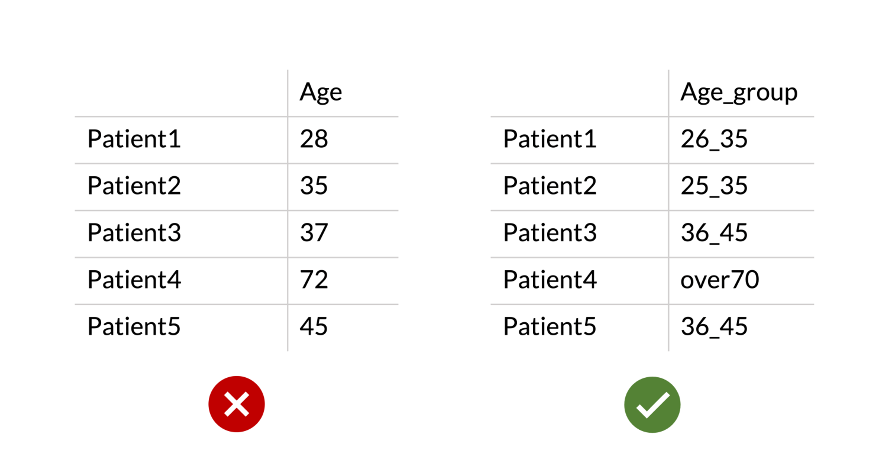

.. _datachecks:

Checks before uploading
================================================================================

**Check #2**. Avoid special characters when naming your samples or phenotypes.
The platform is based on the R programming language, so certain characters are reserved for programming purposes.

As a good code of practice, never use any of these symbols when naming a sample or a phenotype. If you need to connect multiple elements, use underscore, “_” instead. Here’s an example:

.. figure:: ../dataprep/data_checks/p2.png
    :align: center
    :width: 65%

We test regularly which characters are allowed or not, we will update this list accordingly. Here is the current list of characters that are not allowed:

+--------------+--------------+-----------------------+
| Matrix       | Part         | Not allowed           |
+==============+==============+=======================+
| sample.csv   | columns      | @ , : empty spaces, + |
+--------------+--------------+-----------------------+
| sample.csv   | phenotypes   | @ , : empty spaces    |
+--------------+--------------+-----------------------+
| sample.csv   | rows (names) | @ , : empty spaces    |
+--------------+--------------+-----------------------+
| contrast.csv | columns      | @ , : empty spaces +  |
+--------------+--------------+-----------------------+
| contrast.csv | contrasts    | @ , : empty spaces    |
+--------------+--------------+-----------------------+

filenames:
should have counts, contrasts and samples in the name.
Can have prepend or append in the name.

**Check #3**. Don't use spaces in your sample or phenotype names.
Empty spaces in the names of samples or phenotypes will cause the platform to throw an error message. If you need to create complex names, connect them via an underscore. Here’s an example:

.. figure:: ../dataprep/data_checks/p3.png
    :align: center
    :width: 65%

**Check #4**. Define intervals instead of using numeric phenotypes.
The platform does not cope with continuous numeric variables for phenotypes yet. To avoid that, our coders added a filter that flags phenotypes names “Time” or “Age” as unacceptable. The same applies for other continuous variables, such as height, weight, length, etc.

Instead, you should cluster the various numeric values into definite intervals and then name them accordingly (e.g. “Age_groups”, “Time_intervals”, etc…)

