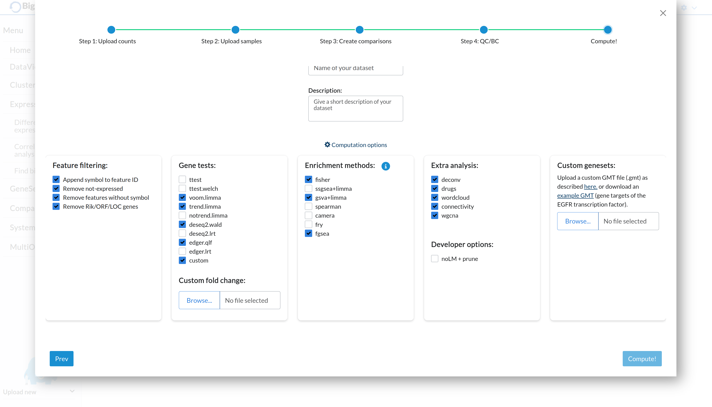

.. _uploadfc:

Uploading custom FC/Pvalues in Omics Playground
--------------------------------------------------------------------------------

The platform provides user with a selection of methods to perform differential expression analysis. However, it might be the case that the user has already performed a differential expression analysis with a method of their choice and wants to upload the results to the platform. If that is the case, we provide a way to upload custom FC/Pvalues.

In order to do so, the user has to prepare a .csv file where each row represents a feature (e.g. gene) and the columns follow a specific naming pattern. For each contrast, there should be three columns named as follows:

- [contrast_name].logFC
- [contrast_name].P.Value  
- [contrast_name].adj.P.Val

For example, if you have a contrast named "act_vs_notact", the columns would be:

- act_vs_notact.logFC
- act_vs_notact.P.Value
- act_vs_notact.adj.P.Val

.. warning::
   The contrast names must exactly match those selected in the "contrast" stage of the data upload process.

Once the CSV file is prepared with the correct column names, you can upload it during the "compute" stage of the data upload process:

1. Select "custom" in the gene test dropdown menu
2. An upload field will appear where you can select your CSV file with custom FC/P-values

You have two options when uploading custom values:

- Upload only your custom FC/P-values
- Compute platform methods alongside your custom values for comparison

If you choose to compute both custom and platform values, an additional "FC-FC Plot" tab will appear in the DEGs module, allowing you to compare the fold changes between methods:

.. figure:: ../figures/uploadfc/fcfc_plot.png
    :align: center  
    :width: 65%
    :alt: FC-FC plot comparing custom vs platform fold changes

