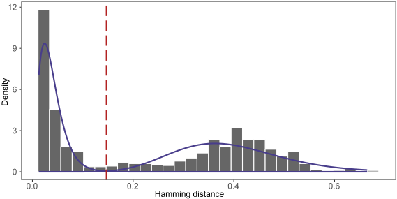

.. _Cloning:

Clustering sequences into clonal groups
================================================================================

Example data
--------------------------------------------------------------------------------

We have hosted a small example data set resulting from the
`Roche 454 example workflow <http://presto.readthedocs.io/en/stable/workflows/Jiang2013_Workflow.html>`__
described in the `pRESTO <http://presto.readthedocs.io>`__ documentation. The files can be
downloded from here:

`Change-O Example Files <http://clip.med.yale.edu/immcantation/examples/Changeo_Example.tar.gz>`__

The following examples use the ``S43_db-pass_parse-select.tab`` database file provided in
the example bundle, which has already undergone the :ref:`IMGT <IMGT>`/:ref:`IgBLAST <IgBLAST>`
parsing and :ref:`filtering <Filtering-Functional>` operations.

Determining a clustering threshold
--------------------------------------------------------------------------------

Before running :ref:`DefineClones`, it is important to determine an
appropriate threshold for trimming the hierarchical clustering into B cell
clones. The `distToNearest <http://shazam.readthedocs.io/en/stable/vignettes/DistToNearest-Vignette>`__
function in the `SHazaM <http://shazam.readthedocs.io>`__ R package calculates
the distance between each sequence in the data and its nearest-neighbor. The
resulting distribution should be bimodal, with the first mode representing sequences
with clonal relatives in the dataset and the second mode representing singletons.
The ideal threshold for separating clonal groups is the value that separates
the two modes of this distribution and can be found using the 
`findThreshold <http://shazam.readthedocs.io/en/stable/vignettes/DistToNearest-Vignette>`__
function in the `SHazaM <http://shazam.readthedocs.io>`__ R package. The
`distToNearest <http://shazam.readthedocs.io/en/stable/vignettes/DistToNearest-Vignette>`__
function allows selection of all parameters that are available in :ref:`DefineClones`. 
Using the length normalization parameter ensures that mutations are weighted equally
regardless of junction sequence length. The distance to nearest-neighbor distribution
for the example data is shown below. The threshold is approximately ``0.15`` - indicated
by the red dotted line.

.. seealso::

    For additional details see the vignette on
    `tuning clonal assignment thresholds <http://shazam.readthedocs.io/en/stable/vignettes/DistToNearest-Vignette>`__.

Assigning clones
--------------------------------------------------------------------------------

There are several parameter choices when grouping Ig sequences into B cell
clones. The argument :option:`--act set <DefineClones --act>`
accounts for ambiguous V gene and J gene calls when grouping similar sequences. The
distance metric :option:`--model ham <DefineClones --model>`
is nucleotide Hamming distance. Because the threshold was generated using length
normalized distances, the :option:`--norm len <DefineClones --norm>` argument is
selected with the previously determined threshold :option:`--dist 0.15 <DefineClones --dist>`::

    DefineClones.py -d S43_db-pass_parse-select.tab --act set --model ham \
        --norm len --dist 0.15
