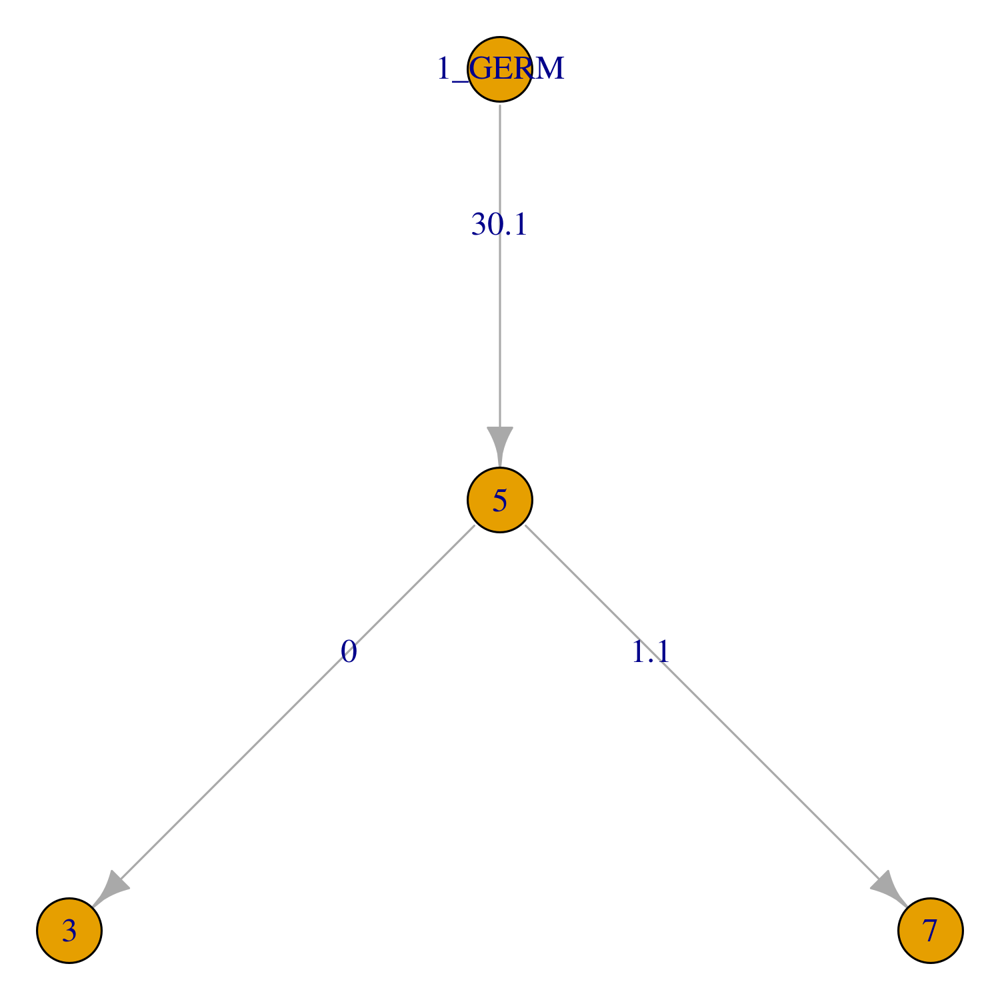
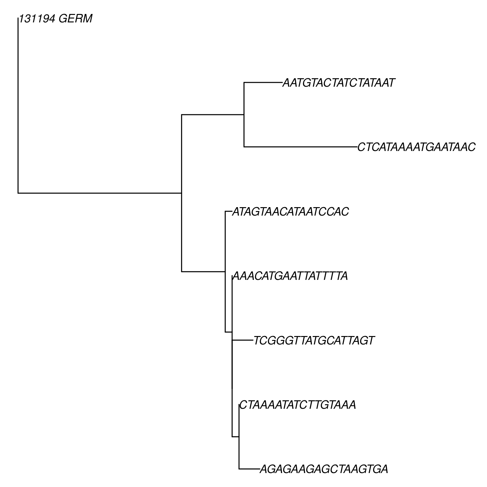

IgPhyML lineage tree analysis
===============================

IgPhyML is a program designed to build phylogenetic trees and test evolutionary 
hypotheses regarding B cell affinity maturation.

The biology of B cell somatic hypermutation (SHM) violates important assumptions 
in most standard phylogenetic substitution models; further, while most phylogenetics 
programs are designed to analyze single lineages, B cell repertoires typically 
contain thousands of lineages. IgPhyML addresses both of these issues by 
implementing substitution models that correct for the context-sensitive nature 
of SHM, and combines information from multiple lineages to give more precisely 
estimated repertoire-wide model parameter estimates. 

An in-depth description of IgPhyML installation and usage
can be found at the `IgPhyML website <https://igphyml.readthedocs.io>`__.

.. warning::

    The new repertoire-wide version of IgPhyML isn't officially released yet,
    so please let us know if you’re planning to publish anything using it.
    A lot of the features are still in active development, so feedback,
    especially with input/output format and problems encountered, would be
    greatly appreciated.

Quick start
-------------------------------------------------------------------------------

Once installed, IgPhyML can be run through 
:ref:`BuildTrees <BuildTrees>`
by specifying the ``--igphyml`` option. IgPhyML is easiest to run through the 
`Immcantation Docker image <https://igphyml.readthedocs.io/en/stable/install.html>`__.
If this is not possible, these instructions require Change-O 0.4.6 or higher, Alakazam 0.3.0 or higher,
and IgPhyML to be installed, with the executable in your ``PATH`` variable. 

The following commands should work as a first pass on many reasonably sized
datasets, but if you really want to understand what’s going on or make
sure what you’re doing makes sense, please check out the 
`IgPhyML website <https://igphyml.readthedocs.io>`__.
 
Build trees and estimate model parameters
-------------------------------------------------------------------------------
 
Download the IgPhyML repository, move to the ``examples`` folder, and run 
:ref:`BuildTrees <BuildTrees>`::

    # clone IgPhyML repository to get example files
    git clone https://bitbucket.org/kbhoehn/igphyml
 
    # move to examples directory
    cd igphyml/examples

    BuildTrees.py -d example.tab --outname ex --log ex.log --collapse \
        --sample 3000 --igphyml --clean all --nproc 1
 
This command processes an AIRR-formatted dataset of BCR sequences that have been
:ref:`clonally clustered <Cloning>`
with :ref:`germlines reconstructed <Germlines>`.
It then quickly builds trees using the GY94 model and, using these
fixed topologies, estimates HLP19 model parameters. This can be sped up by
increasing the ``--nproc`` option. Subsampling using the ``--sample`` option in isn't 
strictly necessary, but IgPhyML will run slowly when applied to large datasets. 
Here, the ``--collapse`` flag is used to collapse identical sequences. This is 
highly recommended because identical sequences slow down calculations without 
affecting likelihood values in IgPhyML.

Visualize results
-------------------------------------------------------------------------------

The output file of the above command can be read using the 
`readIgphyml <https://alakazam.readthedocs.io/en/stable/topics/readIgphyml>`__ 
function of 
`Alakazam <https://alakazam.readthedocs.io>`__.
After opening an ``R`` session in the ``examples`` subfolder, enter the following commands. Note that 
when using the Docker container, you'll need to run ``dev.off()`` after 
plotting the tree to create a pdf plot in the ``examples`` directory::

 library(alakazam)
 library(igraph)
 
 db = readIgphyml("ex_igphyml-pass.tab")

 #plot largest lineage tree
 plot(db$trees[[1]],layout=layout_as_tree)

 #show HLP10 parameters
 print(t(db$param[1,]))
 CLONE         "REPERTOIRE"
 NSEQ          "4"         
 NSITE         "107"       
 TREE_LENGTH   "0.286"     
 LHOOD         "-290.7928" 
 KAPPA_MLE     "2.266"     
 OMEGA_FWR_MLE "0.5284"    
 OMEGA_CDR_MLE "2.3324"    
 WRC_2_MLE     "4.8019"    
 GYW_0_MLE     "3.4464"    
 WA_1_MLE      "5.972"     
 TW_0_MLE      "0.8131"    
 SYC_2_MLE     "-0.99"     
 GRS_0_MLE     "0.2583"

   Lineage tree of example clone.

To visualize a larger dataset with bigger trees, and bifurcating tree topologies,
again open an ``R`` session in the ``examples`` directory::

 library(alakazam)
 library(ape)

 db = readIgphyml("sample1_igphyml-pass.tab",format="phylo")
 
 #plot largest lineage tree
 plot(ladderize(db$trees[[1]]),cex=0.7,no.margin=TRUE)

   Phylo-formatted lineage tree of a larger B cell clone.