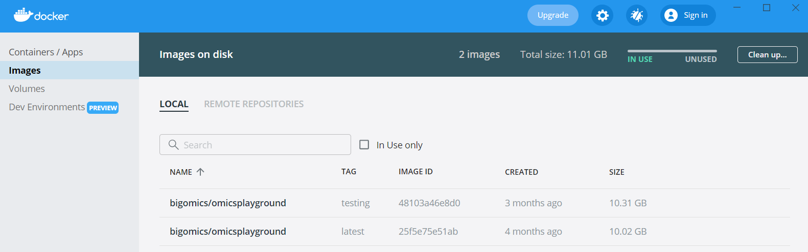
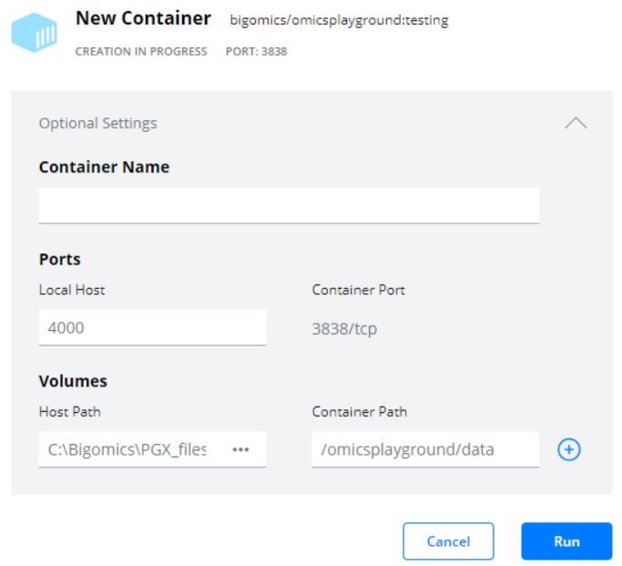

Installation
================================================================================

You can either run the platform from the source code, or download the
docker image. Running Omics Playground from the docker file is the
easiest way.

    
Run using the Docker file
--------------------------------------------------------------------------------
The docker file of the platform is available on `Docker Hub 
<https://hub.docker.com/r/bigomics/omicsplayground>`__.
In Linux OS and Mac OS, once Docker is installed, open a shell window. In Windows, once Docker Desktop is installed, go to “Type here Search” on the Windows taskbar and type: “Command Prompt”. Click on it to open it. Then follow these steps:

1. Pull the docker image using the command::

    docker pull bigomics/omicsplayground
    
2. In Linux and Mac OS, run the docker from a shell with::

    docker run --rm -p 4000:3838 bigomics/omicsplayground

Alternatively, you can open the GUI and follow the same instructions as given for Windows. 

3. In Windows, start Docker and then look under "Images" (as shown below). Once you have found the Omics Playground image, hover over it with your mouse until you see a blue "RUN" icon appear.

Click on “RUN” and then on "Optional settings". Edit the optional settings as shown in the image below. Your “Volume host path” can be any folder where you want to store the PGX files produced locally by the platform. Also type "/omicsplayground/data" in the "Container Path" box. This step is necessary if you want to access your PGX files from the home page. 
Set the port of the local host (“Local Host”) to 4000. You can optionally select a container name. 

4. Open ``http://localhost:4000`` in your browser to run the platform.

.. note::

    Warning. The docker image requires about 8GB hard disk space. Note: if you want the exact version of the NAR/GAB publication, download version v1.0, otherwise docker will download the latest version by default.

   
Run from source code
--------------------------------------------------------------------------------

Omics Playground is implemented in R using the `Shiny Server
<https://shiny.rstudio.com/>`__ web application framework. You will
need R and Shiny Server installed to run Omics Playground.

The source code of the platform is available on 
`GitHub <https://github.com/bigomics/omicsplayground>`__. You can 
download the latest release of the software by cloning
the repository. Below, we explain the steps required to set up the platform from
the source code:

1. Clone the GitHub repository using::

    git clone https://github.com/bigomics/omicsplayground.git
    
2. Install all necessary R packages by running the script in the ``R/`` folder::

    Rscript requirements.R
    
3. Run the following command in the ``build/`` folder to build the datasets::

    Rscript build-datasets.R

.. note::

    Building the datasets can vary from minutes to a couple of hours depending on their sizes.

4. Change the current directory into the ``shiny/`` folder and execute the following command
   to run the platform::

    R -e "shiny::runApp(launch.browser=TRUE)"

   If you have Shiny Server installed you can create a link to the
   shiny folder in the system-wide shiny-server apps folder or in your
   ShinyApps user folder.

   
    
