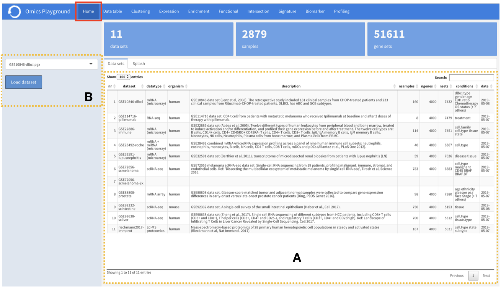

.. _Home:

Home
================================================================================

The platform starts running from the home page. Basically, this module contains 
general information about all available datasets within the platform
(see the figure below).

    
    
- **A**: For each dataset, this tab reports a brief description as well as the total
        number of samples, genes, gene sets (or pathways), the corresponding phenotypes
        and the collection date.
        
        
:**B**  Users can select and load the data of their interest and start the analysis 
        from here.