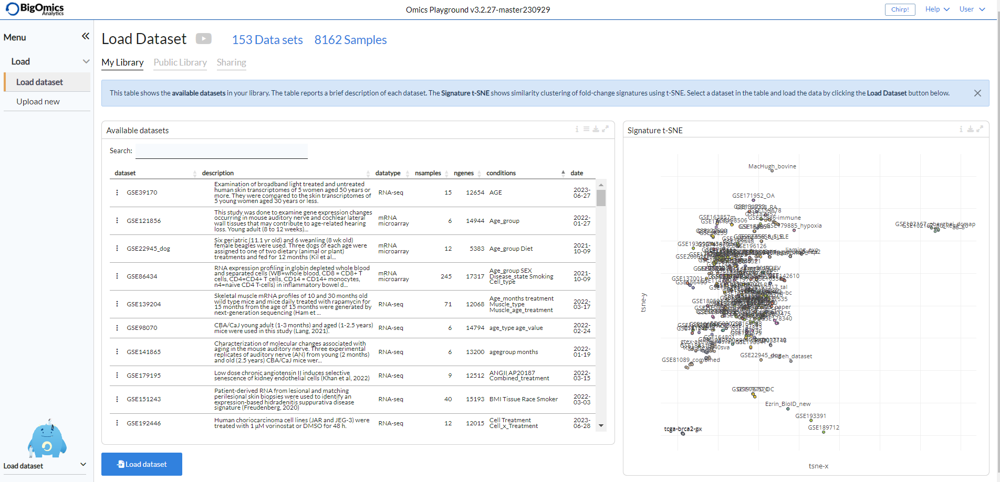
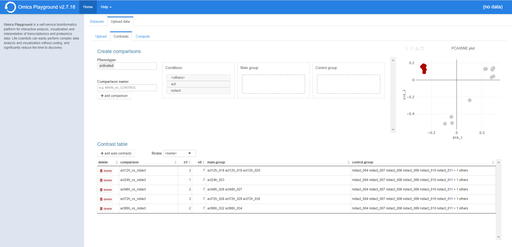

.. _Home:

Home Panel
================================================================================

Selecting the dataset
--------------------------------------------------------------------------------

The platform starts running from the **Home** panel. This panel shows
the available datasets within the platform. The table reports a brief
description as well as the total number of samples, genes, 
corresponding phenotypes and the collection date.

Users can select a dataset in the table and then click on the "Load dataset" button
at the bottom left to load a dataset into the platform. On the right hand side a
signature t-SNE plot is displayed . Each dot corresponds to a specific comparison. 
Signatures/datasets that are clustered closer together, are more similar.

The ``Dataset info`` shows
the information of the dataset of interest and users can load the data
by clicking the ``Load`` button. There are three additional icons to 
dwonload pgx files, download csv files and delete an entry.

.. figure:: figures/psc1.0.png
    :align: center
    :width: 30%

Upload data (Upload)
--------------------------------------------------------------------------------

Under the **Upload** subpanel of the **Upload data** panel users can upload their transcriptomics
and proteomics data to the platform. The platform requires three data
files as listed below: a data file containing counts/expression
(counts.csv), a sample information file (samples.csv) and an optional 
file specifying the statistical comparisons as contrasts (contrasts.csv). 
The file format must be comma-separated-values (CSV) text. 
Be sure the gene names match for all files. On the left side of the panel, 
users need to provide a unique name and brief description for the dataset 
while uploading.

:**counts.csv**: Count/expression file with gene on rows, samples as columns.
:**samples.csv**: Samples file with samples on rows, phenotypes as columns.
:**contrasts.csv**: Contrast file with conditions on rows, contrasts as columns.

Once uploaded, the platform generates three separate plots showing some stastics
and the structure of your input files.

.. figure:: ../modules/figures/psc1.3.png
    :align: center
    :width: 100%

The page also contains a *batch correction* option that allows users to perform batch correction 
on the data. Selecting it will open a new panel from which users can select the level of 
batch correction (low, medium or strong). Under *Advanced* users can fine-tune 
the process. This feature is still in beta and only recommended to users familiar with the 
batch correction precedure and parameters. More information can be found under :ref:`Methods`.

.. figure:: ../modules/figures/psc1.3.a.png
    :align: center
    :width: 100%

Upload data (Contrasts)
--------------------------------------------------------------------------------

Users can eschew adding a contrast file and instead generate contrasts via 
the **Contrasts** subpanel of the **Upload data** panel.
Available phenotypes will appear in the "Phenotypes" box as a scrolldown menu.
Selecting a phenotype will show the available conditions in the "Conditions" box.
Users can then drag individual groups in the "Main group" or "Control Group" boxes.
It is also possible to select individual samples from the "Conditions" box and phenotypes
can be furthermore combined in the "Phenotypes" box. The platform automatically generates 
a contrast name in the "Comparison name" box that users can manually edit. Clicking the 
"add comparison" button will add the selected contrast in the contrast table below.
Users can also task the platform to generate comparisons automatically by selecting a 
phenotype form the "Strata" box and clicking on "add auto-contrasts". However, we recommend
caution when using this function as it is error-prone.
The panel also produces a PCA/tSNE plot that users can consult as a guide for generating 
comparisons.

Upload data (Compute)
--------------------------------------------------------------------------------

The **Compute** subpanel is where users can start the computation of their data.
They need to provide a unique name for the dataset, indicate the type of data and 
provide a short description. Beginners can then click on the "Compute!" button and
let the platform run the calculations. Advanced users can click on "Advanced" to 
access several customisation options. In particular they can de-select feature 
filtering options, select different gene tests and enrichment methods combinations, 
include or exclude analysis types and select developer-specific options.

.. figure:: ../modules/figures/psc1.5.png
    :align: center
    :width: 100%
