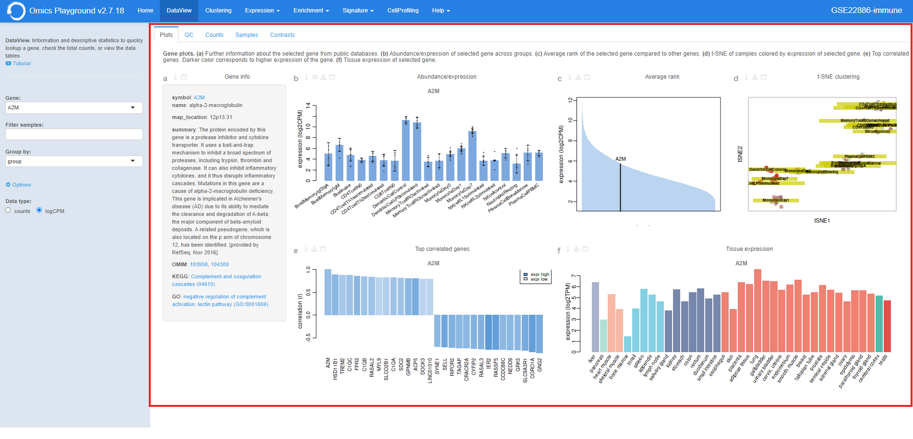

.. _Datatab:

Data table
================================================================================

The **Data Table** module provides a descriptive statistical analysis on a gene level
with visualisations. It has five panels, where each panel is explained below.

Users can find more information by clicking the ``Info`` button in the input slider
on the left side of the panel. It also contains some useful settings for the analysis.
The analysis can be started by selecting a gene of interest from the 
``Search gene`` settings. Under the *Options*, users can filter some samples in the
``Filter samples`` settings or collapse the samples by predetermined groups in the
``Group by`` settings. It is also possible to visualize 
the information on a raw count level, count per million (CPM), or logarithmic expression 
level (logCPM). 

.. figure:: figures/psc2.0.png
    :align: center
    :width: 40%

Plots
--------------------------------------------------------------------------------

The **Plots** panel displays figures related to the expression level of the selected
gene, correlation to other genes, and average expression ranking within the dataset.
To find out more information from the literature, hyperlinks are provide to connect
the selected gene to `OMIM <https://www.ncbi.nlm.nih.gov/omim/>`__, 
`KEGG <https://www.ncbi.nlm.nih.gov/pmc/articles/PMC102409/>`__, 
and `GO <http://geneontology.org/>`__ databases. 
It also correlates the gene to the expressions of other genes across datasets such
as `ImmProt <https://www.ncbi.nlm.nih.gov/pubmed/28263321>`__ 
and `HPA <https://www.nature.com/articles/nbt1210-1248>`__,
and plots the cumulative correlation. Furthermore,
it displays the tissue expression for a selected gene using the genotype-tissue
expression `GTEx <https://www.ncbi.nlm.nih.gov/pubmed/23715323>`__ dataset.
For each chart of the panel, a detailed explanation is provided below.

:**a**: For a gene specified by the user, the **plots** section displays figures 
        related to the expression level of the gene, correlation with other genes,
        and average expression ranking within the dataset. 

:**b**: In the visual analysis, users can filter out some samples or collapse
        the samples by phenotype class. It is also possible to visualize the 
        information on a raw count level (CPM) instead of a log2 level (logCPM).

:**c**: For further information from the literature, hyperlinks are provided to 
        link the selected gene to databases like `OMIM <https://www.ncbi.nlm.nih.gov/omim/>`__, 
        `KEGG <https://www.ncbi.nlm.nih.gov/pmc/articles/PMC102409/>`__, 
        and `GO <http://geneontology.org/>`__.

:**d**: It also correlates the gene to the expressions of other genes across 
        datasets such as `ImmProt <https://www.ncbi.nlm.nih.gov/pubmed/28263321>`__ 
        and `HPA <https://www.nature.com/articles/nbt1210-1248>`__, 
        and plots the cumulative correlation.

:**e**: Furthermore, tissue expression for a selected gene is displayed using
        the `GTEx <https://www.ncbi.nlm.nih.gov/pubmed/23715323>`__ database. 

:**f**: Furthermore, tissue expression for a selected gene is displayed using
        the `GTEx <https://www.ncbi.nlm.nih.gov/pubmed/23715323>`__ database. 
        
:**g**: Furthermore, tissue expression for a selected gene is displayed using
        the `GTEx <https://www.ncbi.nlm.nih.gov/pubmed/23715323>`__ database. 
        

Counts
--------------------------------------------------------------------------------

In the *Counts* panel, the total number of counts (abundance) per sample and their
distribution among the samples are displayed. For each sample, users can also see
the percentage of counts in terms of major gene types such as CD molecules, kinanses
or RNA binding motifs.

:**F**: The total number of counts (abundance) per sample and their distribution
        among the samples are displayed in the **counts** section. 

:**G**: For each sample, the user can also see the percentage of counts for major
        gene types, such as CD molecules, kinases or RNA binding motifs.

.. figure:: figures/ug.007.png
    :align: center
    :width: 100%

Gene table
--------------------------------------------------------------------------------
Under *Gene Table* panle, the exact expression values across the samples can be read,
where genes are ordered by the correlation with respect to the first gene. 
Gene-wise average expression of a phenotype sample grouping is also presented 
in this table.

Further correlation analysis across the samples can be performed under 
the **gene table** section, where genes are ordered in the table according
to the correlations with the selected gene. The gene-wise average expression
of samples per phenotype classes is also presented in the table. 

.. figure:: figures/ug.008.png
    :align: center
    :width: 100%

Sample table
--------------------------------------------------------------------------------

In the *Sample Table* panel, more complete information about samples and their 
phenotype grouping can be found.

More detailed information about the samples and comparisons are reported under
the **sample table** section.

.. figure:: figures/ug.009.png
    :align: center
    :width: 100%
