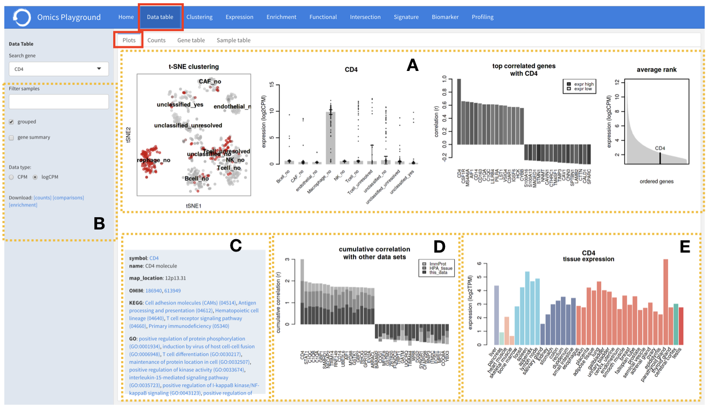
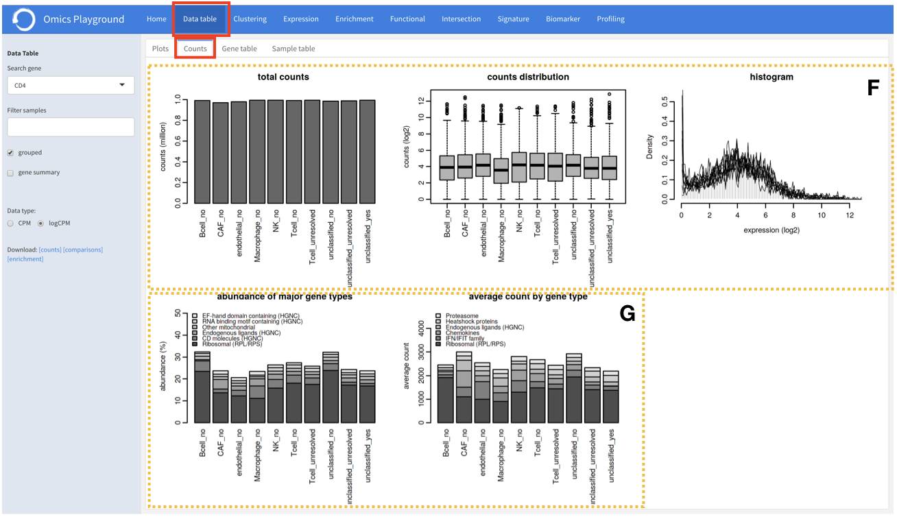
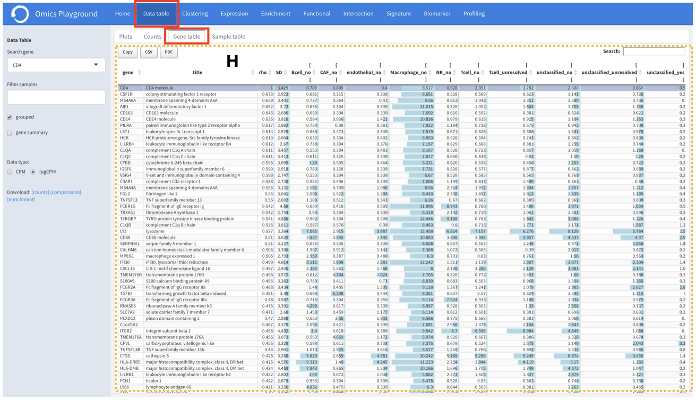
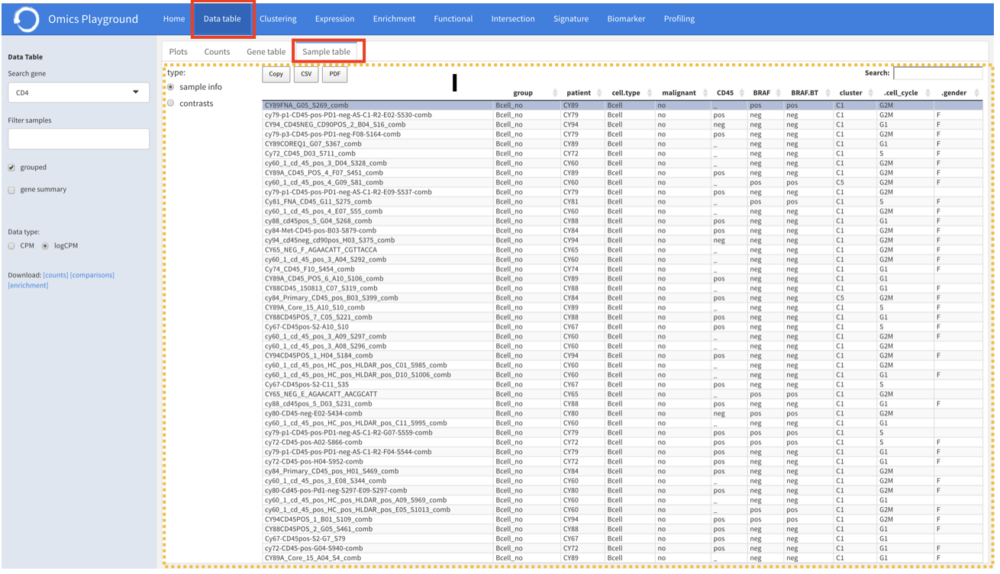

.. _Datatab:

Data table
================================================================================

For the selected dataset, the data table module provides a descriptive 
statistical analysis at a gene level with visualizations. It has four sections
which are described below.

Plots
--------------------------------------------------------------------------------
:**A**: For a gene specified by the user, the plots section displays figures 
        related to the expression level of the gene, correlation with other genes,
        and average expression ranking within the dataset. 

:**B**: In the visual analysis, users can filter out some samples or collapse
        the samples by phenotype class. It is also possible to visualize the 
        information on a raw count level (CPM) instead of a log2 level (logCPM).

:**C**: For further information from the literature, hyperlinks are provided to 
        link the selected gene to databases like OMIM \cite{hamosh2005online}, 
        KEGG \cite{kanehisa2000kegg}, and GO \cite {gene2004gene}.

:**D**: It also correlates the gene to the expressions of other genes across 
        datasets such as ImmProt and HPA, and plots the cumulative correlation.

:**E**: Furthermore, tissue expression for a selected gene is displayed using
        the GTEx database. 

Counts
--------------------------------------------------------------------------------

:**F**: The total number of counts (abundance) per sample and their distribution
        among the samples are displayed in the ``counts`` section. 

:**G**: For each sample, the user can also see the percentage of counts for major
        gene types, such as CD molecules, kinases or RNA binding motifs.

Gene table
--------------------------------------------------------------------------------
Further correlation analysis across the samples can be performed under the 
\texttt{gene table} section, where genes are ordered in the table according to 
the correlations with the selected gene. The gene-wise average expression of samples 
per phenotype classes is also presented in the table. More detailed information 
about the samples is reported in the \texttt{sample table} (\textbf{Supp. Fig. 7-8}).

Sample table
--------------------------------------------------------------------------------
Further correlation analysis across the samples can be performed under the 
\texttt{gene table} section, where genes are ordered in the table according to 
the correlations with the selected gene. The gene-wise average expression of samples 
per phenotype classes is also presented in the table. More detailed information 
about the samples is reported in the \texttt{sample table} (\textbf{Supp. Fig. 7-8}).

