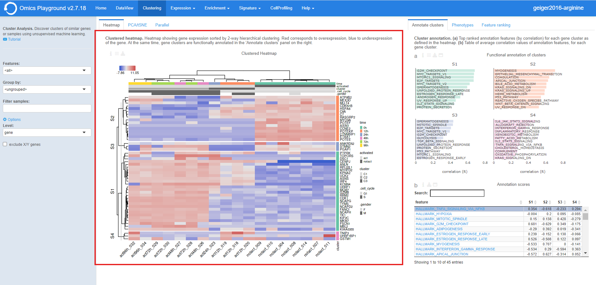
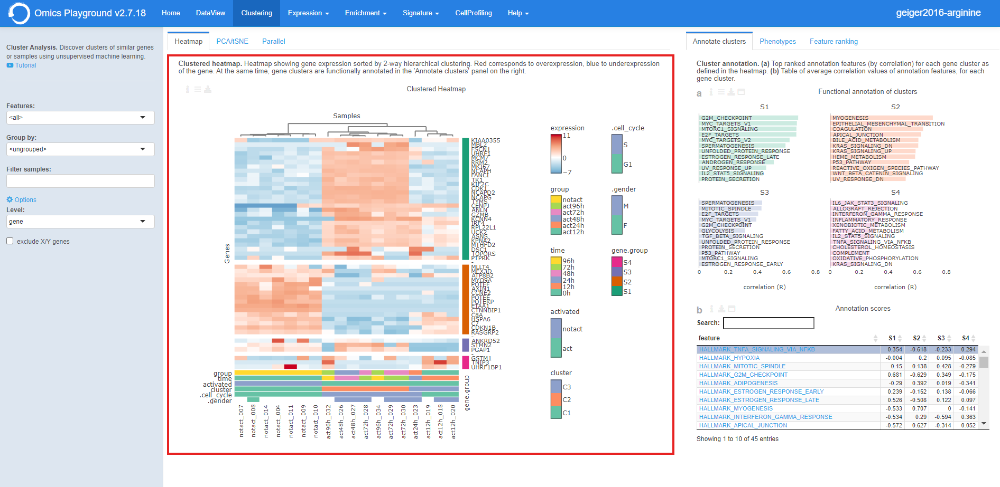
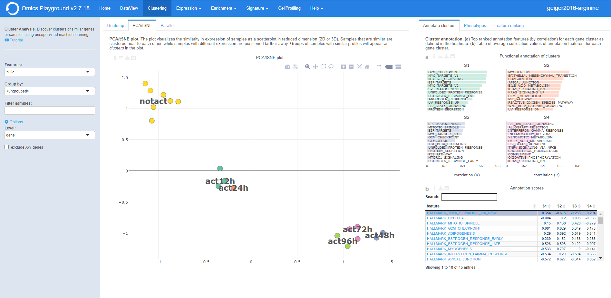

.. _Clustering:

Clustering analysis
================================================================================

The **Cluster Analysis** module performs unsupervised clustering analysis of the data. 
After having done the QC, it is probably the first way to explore your data. 
The main purpose is to discover patterns and subgroups in the data, show correlation
with known phenotypes, detect outliers, or investigate batch effects.

In the **Heatmap** panel hierarchical clustering can be performed on gene level 
or gene set level. During the heatmap generation, the platform provides a functional
annotation for each feature cluster in **Annotate cluster** panel, where users can
select from a variety of annotation databases from the literature. 
The **PCA/tSNE** panel shows unsupervised clustering of the samples in 2D/3D as
obtained by PCA or tSNE algorithms. 
The **Phenotypes** panel on the right, shows the phenotype distribution as colors
on the t-SNE plot.

.. note::

    EXPERT MODE ONLY: The **Feature ranking** panel computes a discriminant 
    score for gene (or geneset) families. This allows to investigate what 
    family of genes (or gene sets) can best discriminate the groups.

Heatmap
--------------------------------------------------------------------------------
In the **Heatmap** panel hierarchical clustering can be performed on gene level
or gene set level expression in which for the latter, for each gene set (or pathway),
an average expression is computed from the gene expression data using summary methods
such as `GSVA <https://bmcbioinformatics.biomedcentral.com/articles/10.1186/1471-2105-14-7>`__
and `ssGSEA <https://bmcbioinformatics.biomedcentral.com/articles/10.1186/1471-2105-14-7>`__. 

Users can find more information by clicking ``Info`` in the input slider. 
It also contains settings for the analysis, where users can 
specify the level analysis in the ``Level`` and select a family of features
in the ``Features``. Furthermore, under the *Options*,
it is possible to filter the relevant 
samples in the ``Filter samples`` and group the samples by a predefined 
phenotype class in the ``grouped``.

.. figure:: figures/psc3.0.png
    :align: center
    :width: 30%

Under the plot configuration *Settings*, users can split the samples by a phenotype
class (e.g., tissue, cell type, or gender) using the ``split`` by setting. 
In addition, users can specify the top N = (50, 500) features to be used in the heatmap. 
The ordering of top features is selected under ``top mode``. 
The criteria to select the top features are:

1. SD - features with the highest standard deviation across all the samples,
2. specific - features that are overexpressed in each phenotype class compared to the rest, or by
3. PCA - by principal components.

Users can also choose between 'relative' or 'absolute' expression scale. 
Under the ``CexCol`` and ``CexRow`` settings, it is also possible to adjust the cex 
for the column and row labels.

.. figure:: figures/psc3.1.0.png
    :align: center
    :width: 30%
        
The complex heatmap below is generated after tuning the options and settings. 

Annotate clusters
--------------------------------------------------------------------------------
:**F**: The top features in the heatmap (figure **D**) are then divided 
        into five clusters based on their expression profiles. For each 
        cluster, the platform provides a functional annotation under the
        **annotate cluster** section using more than 42 published reference 
        databases, including but not limited to well-known databases such as 
        `MSigDB <http://software.broadinstitute.org/gsea/msigdb/index.jsp>`__,
        `KEGG <https://www.ncbi.nlm.nih.gov/pmc/articles/PMC102409/>`__, 
        and `GO <http://geneontology.org/>`__.
        
:**E**: Furthermore, users can see the enrichment scores for the reference set used 
        in annotating clusters

PCA/tSNE
--------------------------------------------------------------------------------
PCA and t-SNE plots can be found in the **PCA/tSNE** tab, which shows 
the relationship (or similarity) between samples in 2D as well as in 3D space for 
visual analytics. Similarity is visualized as proximity of the points. 
Samples that are 'similar' will be placed close to each other. 
Users can customise the PCA/tSNE plot, including colors and shapes of points
using a phenotype class provided in the data.

It also provides a **PCA/tSNE** plot of samples 
obtained by `principal components analysis <https://www.ncbi.nlm.nih.gov/pubmed/19377034>`__
or `t-distributed stochastic embedding <http://jmlr.org/papers/volume15/vandermaaten14a/vandermaaten14a.pdf>`__
algorithms.

    
