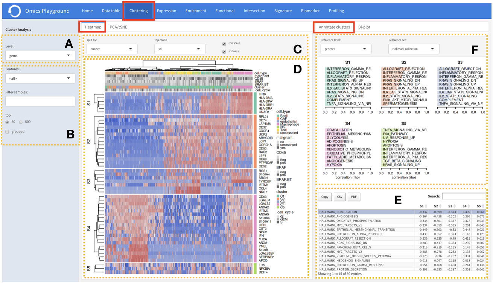
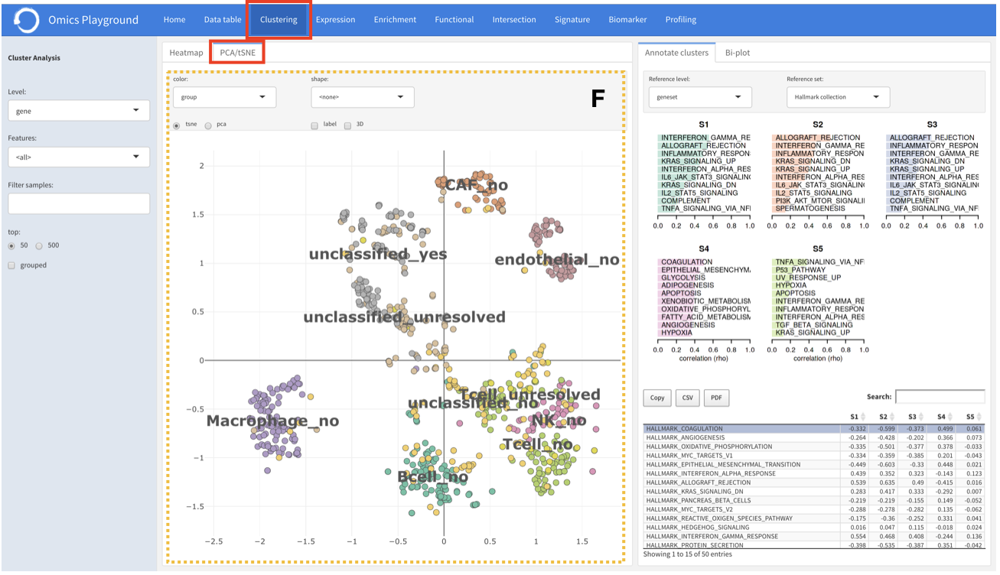

.. _Clustering:

Clustering
================================================================================

The clustering module performs a holistic clustering analysis of the samples. 
The main output of this feature is twofold: i) It generates a \texttt{heatmap} 
of samples and ii) It also provides a \texttt{PCA}/\texttt{tSNE} plot of samples 
obtained by principal components analysis or t-distributed stochastic embedding 
algorithms \cite{witten2009penalized, van2014accelerating}.

Heatmap
--------------------------------------------------------------------------------
:**A**: The heatmap analysis can be performed on a gene level expression or gene
        set level expression in which, for each gene set (or pathway), an average
        expression is computed from the gene expression data using summary methods
        such as GSVA and ssGSEA \cite{hanzelmann2013gsva}. 
        
        
:**B-D**: During the \texttt{heatmap} generation, users have various option that 
          they can select, such as splitting the samples by a phenotype class 
          provided in the data (eg, tissue, cell type, or gender). In addition,
          users have to specify the top N = {50, 500} features to be used in the 
          heatmap for hierarchical clustering. The criteria to select the top 
          features are: 1) sd - features with the highest standard deviation across
          all the samples, 2) biomarker - features that are overexpressed in each 
          phenotype class compared to the rest, 3) pca - principal components 
          computed by the \texttt{irlba} package \cite{witten2009penalized}. 

Heatmap and Annotate cluster
--------------------------------------------------------------------------------
:**F**: The top features in the heatmap (figure **D**) are then divided 
        into five clusters based on their expression profiles. For each 
        cluster, the platform provides a functional annotation under the
        \texttt{annotate cluster} section using more than 42 published reference 
        databases, including but not limited to well-known databases such as 
        MSigDB, KEGG and GO \cite{liberzon2011molecular, kanehisa2000kegg, gene2004gene}.
        
:**E**: Furthermore, users can see the enrichment scores for the reference set used 
        in annotating clusters

PCA/tSNE
--------------------------------------------------------------------------------
PCA and t-SNE plots can be found in the \texttt{PCA}/\texttt{tSNE} tab, which shows 
the relationship between samples in 2D as well as in 3D space for visual analytics. 
Users can customise the PCA/tSNE plot using a phenotype class provided in 
the data.

The PCA/tSNE tab shows the similarity between samples in 2D space as well as in 3D 
space for visual analytics. Similarity is visualized as proximity of the points. 
Samples that are 'similar' will be placed close to each other. Groups of similar 
samples will form 'clusters of points'. Users can color the samples or give 
different shape to the samples by a phenotype class provided in the data. 
By changing the color/shape of the points you can examine if the clustering 
corresponds to certain phenotypes.

    
