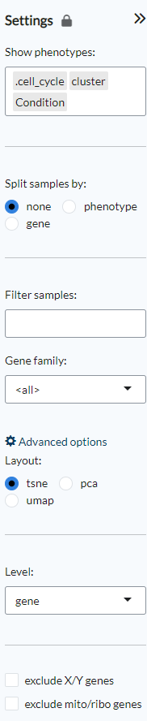
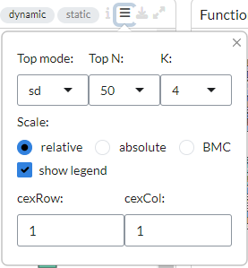
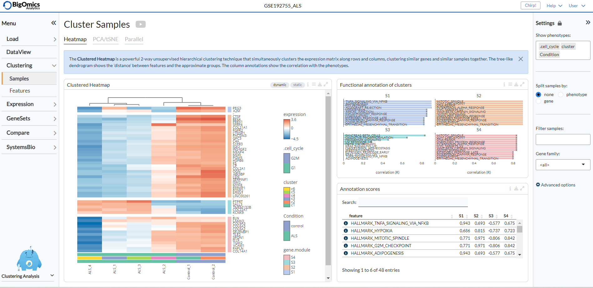
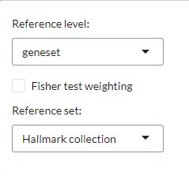
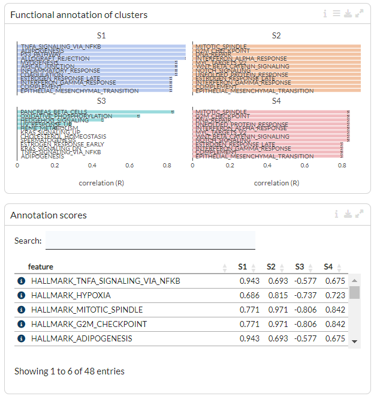
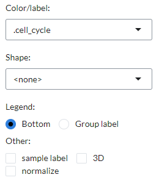
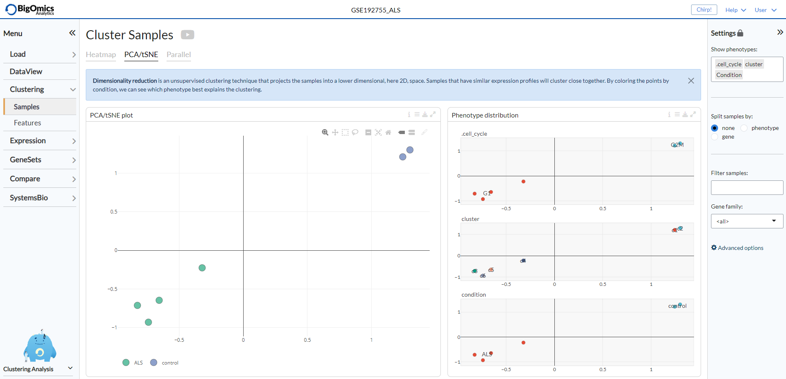
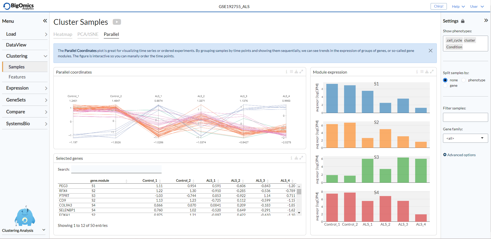
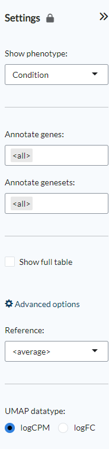

.. _Clustering:

Clustering
================================================================================

The **Clustering** module performs unsupervised clustering analysis of the data. 
After having done the QC, it is probably the first way to explore your data. 
The main purpose is to discover patterns and subgroups in the data, show correlation
with known phenotypes, detect outliers, or investigate batch effects.

The module is divided into two submodules: **Samples** and **Features**.

Under the **Samples** submodule you can find classical clustering functions.
In the **Heatmap** panel hierarchical clustering can be performed on gene level 
or gene set level. The **PCA/tSNE** panel shows unsupervised clustering of the samples 
in 2D/3D as obtained by PCA or tSNE algorithms. The **Parallel** panel displays the 
expression levels of selected genes across all conditions.
On the right, the **Annotate cluster** panel provides a functional annotation for each 
feature cluster in the heatmap. Users can select from a variety of annotation databases 
from the literature. The **Phenotypes** panel shows the phenotype distribution as colors
on the t-SNE plot. Finally, the **Feature ranking** panel  shows a plot that ranks 
the discriminative power of feature sets (or gene sets) as the cumulative discriminant 
score for all phenotype variables.

The **Features** submodule performs clustering at either the gene level (**Gene** panel)
or at the geneset level (**Geneset** panel). For both a gene or geneset UMAP plot is
displayed, next to a "Gene Signatures" UMAP plot, where users can visualise specific 
phenotypes. Finally, below the plots, a table contains eithe the genes or genesets 
in a given selected area.

Samples
*******************************************************************************

Settings panel
--------------------------------------------------------------------------------
The settings panel on the right displays various options to customise the plots.
Under ``Show phenotypes`` users can choose which phenotypes will be displayed in the
Phenotype distribution plot under the **PCA/tSNE** panel.
The ``Split samples by`` option applies only to heatmaps. "None" is the default view, 
"phenotypes" will redraw the heatmap based on the selected phenotype and "gene" allows
users to split the heatmap based on the expression level of a gene that can be selected
from a scrolldown menu. ``Filter samples`` can be used to represent only a specific
subset of samples in the heatmaps, PCA/tSNE/UMAP plots and the parallel coordinates plot.
Under ``Gene family`` a user can select whether the heatmap and parallel coordinates plot
will be built based on all the genes, a specific contrast, a specific gene family 
or alternatively a custom list of genes provided by the user that can be pasted 
in the appropriate space. 
Furthermore, under *Advanced options*, users can choose the layout of the clustering
plots (PCA, tSNE or UMAP), the level of analysis (gene or geneset) and exclude
mitochondrial and ribosomal genes and/or genes in the X and Y chromosomes.

Heatmap
--------------------------------------------------------------------------------
In the **Heatmap** panel hierarchical clustering can be performed on
gene level or gene set level expression. For the latter, for each gene
set (or pathway), a single-sample enrichment value is computed from
the gene expression data using summary methods such as `GSVA
<https://bmcbioinformatics.biomedcentral.com/articles/10.1186/1471-2105-14-7>`__
and `ssGSEA
<https://bmcbioinformatics.biomedcentral.com/articles/10.1186/1471-2105-14-7>`__.

Next to the plot configuration settings, users can select between a "dynamic" or "static" heatmap.
From the plot configuration settings on top of the plot, users can choose various options to 
customise their heatmaps. It is possible to order the top features under ``top mode`` as follows:

* sd - features with the highest standard deviation across all the samples,
* PCA - by principal components.
* marker - features that are overexpressed in each phenotype class compared to the rest

In addition, users can specify the ``Top N`` (50, 150, 500) genes to be used 
in the heatmap and the number of gene clusters to be displayed under ``K``.
Users can also choose between 'relative', 'absolute' or 'BMC' (batch-mean centered) expression
scale. Under the ``CexCol`` and ``CexRow`` settings, it is also possible to adjust the font sizes
for the column and row labels. The legend in the heatmap can be disabled by unticking the
``show legend`` option.

        
The complex heatmap below is generated with the "static" option active. 
It is a clustered heatmap showing gene expression sorted by 2-way hierarchical
clustering. Red corresponds to overexpression, blue to underexpression of the gene.
At the same time, gene clusters are functionally annotated in the **Annotate clusters**
panel on the right.

.. figure:: figures_v3/heatmap_stat.png
    :align: center
    :width: 100%

Activating the "dynamic" option generates an interactive version of the clustered heatmap. 
Users should be aware that for large datasets (such as single-cell RNA-seq data) this plot can become
rather slow.

Annotate clusters
--------------------------------------------------------------------------------
The features in the heatmap are divided into clusters depending on the
selected ``top mode`` in the heatmap panel settings. For each cluster,
the **Annotate cluster** section provides a functional annotation
using more than 42 published reference databases, including but not
limited to well-known databases such as `MSigDB
<http://software.broadinstitute.org/gsea/msigdb/index.jsp>`__, `Wikipathways
<https://www.wikipathways.org/>`__, and `GO
<http://geneontology.org/>`__.  In the plot settings, users can
specify the level and reference set to be used under the ``Reference
level`` and ``Reference set`` settings, respectively. 
Users can also select a Fisher test weighting for gene sets.

The functional annotation for the clusters are displayed below, with
the highest ranking annotation features (by correlation) displayed for
each gene cluster. Length of the bars corresponds to the average
correlation of the cluster with the annotation term. In the table
below the barplots, users can view the correlation values of
annotation features for each cluster.

PCA/tSNE
--------------------------------------------------------------------------------
The **PCA/tSNE** panel visualizes unsupervised clustering obtained by the principal
components analysis (`PCA <https://www.ncbi.nlm.nih.gov/pubmed/19377034>`__), 
t-distributed stochastic embedding 
(`tSNE <http://jmlr.org/papers/volume15/vandermaaten14a/vandermaaten14a.pdf>`__) 
or Uniform Manifold Approximation and Projection (`UMAP <https://arxiv.org/abs/1802.03426>__) algorithms. 
This plot shows the relationship (or similarity) between the samples for visual 
analytics, where similarity is visualized as proximity of the points. 
Samples that are 'similar' will be placed close to each other.

Users can customise the PCA/tSNE/UMAP plot in the plot settings, including
the ``color/label`` and ``shape`` of points using a phenotype class, the placement
of the plot legend at the bottom or as a group label, the inclusion of sample labels,
the choice between a 2D/3D plot display and the normalisation of the plot matrix.

To the right of the PCA/tSNE/UMAP plot (labelled as *PCA/tSNE plot*) the platform also generates a group of
plots, entitled *Phenotype distribution*, that visualise the distribution of the available phenotype data.
The plots show the distribution of the phenotypes superposed on the t-SNE clustering.

Parallel
--------------------------------------------------------------------------------
The **Parallel** panel visualizes the expression levels of selected genes across 
all conditions in the plot labelled *Parallel coordinates*. The expression values are 
scaled but scaling can be removed via the plot settings, where gene expression levels 
can also be averaged by gene module. This interactive plot is particularly useful to users 
working with time series experiments, as samples can be grouped by condition (i.e. time) and ordered manually.
A table (named *Selected genes*) containing average expression levels of selected genes across conditions is generated
below the plot. Finally, to the right of the *Parallel coordinates* plot, a series of histograms 
are group together in the *Module expression* panel and  display the overal expression of each module 
(the number of which is defined by the ``K`` value selected in the heatmap settings) by individual sample.

Features
*******************************************************************************

Settings panel
--------------------------------------------------------------------------------
Using the ``Show phenotype`` option the phenotypes that will be shown
in the *Gene signatures* plots can be selected. Users can also select whether
to use all genes for the *Gene UMAP* plot or instead select a combination 
of gene families under the ``Annotate genes`` option. The ``Annotate genesets``
option provides the same functionality for the *Geneset UMAP* plot based on the available
geneset collections The ``Show full table`` option shows the full list of unfiltered genes
or genesets. Under the advanced options users can select which sample group to use as
a ``Reference`` to calculate the standard-deviation of log-expression (sd.X), 
or standard-deviation of the fold-change (sd.FC). If none is selected, the average values
for all samples will be used instead. The final option, ``UMAP datatype``, is used to select 
how the UMAP plot will be computed: either using the normalised log-expression (logCPM) 
or log-fold change matrix (logFC). logCPM is the default choice, while logFC can be used 
if batch or tissue effects are present in the dataset,

Gene
--------------------------------------------------------------------------------
The **Gene** submodule contains three panels. The **Gene UMAP** panel displays 
the UMAP clustering of genes colored by standard-deviation of log-expression(sd.X), 
or standard-deviation of the fold-change (sd.FC) and using the covariance of gene expression
as a distance metric.

Geneset
--------------------------------------------------------------------------------
