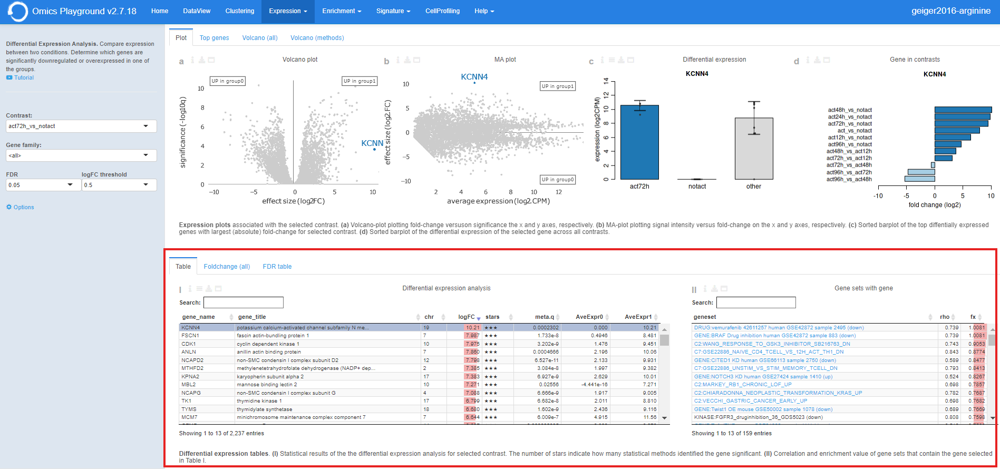
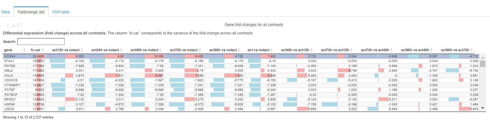
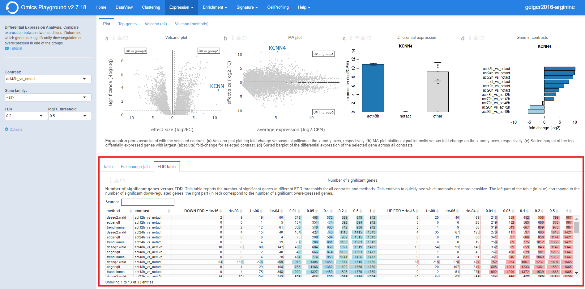
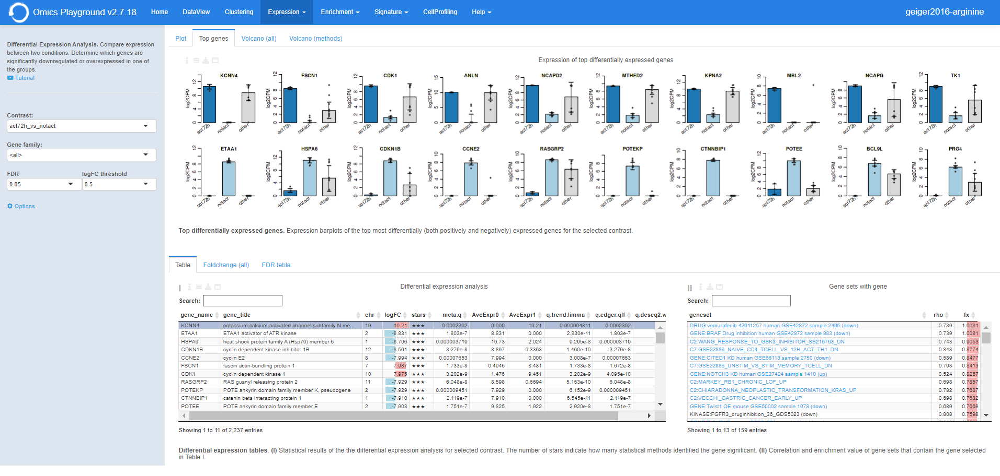
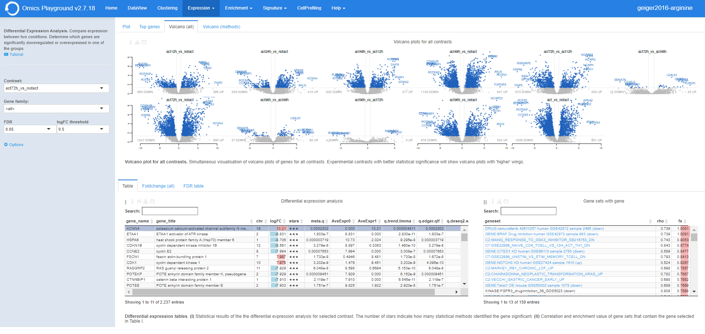
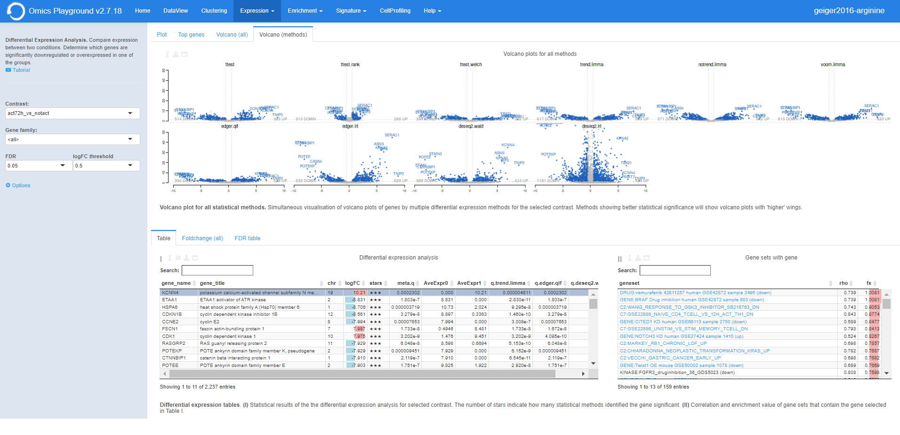

.. _Differential Expression:

Differential expression
================================================================================

Input panel
--------------------------------------------------------------------------------
The input panel on the left contains a link to a tutorial for relevant, as well as some settings 
for the analysis. Users can start the differntial expression (DE) analysis by selecting a contrast 
of their interest in the ``Contrast`` setting and specifying a relevent gene family in the 
``Gene family`` setting. It is possible to set the false discovery rate (FDR) and the 
logarithmic fold change (logFC) thresholds under the ``FDR`` and ``logFC threshold`` settings, respectively. 
Under "Options", users can select to display all genes in the table (not only significant genes) 
and also select different combinations of statistical methods for the analysis.

.. figure:: figures/psc4.0.png
    :align: center
    :width: 30%

Table
--------------------------------------------------------------------------------
Table ``I`` shows the results of the statistical tests slected in the 
``Statistical methods``. By default, this table reports 
the meta (combined) results of 
`DESeq2 <https://www.ncbi.nlm.nih.gov/pmc/articles/PMC4302049/>`__ (Wald),
`edgeR <https://www.ncbi.nlm.nih.gov/pubmed/19910308>`__ (QLF), and 
`limma <https://www.ncbi.nlm.nih.gov/pubmed/25605792>`__ (trend) only.
Users can filter top N = {10} differently expressed genes in the table by 
clicking the ``top 10 genes``  and also show the q-values from individual statistical methods 
by ticking ``show individual q-values`` from the table *Settings*.

.. figure:: figures/psc4.1.0.png
    :align: center
    :width: 30%
    
For a selected comparison under the ``Contrast`` setting, the results of the selected 
methods are combined and reported in Table ``I``, where ``meta.q`` for a gene 
represents the highest ``q`` value among the methods and the number of stars for 
a gene indicate how many methods identified significant ``q`` values (``q < 0.05``). 
The table is interactive (scrollable, clickable); users can sort genes by ``logFC``, 
``meta.q``, or average expression in either conditions.

By clicking on a gene in the Table ``I`` (highlighted in purple in the figure), 
it is possible to see the correlation and enrichment value of gene sets that 
contain the gene in Table ``II``.

Foldchange (all)
--------------------------------------------------------------------------------
The **Foldchange (all)** tab reports the gene fold changes for all contrasts in the selected dataset.
The column ``fc.var`` corresponds to the variance of the fold-change across all contrasts.

FDR table
--------------------------------------------------------------------------------
The **FDR table** tab reports the number of significant genes at different FDR thresholds for 
all contrasts and methods within the dataset. This enables to quickly see which 
methods are more sensitive. The left part of the table (in blue) correspond 
to the number of significant down-regulated genes, the right part (in red) 
correspond to the number of significant overexpressed genes.

Plot
--------------------------------------------------------------------------------
The **Plot** panel shows the following plots:

:**a**: An interactive volcano plot for the chosen contrast. Unless a specific gene is selected 
        from the differential expression analysis table, all significant genes are highlighted in blue.

:**b**: An interactive MA plot for the chosen contrast. Unless a specific gene is selected 
        from the differential expression analysis table, all significant genes are highlighted in blue.

:**c**: Differential expression boxplot for a gene that is selected from the 
        differential expression analysis table. Users can customise the plot via the settings icon on top 
        to ungroup samples and change the scale to counts per million (CPM).

:**d**: Fold change summary barplot across all contrasts for a gene that is selected 
        from the differential expression analysis table.

Top genes
--------------------------------------------------------------------------------
The **Top genes** section shows the average expression plots across the samples for the top differentially 
(both positively and negatively) expressed genes for the selected comparison from the ``Contrast`` setting.

The plot can be customised via the settings to remove the log scale, ungroup samples and show only samples 
included in the selected contrast.

.. figure:: figures/psc4.2.0.png
    :align: center
    :width: 30%

Volcano (all)
--------------------------------------------------------------------------------
Under the **Volcano (all)** tab, the platform simultaneously displays multiple volcano plots 
for genes across all contrasts. By comparing multiple volcano plots, 
the user can immediately see which comparison is statistically weak or strong.
Experimental contrasts with better statistical significance will show 
volcano plots with 'higher' wings.

Volcano (methods)
--------------------------------------------------------------------------------
Under the **Volcano (methods)** tab, the platform displays the volcano plots provided by 
multiple differential expression calculation methods for the selected contrast. 
Methods showing better statistical significance will show volcano 
plots with 'higher' wings.

