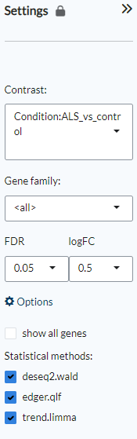
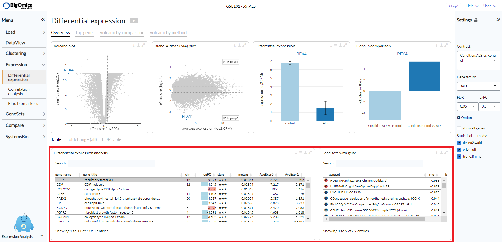
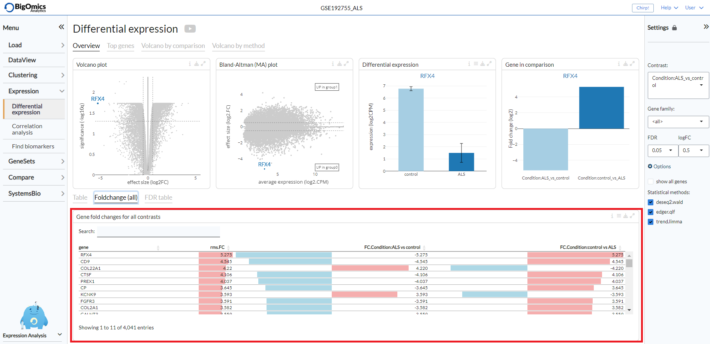
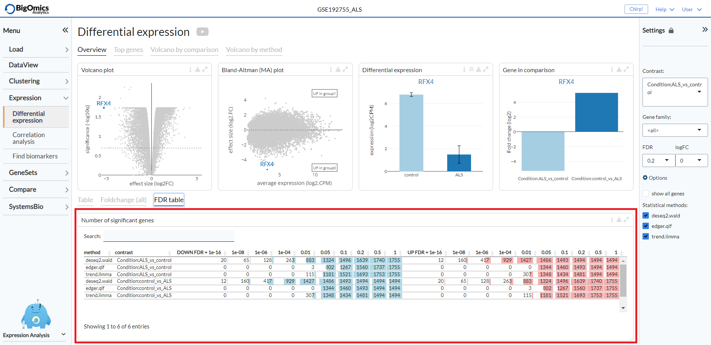
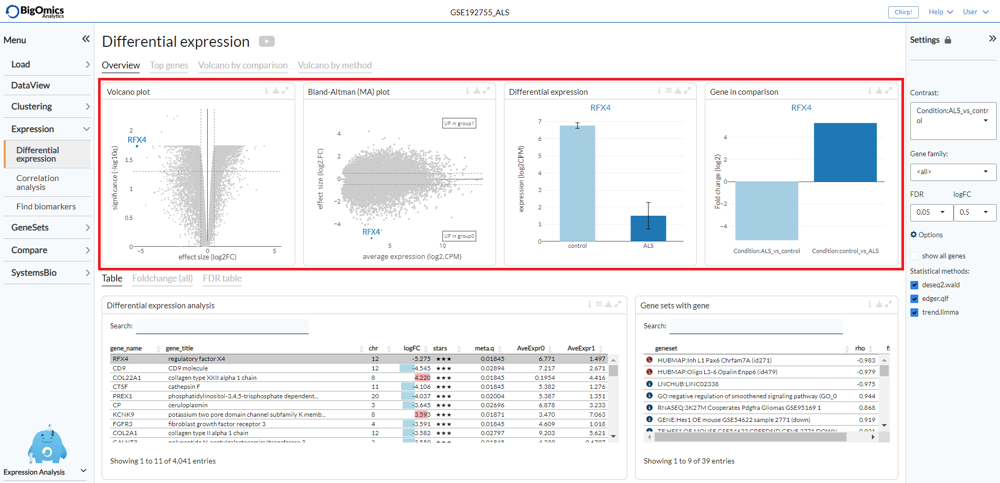
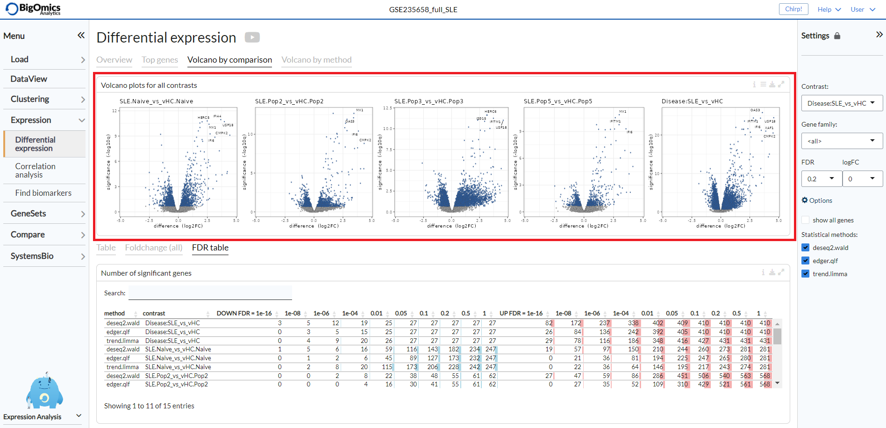
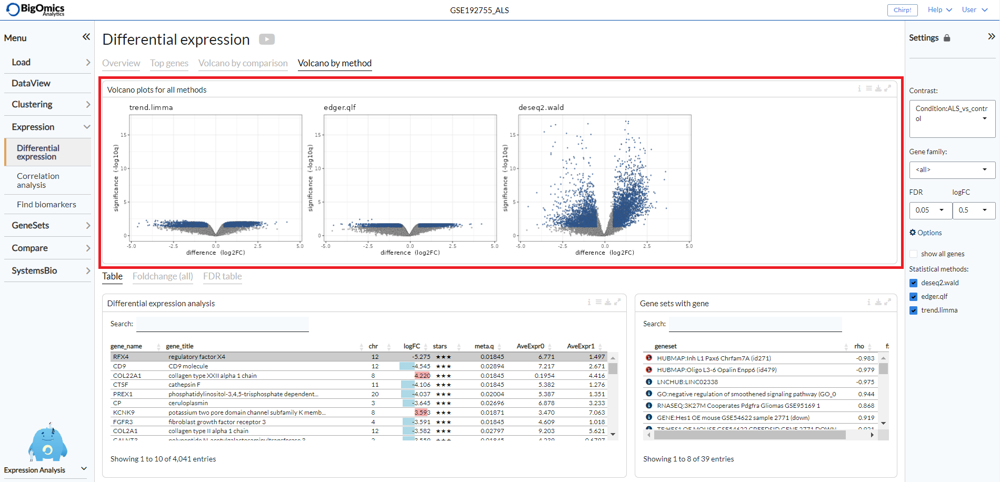
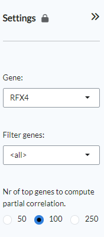
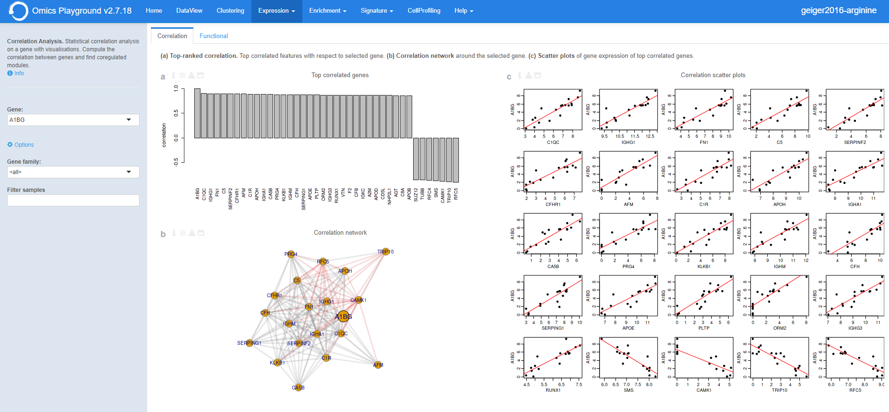
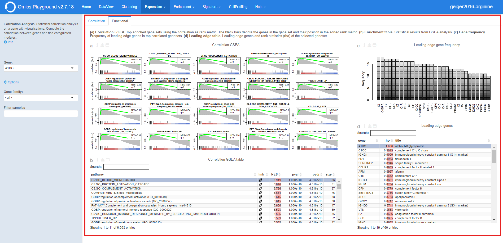

.. _Expression:

Expression
================================================================================

The **Expression** module is divided into three submodules. The **Differential Expression** 
panel compares expression between two conditions (i.e. tumor versus control), 
which is one of the fundamental analysis in the transcriptomics data analytics workflow. 
For each comparison of two conditions (also called a 'contrast'), the analysis identifies 
which genes are significantly downregulated or overexpressed in one of the groups.

The **Correlation Analysis** submodule computes the correlation between genes and finds 
coregulated modules.

Finally, the **Find biomarkers** submodule is used to identify potential biomarkers for a set 
of phenotypic groups based on gene or protein expression values.

Differential expression
--------------------------------------------------------------------------------

Settings panel
~~~~~~~~~~~~~~~~~~~~~~~~~~~~~~~~~~~~~~~~~~~~~~~~~~~~~~~~~~~~~~~~~~~~~~~~~~~~~~~~
The settings panel on the right contains some settings for the analysis. 
Users can start the differntial expression (DE) analysis by selecting a contrast 
of their interest in the ``Contrast`` setting and specifying a relevent gene family in the 
``Gene family`` setting. It is possible to set the false discovery rate (FDR) and the 
logarithmic fold change (logFC) thresholds under the ``FDR`` and ``logFC threshold`` settings, respectively. 
Under "Options", users can select to display all genes in the table (not only significant genes) 
and also select different combinations of statistical methods for the analysis.

Table
~~~~~~~~~~~~~~~~~~~~~~~~~~~~~~~~~~~~~~~~~~~~~~~~~~~~~~~~~~~~~~~~~~~~~~~~~~~~~~~~
The ``Differential expression analysis`` table shows the results of the statistical tests slected in the 
``Statistical methods``. By default, this table reports 
the meta (combined) results of 
`DESeq2 <https://www.ncbi.nlm.nih.gov/pmc/articles/PMC4302049/>`__ (Wald),
`edgeR <https://www.ncbi.nlm.nih.gov/pubmed/19910308>`__ (QLF), and 
`limma <https://www.ncbi.nlm.nih.gov/pubmed/25605792>`__ (trend) only.
Users can filter top N = {10} differently expressed genes in the table by 
clicking the ``top 10 genes``  and also show the q-values from individual statistical methods 
by ticking ``show individual q-values`` from the table *Settings*.

.. figure:: figures/psc4.1.0.png
    :align: center
    :width: 30%
    
For a selected comparison under the ``Contrast`` setting, the results of the selected 
methods are combined and reported in the ``Differential expression analysis`` table, where ``meta.q`` for a gene 
represents the highest ``q`` value among the methods and the number of stars for 
a gene indicate how many methods identified significant ``q`` values (``q < 0.05``). 
The table is interactive (scrollable, clickable); users can sort genes by ``logFC``, 
``meta.q``, or average expression in either conditions.

By clicking on a gene in the the ``Differential expression analysis`` table (highlighted in grey in the figure), 
it is possible to see the correlation and enrichment value of gene sets that 
contain the gene in the the ``Gene sets with gene`` table.

Foldchange (all)
~~~~~~~~~~~~~~~~~~~~~~~~~~~~~~~~~~~~~~~~~~~~~~~~~~~~~~~~~~~~~~~~~~~~~~~~~~~~~~~~
The **Foldchange (all)** tab reports the gene fold changes for all contrasts in the selected dataset.
The column ``fc.var`` corresponds to the variance of the fold-change across all contrasts.

FDR table
~~~~~~~~~~~~~~~~~~~~~~~~~~~~~~~~~~~~~~~~~~~~~~~~~~~~~~~~~~~~~~~~~~~~~~~~~~~~~~~~
The **FDR table** tab reports the number of significant genes at different FDR thresholds for 
all contrasts and methods within the dataset. This enables to quickly see which 
methods are more sensitive. The left part of the table (in blue) correspond 
to the number of significant down-regulated genes, the right part (in red) 
correspond to the number of significant overexpressed genes.

Overview Plots
~~~~~~~~~~~~~~~~~~~~~~~~~~~~~~~~~~~~~~~~~~~~~~~~~~~~~~~~~~~~~~~~~~~~~~~~~~~~~~~~
The **Overview** tab shows on top the following plots (from left to right):

:**Volcano Plot**: An interactive volcano plot for the chosen contrast. Unless a specific gene is selected 
        from the differential expression analysis table, all significant genes are highlighted in blue.

:**Bland-Altman (MA) plot**: An interactive MA plot for the chosen contrast. Unless a specific gene is selected 
        from the differential expression analysis table, all significant genes are highlighted in blue.

:**Differential expression**: Differential expression boxplot for a gene that is selected from the 
        differential expression analysis table. Users can customise the plot via the settings icon on top 
        to ungroup samples and change the scale to counts per million (CPM).

:**Gene in comparison**: Fold change summary barplot across all contrasts for a gene that is selected 
        from the differential expression analysis table.

Top genes
~~~~~~~~~~~~~~~~~~~~~~~~~~~~~~~~~~~~~~~~~~~~~~~~~~~~~~~~~~~~~~~~~~~~~~~~~~~~~~~~
The **Top genes** tab shows the average expression plots across the samples for the top differentially 
(both positively and negatively) expressed genes for the selected comparison from the ``Contrast`` setting.

.. figure:: figures_v3/DE_topgenes.png
    :align: center
    :width: 100%

The plot can be customised via the settings to remove the log scale, group samples and show only samples 
included in the selected contrast.

.. figure:: figures_v3/DE_topgenes_opts.png
    :align: center
    :width: 20%

Volcano by comparison
~~~~~~~~~~~~~~~~~~~~~~~~~~~~~~~~~~~~~~~~~~~~~~~~~~~~~~~~~~~~~~~~~~~~~~~~~~~~~~~~
Under the **Volcano by comparison** tab, the platform simultaneously displays multiple volcano plots 
for genes across all contrasts. By comparing multiple volcano plots, 
the user can immediately see which comparison is statistically weak or strong.
Experimental contrasts with better statistical significance will show 
volcano plots with 'higher' wings.

Volcano by method
~~~~~~~~~~~~~~~~~~~~~~~~~~~~~~~~~~~~~~~~~~~~~~~~~~~~~~~~~~~~~~~~~~~~~~~~~~~~~~~~
Under the **Volcano by method** tab, the platform displays the volcano plots provided by 
multiple differential expression calculation methods for the selected contrast. 
Methods showing better statistical significance will show volcano 
plots with 'higher' wings.

Correlation analysis
--------------------------------------------------------------------------------

Settings panel
~~~~~~~~~~~~~~~~~~~~~~~~~~~~~~~~~~~~~~~~~~~~~~~~~~~~~~~~~~~~~~~~~~~~~~~~~~~~~~~~
The panel contains the main settings for the analysis. The analysis can be started 
by selecting a gene of interest from the ``Gene`` settings. Users can 
filter for a specific gene family by using the ``Filter genes`` setting.
Finally, users can select the number of top genes used to compute partial correlation 
under the homonymous setting.

Correllation
~~~~~~~~~~~~~~~~~~~~~~~~~~~~~~~~~~~~~~~~~~~~~~~~~~~~~~~~~~~~~~~~~~~~~~~~~~~~~~~~
Under the **Correlation** tab, the platform displays three different outputs:

:**Top correlated genes**: A plot displaying the highest correlated genes in respect to the selected gene. 

:**Correlation scatter plots**: Pairwise scatter plots for the co-expression of correlated gene pairs across the samples. 
The straight line correspond to the (linear) regression fit. Using the settings on top, the plot can be customised 
by changing the colour of the gene pairs by phenotype using the ``Colour by`` option. Users can also change the layout of 
the plots under ``Layout`.

.. figure:: figures/psc4.5.2.png
    :align: center
    :width: 30%

:**Correlation table**: Pairwise scatter plots for the expression values of the gene pairs across the samples.

Functional
~~~~~~~~~~~~~~~~~~~~~~~~~~~~~~~~~~~~~~~~~~~~~~~~~~~~~~~~~~~~~~~~~~~~~~~~~~~~~~~~
Four outputs are generated under the **Functional** tab:

:**a**: A series of gene set enrichment analysis (GSEA) plots using the correlation as rank metric.
        The black bars denote the genes in the gene set and their position in the sorted rank metric.

:**b**: A table containing the statistical results from the GSEA. The table displays 
        normalised enrichment scores (NES), adjusted and non-adjusted p-values,size of the gene set 
        and a link to gene set information.

:**c**: A plot of the frequency of leading edge genes in top correlated genesets.

:**d**: A table of the leading edge genes and rank statistics (rho) of the selected geneset.

Find Biomarkers
--------------------------------------------------------------------------------

Settings panel
~~~~~~~~~~~~~~~~~~~~~~~~~~~~~~~~~~~~~~~~~~~~~~~~~~~~~~~~~~~~~~~~~~~~~~~~~~~~~~~~
Users can find more information by clicking ``Info``. The panel contains the main settings for the analysis. 
The analysis can be started by selecting a gene of interest from the ``Gene`` settings. 
Under *Options*, users can filter for a specific gene family by using the ``Gene family`` setting.
By using the ``Filter samples`` setting they con focus only on specific sample groups.

.. figure:: figures/psc4.5.0.png
    :align: center
    :width: 30%
    
