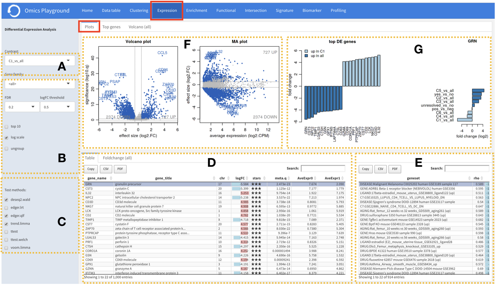
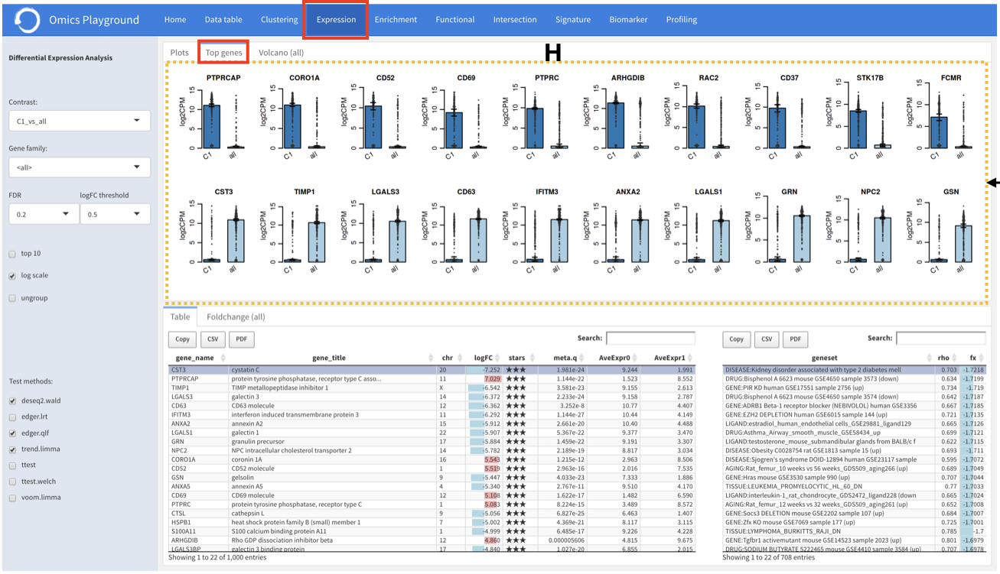
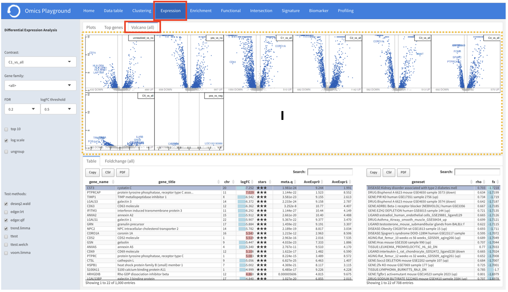

.. _DEGs:

Differential Expression Analysis
================================================================================
The **Differential Expression Analysis** module compares expression between two 
conditions (i.e. tumor versus control), which is one of the fundamental analysis 
in the transcriptomics data analytics workflow. For each comparison of two 
conditions (also called 'contrast'), the analysis identifies which genes are 
significantly downregulated or overexpressed in one of the groups.

The **Plots** panel shows volcano and MA plots for the chosen contrast. 
It also shows the so-called 'signature', i.e. the top downregulated and overexpressed
genes, for that contrast. The **Top genes** panel shows the average expression plots 
across the samples for top differentially expressed genes within the selected 
comparison. A very useful feature of the platform is that it can display volcano 
plots for all comparisons simultaneously under the **Volcano (all)** panel. This provides
users an overview of the statistics of all comparisons. The **Table** panel on the 
bottom shows the results of the statistical tests. The **Foldchange (all)** panel
reports the gene fold changes for all contrasts.

.. note::

    EXPERT MODE ONLY: To compare the different statistical methods, the **Volcano (methods)**
    panel shows volcano plots of all methods. The **FDR table** panel reports
    the number of significant genes at different FDR thresholds for all contrasts.

Input slider
--------------------------------------------------------------------------------
The input slider on the left contains the ``Info`` button for relevant information about
the module as well as some settings for the analysis. 
Users can start the differntial expression (DE) analysis by selecting a contrats of their 
interest in the ``Contrast`` and specifying a relevent gene family in the ``Gene family``.
It is possible to set the false discovery rate (FDR) and the logarithmic fold change 
(logFC) thresholds undr the ``FDR`` and ``logFC threshold`` settings, respectively.

.. figure:: figures/psc4.0.png
    :align: center
    :width: 30%

.. note::

    EXPERT MODE ONLY: We allow expert users to select a method for the DE statistical test. 
    To increase the statistical reliability of the Omics Playground, we perform the DE 
    analysis using commonly accepted methods in the literature, including t-test 
    `t-test <https://en.wikipedia.org/wiki/Student%27s_t-test>`__ (standard, Welch), 
    `limma <https://www.ncbi.nlm.nih.gov/pubmed/25605792>`__ (no trend, trend, voom), 
    `edgeR <https://www.ncbi.nlm.nih.gov/pubmed/19910308>`__ (QLF, LRT), and 
    `DESeq2 <https://www.ncbi.nlm.nih.gov/pmc/articles/PMC4302049/>`__ (Wald, LRT),
    and merge the results.

Expression table
--------------------------------------------------------------------------------
Table ``I`` shows the results of the statistical tests slected in the ``Statistical methods``.
In the Basic mode, this table reports the meta (combined) results of 
`DESeq2 <https://www.ncbi.nlm.nih.gov/pmc/articles/PMC4302049/>`__ (Wald),
`edgeR <https://www.ncbi.nlm.nih.gov/pubmed/19910308>`__ (QLF), and 
`limma <https://www.ncbi.nlm.nih.gov/pubmed/25605792>`__ (trend) only.

For a selected comparison under the ``Contrast`` setting, the results of the selected 
methods are combined and reported in the table, where ``meta.q`` for a gene 
represents the highest ``q`` value among the methods and the number of stars for 
a gene indicate how many methods identified significant ``q`` values (``q < 0.05``). 
The table is interactive (scrollable, clickable); users can sort genes by ``logFC``, 
``meta.q``, or average expression in either conditions.

Users can filter top N = {10} differently expressed genes in the table by 
clicking the top 10 genes from the table Settings.

:**A**: The user starts the DEG analysis by selecting a desireable contrast form
        the drop-down menu items.

:**B**: There are further options to filter out some genes by functional 
        families, logarithmic fold change (logFC) and false discovery rate (FDR).

:**C**: To increase the statistical reliability of the platform, the DEG analysis
        is performed using four commonly accepted methods in the literature, namely: 
        t-test (standard, Welch), 
        `limma <https://www.ncbi.nlm.nih.gov/pubmed/25605792>`__ (no trend, trend, voom), 
        `edgeR <https://www.ncbi.nlm.nih.gov/pubmed/19910308>`__ (QLF, LRT), 
        and 
        `DESeq2 <https://www.ncbi.nlm.nih.gov/pmc/articles/PMC4302049/>`__ (Wald, LRT).

:**D**: For each selected contrast in **A**, the results of these methods are combined
        and reported under the **DEG table** section, where :option:`meta.q` for a gene 
        represents the highest :option:`q` value among the methods and the number of starts 
        indicates how many methods have significant q values (:option:`q < 0.05`). Users 
        can sort genes by :option:`logFC`, :option:`meta.q`, or average expression
        in an interactive table. 

:**E**: By clicking on a gene row in **D**, it is possible to see which genesets contain
        that gene from the geneset table located on the right. 

.. figure:: figures/psc4.1.png
    :align: center
    :width: 100%

Plots
--------------------------------------------------------------------------------
:**F**: The **plots** section provides volcano  and MA (an application 
        of a Bland-Altman) plots.  
        
:**G**: This section shows the so-called 'signature', i.e. the top downregulated
        and overexpressed genes, for that contrast. The expression of the selected
        gene across all contrasts is also summarized. By clicking on a gene 
        row in **D**, it is possible to check the status of the differential 
        expression of that particular gene accross other comparisons.  

Top genes
--------------------------------------------------------------------------------
Furthermore, for the top 10 DEGs 
within the selected comparison, average expression plots across the samples are 
displayed in the ``top genes`` section. 

Volcano (all)
--------------------------------------------------------------------------------
Another important feature of this module is the simultaneous visualisation of volcano
plots for all comparisons under the **volcano (all)** section. This can provide
the user a statistical overview all comparisons at the same time, and the user
can immediately see which comparison is statistically weak or strong.

    
    
    