.. _Enrichment:

GeneSets
================================================================================

This module is subdivided into four submodules: **Geneset enrichment**, 
**Test Geneset**, **Pathway Analysis** and **Word cloud**.

Geneset enrichment
--------------------------------------------------------------------------------
Similar to the differential gene expression analysis, users can perform differential
expression analysis on a geneset level in this page, which is also referred as 
gene set enrichment (GSE) analysis. The platform has more than 50.000 genesets 
(or pathways) in total that are divided more than 30 geneset collections such 
`Hallmark <https://www.cell.com/abstract/S0092-8674(11)00127-9>`__, 
`Reactome <https://reactome.org/>`__,
`Wikipathways <https://www.wikipathways.org/>`__, 
and Gene Ontology (`GO <http://geneontology.org/>`__).
Users have to specify which comparison they want to visually analyze 
employing a certain geneset collection.

The tab consists of the settings panels as well as four results panels: **Top enriched gene sets**, 
**Frequency in top gene sets**, a **Table** panel where users can swicth between three tables and **Genes in gene sets**.

Settings panel
~~~~~~~~~~~~~~~~~~~~~~~~~~~~~~~~~~~~~~~~~~~~~~~~~~~~~~~~~~~~~~~~~~~~~~~~~~~~~~~~
The enrichment analysis can be started by selecting a contrats of interest in 
the ``Contrast`` and specifying a relevent gene set family in the ``Gene set collection``.
It is possible to set the false discovery rate (FDR) and the logarithmic fold change 
(logFC) thresholds under the ``FDR`` and ``logFC threshold`` settings, respectively.
We allow users to show all gene sets in the``Enrichment analysis`` table , rather than just the significant ones, under the *Options* menu.
Users can also select statistical methods for the enrichment analysis from the same menu.
To ensure the statistical reliability, the platform performs enrichment analyses using multiple methods, including 
`Spearman rank correlation <https://en.wikipedia.org/wiki/Spearman%27s_rank_correlation_coefficient>`__, 
`GSVA <https://bmcbioinformatics.biomedcentral.com/articles/10.1186/1471-2105-14-7>`__, 
`ssGSEA <https://bmcbioinformatics.biomedcentral.com/articles/10.1186/1471-2105-14-7>`__, 
`Fisher's exact test <https://www.jstor.org/stable/2340521?seq=1#metadata_info_tab_contents>`__, 
`GSEA <http://software.broadinstitute.org/gsea/index.jsp>`__, 
`camera <https://www.ncbi.nlm.nih.gov/pmc/articles/PMC3458527/>`__ and 
`fry <https://academic.oup.com/bioinformatics/article/26/17/2176/200022>`__. Finally users can limit the results to only the top 10 
up- and down-regulated gene sets.

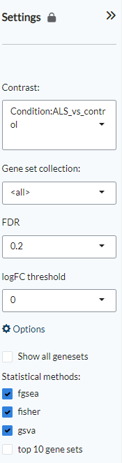

Top enriched gene sets
~~~~~~~~~~~~~~~~~~~~~~~~~~~~~~~~~~~~~~~~~~~~~~~~~~~~~~~~~~~~~~~~~~~~~~~~~~~~~~~~
This panel displays the enrichment plots of the top differentially enriched gene sets (up and down) for the selected contrast. 
Black vertical bars indicate the rank of genes in the gene set in the sorted list metric. 
The green curve corresponds to the enrichment score (ES). The more the green ES curve is shifted to the upper left of the graph, 
the more the gene set is enriched in the first group. Conversely, a shift of the ES curve to the lower right, 
corresponds to more enrichment in the second group. This panel will by default display the 12 most up-regulated genesets 
in the selected contrast. Selecting a specific gene set from the 'Enrichment analysis' table below it will display 
the selected gene set alone.

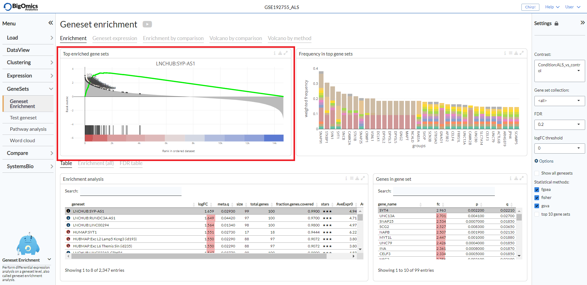

Frequency in top gene sets
~~~~~~~~~~~~~~~~~~~~~~~~~~~~~~~~~~~~~~~~~~~~~~~~~~~~~~~~~~~~~~~~~~~~~~~~~~~~~~~~
This panel shows the number of times a gene is present in the top-N genesets sorted by frequency. Genes that are frequently shared among the top enriched gene sets may suggest driver genes.

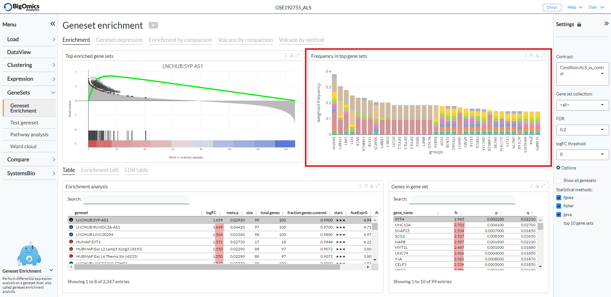

The settings icon open the settings menu from which users can select the number of top gene sets to be used (``Number of top sets``), 
whether to weight by geneset size (``Weight by geneset size``) and whether to weight by fold-change (``Weight by FC``).

.. figure:: figures_v3/GE_freq_opts.png
    :align: center
    :width: 20%

In the **Plots** panel,
a volcano plot of genes contained in the selected geneset and a barplot of 
expressions per sample group are displayed. In the **Compare** panel, users can 
compare the differential expression status of that geneset for all other 
comparisons. Volcano plots of genesets for all comparisons are 
displayed under the **Volcano (all)** tab. This allows users to have an overall 
picture across comparisons at the same time. To compare the different statistical methods, 
the **Volcano (methods)** panel shows volcano plots of all methods. The **GeneMap** panel 
displays the co-activation heatmap of top N = {25} enriched gene sets and their common genes.
The **Foldchange (all)** tab reports the gene fold changes for all contrasts in the selected dataset.
The column ``fc.var`` corresponds to the variance of the fold-change across all contrasts.
The **FDR table** panel reports the number of significant gene sets at different FDR thresholds for all contrasts.

Table
~~~~~~~~~~~~~~~~~~~~~~~~~~~~~~~~~~~~~~~~~~~~~~~~~~~~~~~~~~~~~~~~~~~~~~~~~~~~~~~~
This table shows the enrichment analysis results from the selected statistical methods.
With default settings, this table reports the meta (combined) results of 
`camera <https://www.ncbi.nlm.nih.gov/pmc/articles/PMC3458527/>`__,
`fgsea <http://software.broadinstitute.org/gsea/index.jsp>`__, and 
`Spearman rank correlation <https://en.wikipedia.org/wiki/Spearman%27s_rank_correlation_coefficient>`__ only.
Users can also display individual q-values for each of the selected analysis methods using the settings on top of the table.

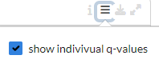
    
The combined enrichment analysis results from the methods are displayed in this table,
where for each geneset the ``meta.q`` corresponds to the highest ``q`` value provided
by the methods and the number of ``stars`` indicate how many methods identified
the geneset as significant (``q < 0.05``). ``AveExpr0`` and ``AveEprx1`` refer to the average gene set expression 
in group 0 and group 1 of the selected pairwise comparison respectively.
The table is interactive; users can sort it by ``logFC``, ``meta.q``, ``AveExpr0``, ``AveEprx1`` and ``stars``.

.. figure:: figures_v3/psc5.1.png
    :align: center
    :width: 100%

By clicking on a gene set in Table ``I``, it is possible to see the gene list of 
that gene set in Table ``II``. It also reports the fold-change, statistics and 
correlation of the genes in the selected gene set. By clicking on a gene in 
Table ``II``, under the **Plots** panel, users can check its correlation to the gene set 
in the ``Enrichment vs. expression`` correlation scatter plot.

Plots
~~~~~~~~~~~~~~~~~~~~~~~~~~~~~~~~~~~~~~~~~~~~~~~~~~~~~~~~~~~~~~~~~~~~~~~~~~~~~~~~
The **Plots** panel provide plots associated with the gene set 
(selected in Table ``I``) and gene (selected in Table ``II``) under ``Table``.

:**a**: Enrichment plot associated with the gene set selected from Table ``I``.  
:**b**: Volcano-plot of genes showing the significance versus the fold-change on the y and x axes,
        respectively. Genes in the selected gene set are highlighted in blue.
:**c**: Barplot of the gene expression of the gene. Samples in the barplot 
        can be ungrouped in the plot *Settings*.
:**d**: Scatter plot of the enrichment versus the expression of the selected 
        geneset and gene, on the y and x axes, respectively.

.. figure:: figures/psc5.3.png
    :align: center
    :width: 100%

Compare
~~~~~~~~~~~~~~~~~~~~~~~~~~~~~~~~~~~~~~~~~~~~~~~~~~~~~~~~~~~~~~~~~~~~~~~~~~~~~~~~
Under the **Compare** panel, users can fin enrichment plots for the selected gene
set (in Table ``I``) across multiple contrasts. The figure allows to quickly 
compare the enrichment of a certain gene set across all other comparisons.

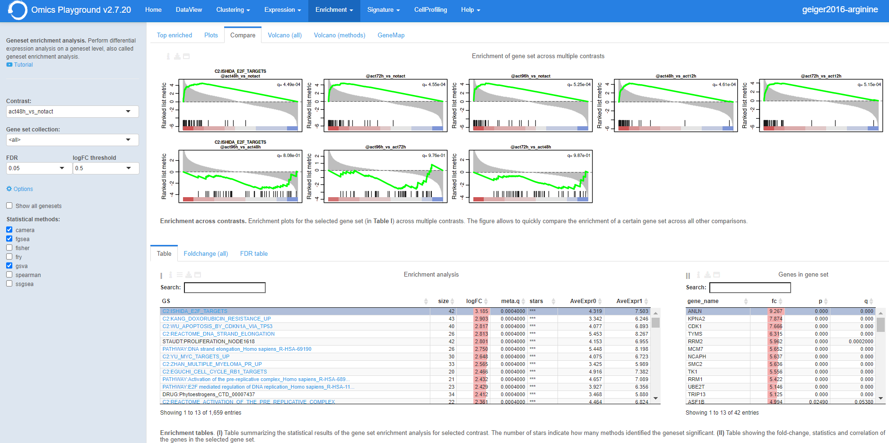

Volcano (all)
~~~~~~~~~~~~~~~~~~~~~~~~~~~~~~~~~~~~~~~~~~~~~~~~~~~~~~~~~~~~~~~~~~~~~~~~~~~~~~~~
The **Volcano (all)** panel simultaneously displays volcano plots of gene sets 
enrichment across all contrasts, showing the enrichment score versus significance 
on the x and y axes, respectively. This provides users an overview of the 
statistics across all comparisons. By comparing multiple volcano plots, the user
can immediately see which comparison is statistically weak or strong.
Experimental contrasts showing better statistical significance will show volcano
plots with 'higher' wings.

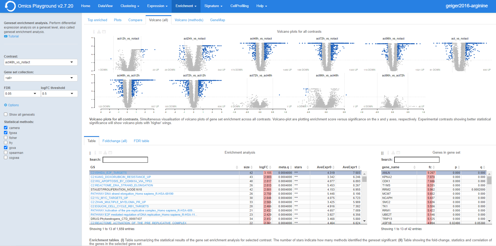

Volcano (methods)
~~~~~~~~~~~~~~~~~~~~~~~~~~~~~~~~~~~~~~~~~~~~~~~~~~~~~~~~~~~~~~~~~~~~~~~~~~~~~~~~
Under the **Volcano (methods)** panel, users can see the simultaneous 
visualisation of volcano plots of gene sets for different enrichment methods.
This provides users an quick overview of the sensitivity of the statistical 
methods at once. Methods showing better statistical significance will show 
volcano plots with 'higher' wings.

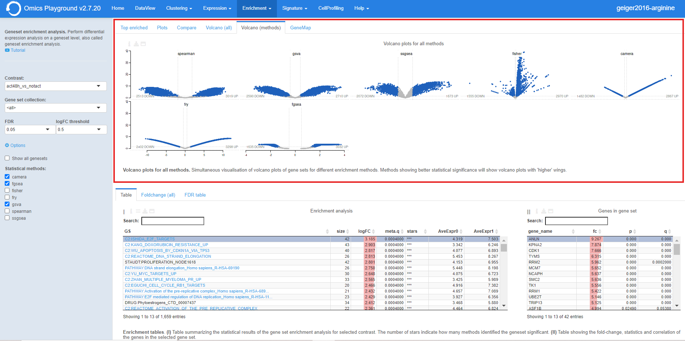

GeneMap
~~~~~~~~~~~~~~~~~~~~~~~~~~~~~~~~~~~~~~~~~~~~~~~~~~~~~~~~~~~~~~~~~~~~~~~~~~~~~~~~
Under the **GeneMap** panel, users can view a co-activation heatmap of the top N = {25} 
enriched gene sets and their common genes.

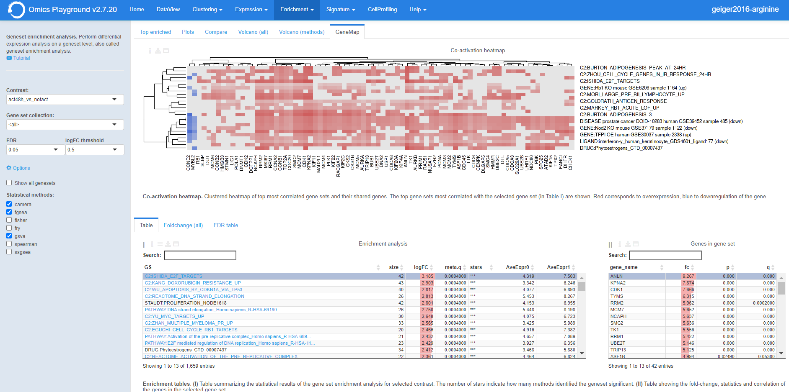

Foldchange (all)
~~~~~~~~~~~~~~~~~~~~~~~~~~~~~~~~~~~~~~~~~~~~~~~~~~~~~~~~~~~~~~~~~~~~~~~~~~~~~~~~ 
The **Foldchange (all)** provides the enrichment analysis of gene sets 
across all contrasts. The column ``fc.var`` corresponds to the variance of 
the fold-change across all contrasts.

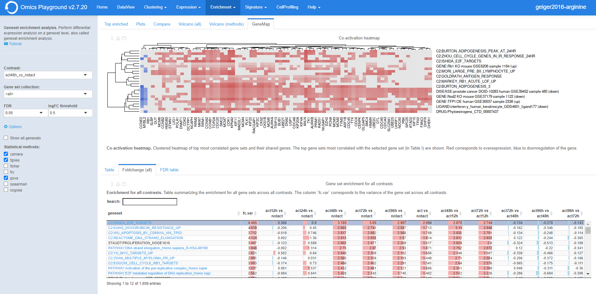

FDR table
~~~~~~~~~~~~~~~~~~~~~~~~~~~~~~~~~~~~~~~~~~~~~~~~~~~~~~~~~~~~~~~~~~~~~~~~~~~~~~~~ 
The **FDR table** panel reports the number of significant gene sets at different 
FDR thresholds for all contrasts and methods. Using the table the user can
determine which statistical methods perform better for a particular contrast.
The left part of the table (in blue) correspond 
to the number of significant down-regulated gene sets, the right part (in red) 
correspond to the number of significant overexpressed gene sets.

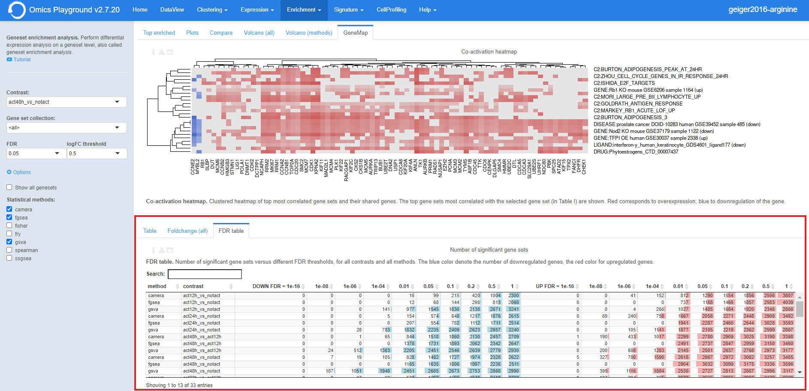

Pathway analysis
--------------------------------------------------------------------------------
This module performs specialized pathway and enrichment analysis
providing higher level functional and visual analysis

The **KEGG pathways** panel maps the differential fold-changes onto
the `KEGG <https://www.ncbi.nlm.nih.gov/pmc/articles/PMC102409/>`__
pathway maps. Under the **GO** panel, a graph-based enrichment
analysis is done using the Gene Ontology (`GO
<http://geneontology.org/>`__) graph structure.

Input panel
~~~~~~~~~~~~~~~~~~~~~~~~~~~~~~~~~~~~~~~~~~~~~~~~~~~~~~~~~~~~~~~~~~~~~~~~~~~~~~~~
A tutorial about the module can be found under ``Youtube`` in the input panel.
Users can specify the contrast of their interest
in the ``Contrast`` settings. Under the main *Options*, users can
select ``filter significant (tables)``  to keep only significant entries in the table.

.. figure:: figures/psc6.0.png
    :align: center
    :width: 30%

KEGG pathways
~~~~~~~~~~~~~~~~~~~~~~~~~~~~~~~~~~~~~~~~~~~~~~~~~~~~~~~~~~~~~~~~~~~~~~~~~~~~~~~~
`KEGG <https://www.ncbi.nlm.nih.gov/pmc/articles/PMC102409/>`__ is a collection
of manually curated pathways representing the current knowledge of molecular 
interactions, reactions and relation networks as pathway maps. In the 
**KEGG pathway** panel, each pathway is scored for the selected contrast profile
and reported in the table. A unique feature of the platform is that it provides 
an activation-heatmap comparing the activation levels of pathways across multiple
contrast profiles. This facilitates to quickly see and detect the similarities 
between profiles in certain pathways. More detailed explaination of each output
is provided below.

:**a**: In the pathway map, genes are colored according to their upregulation 
        (red) or downregulation (blue) in the contrast profile. Each pathway 
        is scored for the selected contrast profile and reported in the table 
        below.

:**b**: Enrichment table. The table is interactive; enabling user to sort on 
        different variables (kegg id, pathway, logFC and meta q-values) 
        and select a pathway by clicking on the row in the table.

:**c**: The KEGG activation matrix visualizes the activation levels of pathways
        (or pathway keywords) across multiple contrast profiles. This facilitates
        to quickly see and detect the similarities of certain pathways between
        contrasts. The size of the circles correspond to their relative activation,
        and are colored according to their upregulation (red) or downregulation
        (blue) in the contrast profile. The matrix can be normalised from the 
        *Settings*.

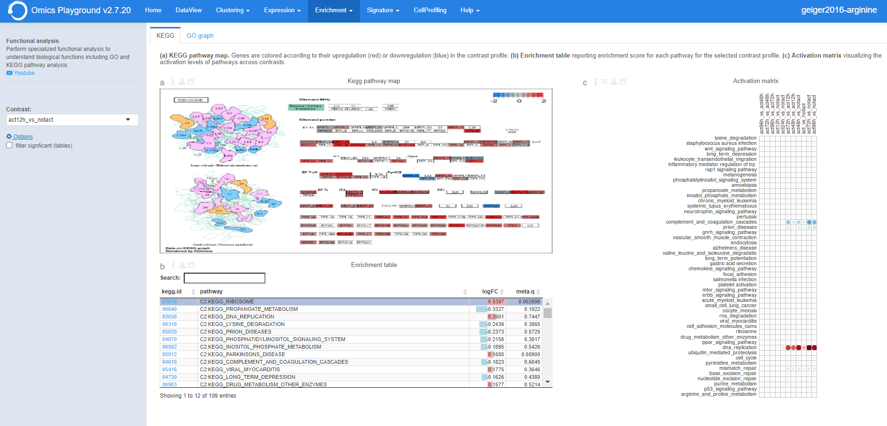

GO graph
~~~~~~~~~~~~~~~~~~~~~~~~~~~~~~~~~~~~~~~~~~~~~~~~~~~~~~~~~~~~~~~~~~~~~~~~~~~~~~~~
In the **GO** panel, users can perform `GO <http://geneontology.org/>`__ analysis.
GO defines functional concepts/classes and their relationships as a hierarchical
graph. 
The GO database provides a computational representation of the current knowledge 
about roles of genes for many organisms in terms of molecular functions, cellular
components and biological processes. All the features described under the 
**KEGG pathway** panel, such as scoring the gene sets and drawing an 
activation-heatmap,
can be performed for the GO database under the GO graph tab. Instead of pathway
maps, an annotated graph structure provided by the GO database is potted for
every selected gene set. 
Each output chart/table of the panel is describer below in detail.

:**a**: The structure of GO can be described in terms of a graph, where each
        GO term is a node, and the relationships between the terms are edges 
        between the nodes. GO is loosely hierarchical, with 'child' terms being
        more specialized than their 'parent' terms. The graph is interactive. 
        You can move the graph and zoom in using the mouse.
        Under the graph *Settings*, users can select ``Prune tree`` to prune
        the tree only with significant branches and ``color custers`` to 
        highlight clusters with different colors

        .. figure:: figures/psc6.2.a.png
            :align: center
            :width: 35%

:**b**: GO score table. The scoring of a GO term is performed by considering
        the cumulative score of all terms from that term to the root node. 
        That means that GO terms that are supported by higher level terms
        levels are preferentially scored.

:**c**: The GO activation matrix visualizes the activation of GO terms
        across conditions. From this figure, you can easily detect GO terms
        that are consistently up/down across conditions. The size of the circles
        correspond to their relative activation, and are colored according to 
        their upregulation (red) or downregulation (blue) in the contrast
        profile. The matrix can be normalised from the *Settings*.

.. figure:: figures/psc6.2.png
    :align: center
    :width: 100%

Word Cloud
--------------------------------------------------------------------------------
The **WordCloud** panel performs "keyword enrichment analysis". It
computes enrichment of a selected keyword across all contrasts. Select
a keyword by clicking a word in the 'Enrichment table'. Keyword
enrichment is computed by running GSEA on the enrichment score profile
for all contrasts. We defined the test set as the collection of
genesets that contain the keyword in the title/description.

Input panel
~~~~~~~~~~~~~~~~~~~~~~~~~~~~~~~~~~~~~~~~~~~~~~~~~~~~~~~~~~~~~~~~~~~~~~~~~~~~~~~~
A tutorial about the module can be found under ``Youtube`` in the input panel.
Users can specify the contrast of their interest
in the ``Contrast`` settings. Under the main *Options*, users can
select ``normalize activation matrix``  to normalize the activation matrix.

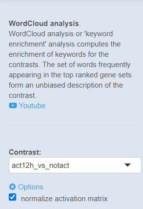
              

Main panel
~~~~~~~~~~~~~~~~~~~~~~~~~~~~~~~~~~~~~~~~~~~~~~~~~~~~~~~~~~~~~~~~~~~~~~~~~~~~~~~~
The main panel consists of six different outputs:
        
:**a**: The **Enrichment plots** visualize the enrichment of the
    selected keyword in the contrasts.  Black vertical bars
    indicate the position of gene sets that contains the *keyword*
    in the ranked list of enrichment scores. The curve in green
    corresponds to the 'running statistic' of the keyword
    enrichment score. The more the green ES curve is shifted to
    the upper left of the graph, the more the keyword is enriched
    in the first group. Conversely, a shift of the green ES curve
    to the lower right, corresponds to keyword enrichment in the
    second group.

:**b**: The **Word cloud plot** visualizes the frequency/enrichment of
    keywords for the data set. Select a keyword in the 'Enrichment
    table'. In the plot settings, users can exclude certain words
    from the figure, or choose the color palette. The sizes of the
    words are relative to the normalized enrichment score (NES)
    from the GSEA computation. Keyword enrichment is computed by
    running GSEA on the mean (squared) enrichment profile
    (averaged over all contrasts). For each keyword, we defined
    the 'keyword set' as the collection of genesets that contain
    that keyword in the title/description.

.. figure:: figures/psc6.4.1.png
    :align: center
    :width: 30%

:**c**: The **Word t-SNE** plot visualizes the similarity of the
    keywords that were found in the title/description of gene
    sets. Keywords that are often found together in
    title/descriptions are placed close together in the t-SNE. For
    each keyword we computed enrichment using GSEA on the mean
    (absolute) enrichment profiles (averaged over all
    contrasts). Statistically significant gene sets (q<0.05) are
    colored in red. The sizes of the nodes are proportional to the
    normalized enrichment score (NES) of the keyword. In the plot
    settings, the user can choose between t-SNE and "Uniform
    Manifold Approximation and Projection" (UMAP).

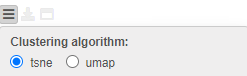
         
:**d**: The **Activation matrix** visualizes the keywords enrichment 
    across the conditions. The size of the circles correspond to 
    their relative activation, and are colored according to their 
    upregulation (red) or downregulation (blue) in the contrast profile.

:**e**: The **Enrichment table** summarizes the results from the
    enrichment test for the tested keywords. The NES corresponds
    to the normalized enrichment score from the GSEA analysis.

:**f**: The **Leading-edge table** shows the geneset titles that have
    contributed to the enrichment of the selected keyword.

.. figure:: figures/psc6.4.png
    :align: center
    :width: 100%

Drug connectivity
--------------------------------------------------------------------------------
In the **Drug Connectivity Map** panel, users can correlate their signature with
more than 5000 known drug profiles from the 
`L1000 <https://www.ncbi.nlm.nih.gov/pubmed/29195078>`__ database, as well as with drug 
sensitivity profiles from the `CTRP v2 <https://portals.broadinstitute.org/ctrp.v2.1/>`__ 
and `GDSC <https://www.cancerrxgene.org/>`__ databases. 
Additionally, a separate list of shRNA- and cDNA-perturebed datasets from the L1000 database 
is also available (gene/L1000).

An activation-heatmap compares drug activation profiles across multiple contrasts. 
This facilitates to quickly see and detect the similarities between contrasts
for certain drugs.

Input panel
~~~~~~~~~~~~~~~~~~~~~~~~~~~~~~~~~~~~~~~~~~~~~~~~~~~~~~~~~~~~~~~~~~~~~~~~~~~~~~~~
A tutorial about the module can be found under ``Youtube`` in the input panel.
Users can specify the contrast of their interest
in the ``Contrast`` settings. Under ``Analysis type`` users can select from four 
databases.

.. figure:: figures/psc6.3.0.png
    :align: center
    :width: 30%

Main panel
~~~~~~~~~~~~~~~~~~~~~~~~~~~~~~~~~~~~~~~~~~~~~~~~~~~~~~~~~~~~~~~~~~~~~~~~~~~~~~~~
The main panel consists of four outputs:    

:**a**: The Drug Connectivity Map correlates your signature with profiles from the L1000 
        (activity/L1000 and gene/L1000), CTRP and GDSC databases. 
        It shows the top N=10 similar and opposite profiles by running 
        the GSEA algorithm on the contrast-drug profile correlation space. 

:**b**: Enrichment table. Enrichment is calculated by correlating
        your signature with the profiles from the chosen
        database. Because of multiple perturbation experiments for a
        single small molecule, they are scored by running the GSEA algorithm on the 
        contrast-small molecule profile correlation space. In this way, we obtain a 
        single score for multiple profiles of a single small molecule. The table can be 
        customised via the table *Settings* to only show annotated drugs.

:**c**: This plot visualizes the mechanism of action (MOA) across the enriched
        drug profiles. On the vertical axis, the number of drugs with the same
        MOA are plotted. You can switch to visualize between MOA or target gene.
        Under the plots *Settings*, users can select the plot type of MOA
        analysis: by class description (``drug class``) or by target gene 
        (``target gene``).

        .. figure:: figures/psc6.3.c.png
            :align: center
            :width: 35%

:**d**: The **Activation matrix** visualizes the correlation of small molecule 
        profiles with all available pairwise comparisons. The size of the
        circles correspond to the strength of their correlation, and are
        colored according to their positive (red) or
        negative (blue) correlation to the contrast profile. 
        The matrix can be normalised from the *Settings*.

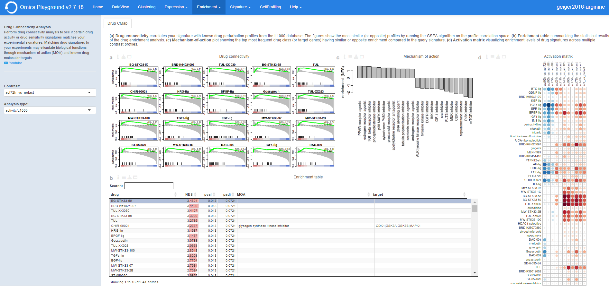
