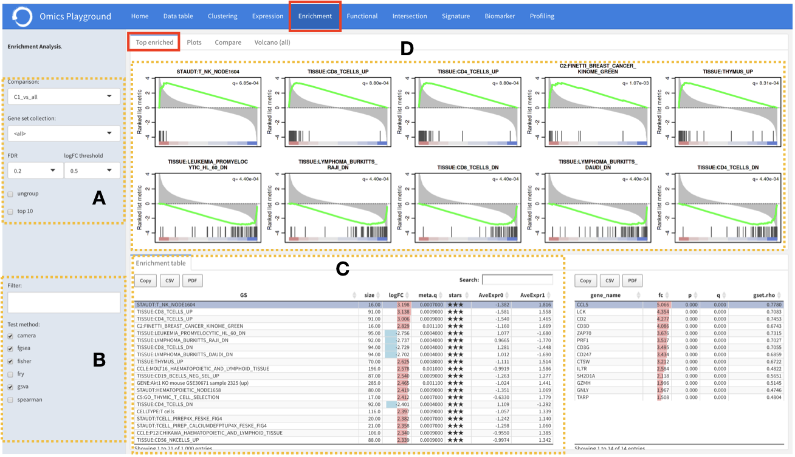
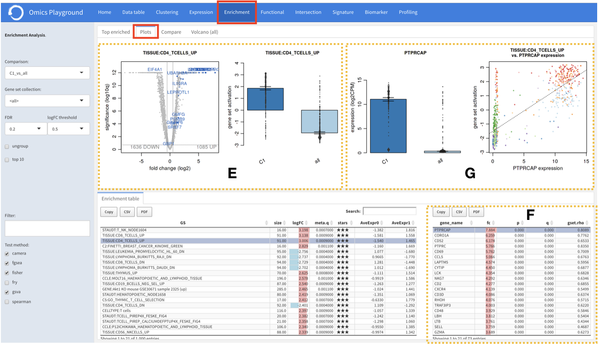
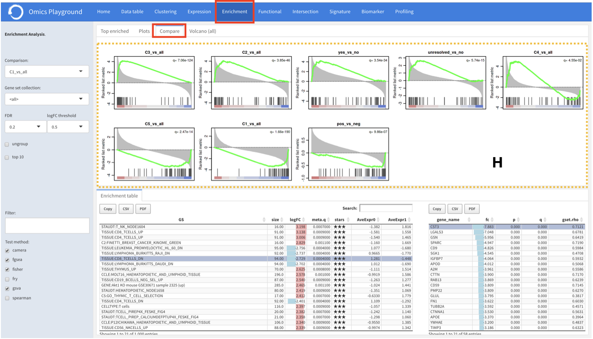
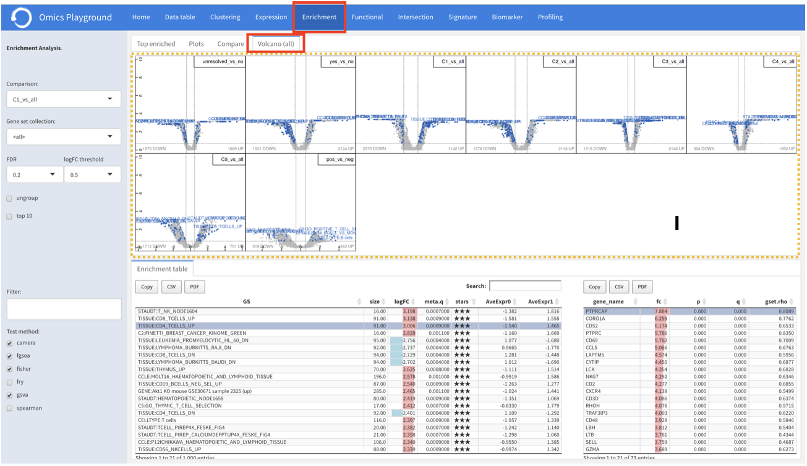

.. _DESGs:

Gene set enrichment analysis
================================================================================

This module visualises a differential expression analysis at a gene set level. 
Expression analysis for each gene set (or pathway) is computed from gene expression 
data using summary methods such as 
`GSVA <https://bmcbioinformatics.biomedcentral.com/articles/10.1186/1471-2105-14-7>`__
and `ssGSEA <https://bmcbioinformatics.biomedcentral.com/articles/10.1186/1471-2105-14-7>`__. 
The platform has more than 50,000 gene sets and pathways in total, which are divided 
into 30 gene set collections such as 
`Hallmark <https://www.cell.com/abstract/S0092-8674(11)00127-9>`__, 
`MSigDB <http://software.broadinstitute.org/gsea/msigdb/index.jsp>`__,
`KEGG <https://www.ncbi.nlm.nih.gov/pmc/articles/PMC102409/>`__, 
and `GO <http://geneontology.org/>`__.

Enrichment table
--------------------------------------------------------------------------------
:**A**: To perform the enrichment analysis, users have to first specify the 
        contrast they want to visually analyze using a particular gene 
        set collection. Gene sets can be optionally filtered by :option:`logFC` and 
        :option:`FDR` thresholds before performing the analysis.
        
:**B**: To ensure statistical reliability, the platform performs GSE analyses 
        using seven different methods, including Spearman rank correlation, 
        `GSVA <https://bmcbioinformatics.biomedcentral.com/articles/10.1186/1471-2105-14-7>`__, 
        `ssGSEA <https://bmcbioinformatics.biomedcentral.com/articles/10.1186/1471-2105-14-7>`__, 
        `Fisher's exact test <https://www.jstor.org/stable/2340521?seq=1#metadata_info_tab_contents>`__, 
        `GSEA <http://software.broadinstitute.org/gsea/index.jsp>`__, 
        `camera <https://www.ncbi.nlm.nih.gov/pmc/articles/PMC3458527/>`__ 
        and 
        `fry <https://academic.oup.com/bioinformatics/article/26/17/2176/200022>`__. 
        
:**C**: Then the combined result from multiple methods is displayed under the 
        ``enrichment table``, where for each geneset the :option:`meta.q` corresponds
        to the highest :option:`q` value provided by the methods and the number of 
        stars indicate how many methods identified the geneset as significant 
        (:option:`q < 0.05`). The table is interactive; users can sort it by 
        :option:`logFC`, :option:`meta.q` and :option:`starts`.

Top enriched
--------------------------------------------------------------------------------
For a selected comparison in **A**, top ten differentially enriched geneses or pathways
(five positive abd five negative) are displayed under top enriched section.

Plots
--------------------------------------------------------------------------------
:**E**: For a selected geneset from the enrichment table in **C**, a volcano plot
        of its genes and barplots of expressions per phenotype class are displayed
        under the ``plots`` tab.

:**G**: For a selected geneset from the enrichment table in **C**, it is also possible to 
        see the expression barplots per sample group and a scatter plot of gene to
        geneset expressions.

:**F**: Additionally, For a selected geneset from the enrichment table in **C**,
        its gene lists is also visualised in a separate table with further statistics. 

Compare
--------------------------------------------------------------------------------
Under the ``compare`` section, expression profiles of individually selected gene sets
from the enrichment table can be visualised against all available contrasts.

Volcano (all)
--------------------------------------------------------------------------------
Similarly, volcano plots of gene sets for all available contrasts are displayed
under the ``volcano (all)`` tab. This allows users to have a simultaneous overview
of all comparisons.

