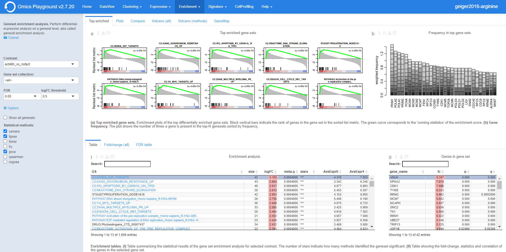

.. _DESGs:

Gene Set Enrichment Analysis
================================================================================
Similar to the differential gene expression analysis, users can perform differential
expression analysis on a geneset level in this page, which is also referred as 
gene set enrichment (GSE) analysis. The platform has more than 50.000 genesets 
(or pathways) in total that are divided into 30 geneset collections such 
`Hallmark <https://www.cell.com/abstract/S0092-8674(11)00127-9>`__, 
`MSigDB <http://software.broadinstitute.org/gsea/msigdb/index.jsp>`__,
`KEGG <https://www.ncbi.nlm.nih.gov/pmc/articles/PMC102409/>`__, 
and Gene Ontology (`GO <http://geneontology.org/>`__).
Users have to specify which comparison they want to visually analyze 
employing a certain geneset collection.

The enrichment analyses results from the statistical methods are 
displayed in **Enrichment table** panel. In the **Top enriched** panel, the top 
differentially enriched geneses (pathways) are displayed. In the **Plots** panel,
a volcano plot of genes contained in the selected geneset and a barplot of 
expressions per sample group are displayed. In the **Compare** panel, users can 
compare the differential expression status of that geneset for all other 
comparisons. Finally, volcano plots of genesets for all comparisons are 
displayed under the **Volcano (all)** tab. This allows users to have an overall 
picture across comparisons at the same time.

.. note::

    EXPERT MODE ONLY: To compare the different statistical methods, the **Volcano 
    (methods)** panel shows volcano plots of all methods. The **FDR table** panel 
    reports the number of significant gene sets at different FDR thresholds for all contrasts.

Input slider
--------------------------------------------------------------------------------
Users can find relevant information about the module in the ``Info`` from the input slider.
The enrichment analysis can be started by selecting a contrats of interest in 
the ``Contrast`` and specifying a relevent gene set family in the ``Gene set collection``.
It is possible to set the false discovery rate (FDR) and the logarithmic fold change 
(logFC) thresholds under the ``FDR`` and ``logFC threshold`` settings, respectively.

.. figure:: figures/psc5.0.png
    :align: center
    :width: 30%

.. note::

    EXPERT MODE ONLY: 
    We allow expert users to select statistical methods for the enrichment analysis.
    To ensure the statistical reliability, the platform performs 
    enrichment analyses using multiple methods, including 
    `Spearman rank correlation <https://en.wikipedia.org/wiki/Spearman%27s_rank_correlation_coefficient>`__, 
    `GSVA <https://bmcbioinformatics.biomedcentral.com/articles/10.1186/1471-2105-14-7>`__, 
    `ssGSEA <https://bmcbioinformatics.biomedcentral.com/articles/10.1186/1471-2105-14-7>`__, 
    `Fisher's exact test <https://www.jstor.org/stable/2340521?seq=1#metadata_info_tab_contents>`__, 
    `GSEA <http://software.broadinstitute.org/gsea/index.jsp>`__, 
    `camera <https://www.ncbi.nlm.nih.gov/pmc/articles/PMC3458527/>`__ and 
    `fry <https://academic.oup.com/bioinformatics/article/26/17/2176/200022>`__.

Enrichment table
--------------------------------------------------------------------------------
Table ``I`` shows the enrichment analysis results from the selected statistical methods.
In the Basic mode, this table reports the meta (combined) results of 
`camera <https://www.ncbi.nlm.nih.gov/pmc/articles/PMC3458527/>`,
`fgsea <http://software.broadinstitute.org/gsea/index.jsp>`__, and 
`Spearman rank correlation <https://en.wikipedia.org/wiki/Spearman%27s_rank_correlation_coefficient>` only.
Users can filter top N = {10} differently enriched gene sets in the table by 
clicking the ``top 10 gene sets`` from the table *Settings*.

    
The combined enrichment analysis results from the methods are displayed below,
where for each geneset the ``meta.q`` corresponds to the highest ``q`` value provided
by the methods and the number of ``stars`` indicate how many methods identified
the geneset as significant (``q < 0.05``). The table is interactive; users can sort it 
by ``logFC``, ``meta.q`` and ``starts``.

Top enriched
--------------------------------------------------------------------------------
For a selected comparison in **A**, top ten differentially enriched geneses or pathways
(five positive abd five negative) are displayed under top enriched section.

Plots
--------------------------------------------------------------------------------
:**E**: For a selected geneset from the enrichment table in **C**, a volcano plot
        of its genes and barplots of expressions per phenotype class are displayed
        under the **plots** tab.

:**G**: For a selected geneset from the enrichment table in **C**, it is also possible to 
        see the expression barplots per sample group and a scatter plot of gene to
        geneset expressions.

:**F**: Additionally, For a selected geneset from the enrichment table in **C**,
        its gene lists is also visualised in a separate table with further statistics. 

.. figure:: figures/ug.016.png
    :align: center
    :width: 100%

Compare
--------------------------------------------------------------------------------
Under the **compare** section, expression profiles of individually selected gene sets
from the enrichment table can be visualised against all available contrasts.

.. figure:: figures/ug.017.png
    :align: center
    :width: 100%

Volcano (all)
--------------------------------------------------------------------------------
Similarly, volcano plots of gene sets for all available contrasts are displayed
under the **volcano (all)** tab. This allows users to have a simultaneous overview
of all comparisons.

.. figure:: figures/ug.018.png
    :align: center
    :width: 100%

