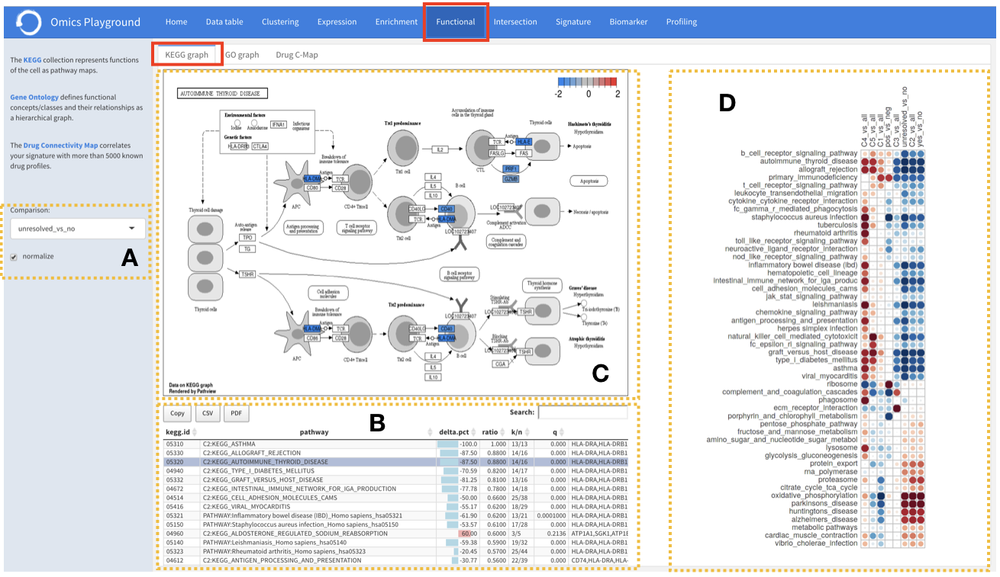
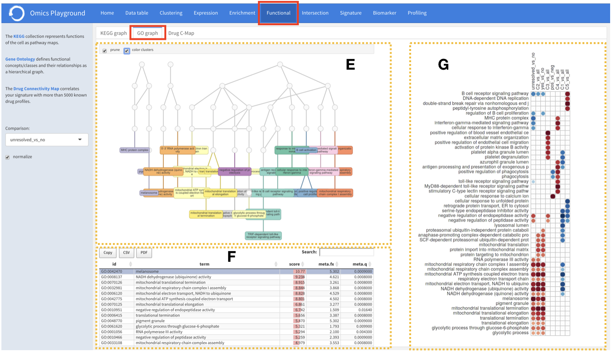

.. _Functional:

Functional analysis
================================================================================

This module provides higher level functional and visual analysis of the contrast 
space using the  
`KEGG <https://www.ncbi.nlm.nih.gov/pmc/articles/PMC102409/>`__ 
and `GO <http://geneontology.org/>`__
graph structures. Given the profile of a particular 
contrast, it also searches for the closest drug profiles from the 
`L1000 <https://www.ncbi.nlm.nih.gov/pubmed/29195078>`__
drug expression database.

KEGG graph
--------------------------------------------------------------------------------
`KEGG <https://www.ncbi.nlm.nih.gov/pmc/articles/PMC102409/>`__
is a collection of manually curated pathways representing the current knowledge
of molecular interactions, reactions and relation networks as pathway maps.

:**A**: The user selects the contrast of interest to perform the analysis and
        visualisation of KEGG pathways.

:**B**: Each KEGG pathway is scored according to the selected contrast profile
        and reported
        in an interactive table. The scoring is performed by considering the total
        number of genes in the pathway (:option:`n`), the number of genes in the pathway 
        supported by the contrast profile (:option:`k`), the ratio of :option:`k/n`,
        and the ratio of
        :option:`|upregulated or downregulated genes|/k`. Additionally, the table contains
        the list of the upregulated and downregulated genes for each pathway and a
        :option:`q` value from the Fisher's test for the overlap. 
        
        
:**C**: Pathway maps can be summoned from the interactive table, with individual
        genes coloured according to their differential expression 
        (upregulation: red;  downregulation: blue). 

:**D**: Another important feature is an activation-heatmap including the comparison
        of activation levels of pathways (or pathway keywords) across multiple 
        contrast profiles. This facilitates to quickly see and detect the 
        similarities between profiles in certain pathways.

GO graph
--------------------------------------------------------------------------------

`GO <http://geneontology.org/>`__ database provides a computational representation
of the current knowledge about roles of genes for many organisms in terms of 
molecular functions, cellular components and biological processes. 

:**E**: Instead of pathway maps, an annotated graph structure provided by the 
        GO database is plotted for every selected gene set.

:**F,G**: All the features described under the ``KEGG graph`` tab, such as scoring 
          the gene sets and drawing an activation-heatmap, can be performed for the
          GO database under the ``GO graph`` tab.

Drug C-Map
--------------------------------------------------------------------------------
:**H**: The drug connectivity map ``Drug C-Map`` section correlates the selected 
        contrast profile with more than 5000 known drug profiles from the 
        `L1000 <https://www.ncbi.nlm.nih.gov/pubmed/29195078>`__ database, and shows
        the top 10 similar and opposite profiles by running the 
        `GSEA <https://www.biorxiv.org/content/10.1101/060012v1.full>`__ 
        algorithm on the contrast-drug profile correlation space. 

:**I**: It also provides an activation-heatmap for drugs across
        multiple contrast profiles. Users can perform the contrast-drug 
        profile correlation analysis in mono (single drug) or combo 
        (combination of two drugs) mode.

.. figure:: figures/ug.021.png
    :align: center
    :width: 100%
    
    
    