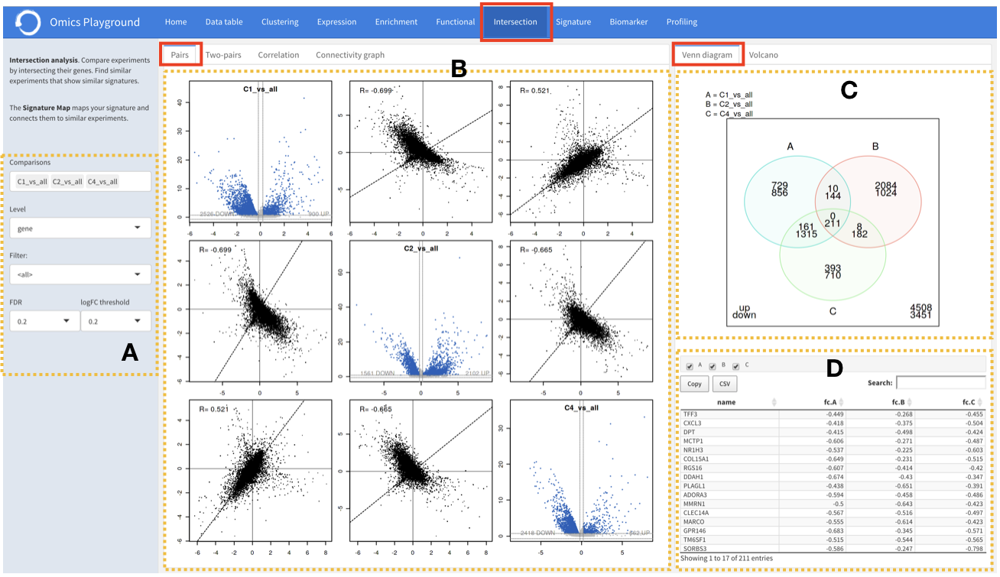
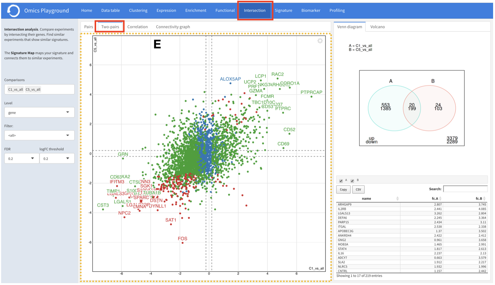
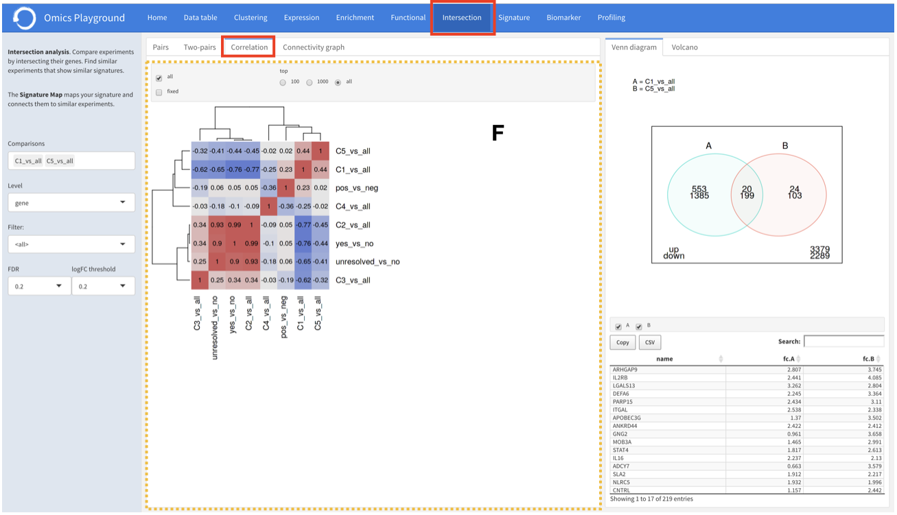
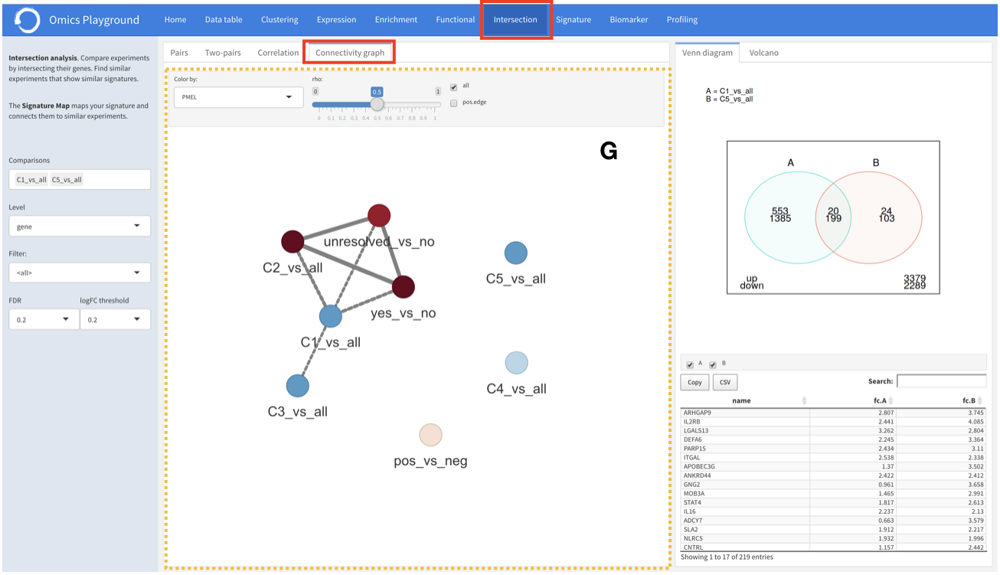

.. _Intersection:

Intersection analysis
================================================================================

The intersection analysis module enables users to compare multiple contrasts by 
intersecting the genes of profiles. Its main goal is to identify contrasts showing 
similar profiles. 

Pairs
--------------------------------------------------------------------------------
:**A**: Select the contrasts of interest for the analysis.

:**B**: For the selected contrasts, the platform provides volcano plots and 
        pairwise correlation plots between the profiles under the ``pairs`` tab. 

    
    
Venn diagram
--------------------------------------------------------------------------------
:**C**: The platform simultaneously plots a Venn diagram with the number of 
        intersecting genes between the selected profiles in the ``venn diagram``
        section. 
         
         
:**D**: The list of intersecting genes with further details is also reported in
        an interactive table, where users can select and remove a particular 
        contrast from the intersection analysis.

    
    
Volcano
--------------------------------------------------------------------------------
A ``volcano`` tab provides the volcano plot of genes from the intersection analysis.

Two-pairs
--------------------------------------------------------------------------------

It is possible to check a more detailed scatter plot of two profiles under the
``two-pairs`` tabs. 

Correlation
--------------------------------------------------------------------------------
In addition, it is possible to check the correlation-heatmap of multiple profiles
under the ``correlation`` tabs. 

Connectivity graph
--------------------------------------------------------------------------------
The ``connectivity`` graph tab 
constructs a network, in which nodes represent contrasts and edges are obtained 
from the pairwise-correlation of corresponding profiles. 
The correlation-heatmap and the network of contrasts facilitate to quickly 
highlight the similarities and differences between multiple contrasts.

