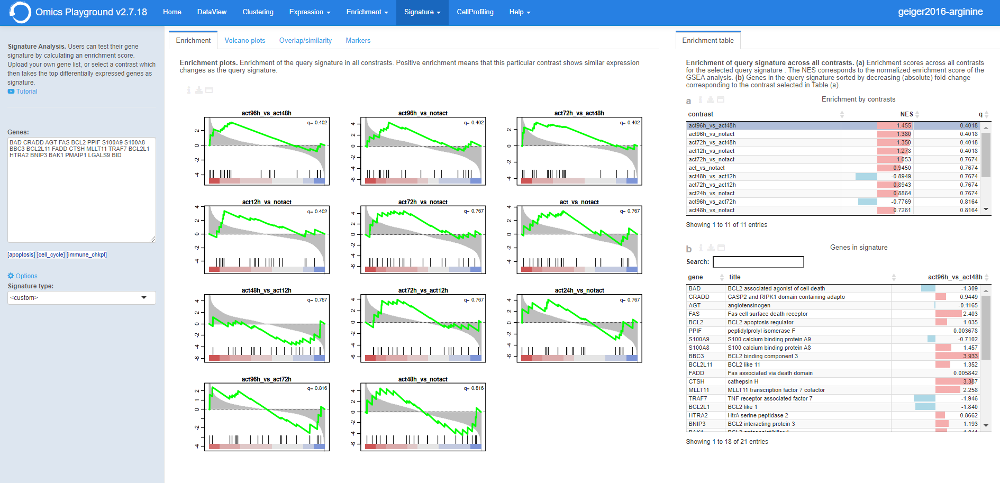
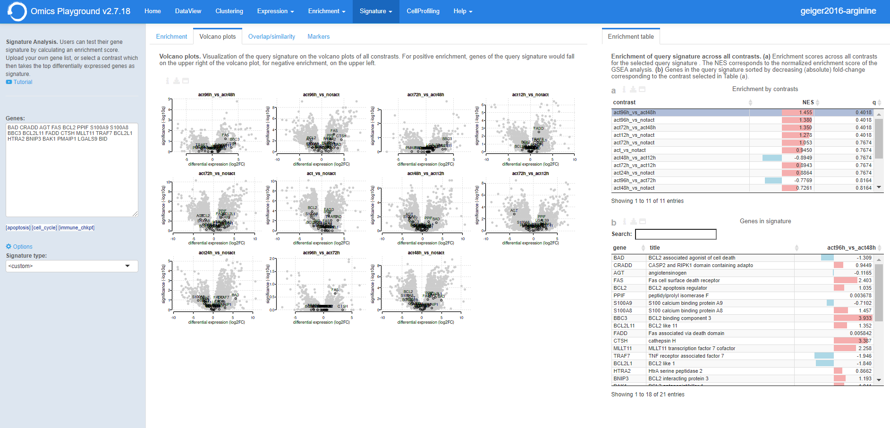

.. _Signature:

Compare
================================================================================

The **Compare** module consists of three submodules: **Compare signatures**, 
**Compare datasets** and **Similar experiments**.

**Compare signatures** allows users to compare experiments by intersecting 
their signature genes. Under **Compare datasets**, users can compare pairwise comparisons from the dataset in use and another dataset stored in the platform. Finally, with the **Similar experiments** panel, users can perform a large-scale comparison across all uploaded datasets or a pre-loaded collection of more than 6000 public dataset.

Compare signatures
--------------------------------------------------------------------------------

The main goal of this submodule is to identify contrasts showing similar profiles and 
find genes that are commonly up/down regulated between two contrasts. The panel is 
divided into two subpanels: **Pairwise scatter** and **Signature clustering**.
    

Settings panel
~~~~~~~~~~~~~~~~~~~~~~~~~~~~~~~~~~~~~~~~~~~~~~~~~~~~~~~~~~~~~~~~~~~~~~~~~~~~~~~~
Users can select contrasts to compare from the ``Contrast`` settings
in the input panel on the left. Under *Options*, the ``Level`` setting allows users 
to toggle between gene or gene set level analysis, while users can set the ``Filter`` for
selecting specific features (e.g. a specific gene family or gene set). 

.. figure:: figures_v3/SIG_settings.png
    :align: center
    :width: 20%

Pairwise scatter
~~~~~~~~~~~~~~~~~~~~~~~~~~~~~~~~~~~~~~~~~~~~~~~~~~~~~~~~~~~~~~~~~~~~~~~~~~~~~~~~
The **Pairwise scatter** panel shows three outputs:

:**Scatterplot pairs**: The Pairs plot provides interactive pairwise scatterplots for the differential expression 
        profiles corresponding to multiple contrasts. The main purpose of this panel is 
        to identify similarity or dissimilarity between selected contrasts. 
        When K>=3 contrasts are selected, the figure shows a KxK scatterplot matrix. 
        Via the *Settings*, users can disable the highlighting of genes on the plot. 

:**Venn diagram**: The Venn diagram visualizes the number of intersecting genes
        between the selected contrast profiles. The diagram can be customised via 
        the settings icon by altering ``logFC`` and ``FDR`` thresholds and by selecting whether to view 
        disregulated genes jointly or separated by up- and down-regulation under ``Counting``.

	.. figure:: figures_v3/SIG_venn_set.png
   		:align: center
   		:width: 20%

:**Leading-edge table**: Venn diagram areas can be selected via the settings icon (``Filter intersection``) and are represented by corresponding letters 
	(e.g. 'ABC' represents the intersection of contrasts A, B and C). Contrast letter identifiers are provided in the Venn Diagram.

	.. figure:: figures_v3/SIG_le_set.png
    		:align: center
    		:width: 25%

The three output panels are highlighted in the figure below.

.. figure:: figures_v3/SIG_scatter.png
    :align: center
    :width: 100%
        

Signature clustering
~~~~~~~~~~~~~~~~~~~~~~~~~~~~~~~~~~~~~~~~~~~~~~~~~~~~~~~~~~~~~~~~~~~~~~~~~~~~~~~~
Two plots are showed in this panel:

:**Foldchange heatmap**: The foldchange heatmap shows the similarity of the contrasts visualized as 
        a clustered heatmap. Contrasts that are similar will be clustered close together.
        The plot can be customised via the settings icon. Users can select to show 
        only the selected contrasts (default is to show all), cluster the genes on the heatmap and 
	change the annotation type between logFC (*boxplot*) and cumulative logFC (*barplot*).

	.. figure:: figures_v3/SIG_heat_set.png
    		:align: center
    		:width: 30%

:**Contrast correlation**: Contrasts that are similar will be clustered close together. The numeric value in the cells correspond to the Pearson correlation coefficient between contrast signatures. Red corresponds to positive correlation and blue to negative correlation.
        Under the plot settings, users can use ``show all contrasts`` (default) to show all contrasts or only the selected ones and change the 
	``number of top genes`` to specify the number of top genes for computations (default=1000).

	.. figure:: figures_v3/SIG_cc_set.png
   		:align: center
    		:width: 30%

A typical output can be seen below.

.. figure:: figures_v3/SIG_cluster_.png
    :align: center
    :width: 100%

Compare datasets
--------------------------------------------------------------------------------

With this submodule, users can compare pairwise comparisons across datasets that have been uploaded into the platform.
The submodule is split into thee tabs: **Compare expression**, **Foldchange** and **Gene Correlation**.

Settings panel
~~~~~~~~~~~~~~~~~~~~~~~~~~~~~~~~~~~~~~~~~~~~~~~~~~~~~~~~~~~~~~~~~~~~~~~~~~~~~~~~
Users can select the pairwise comparisons to be selcted from ``Dataset1`` and ``Dataset2``, from which they can also select a dataset from the list of uploaded experiments. 
Under *Options*, users can set the ``Plot type`` (default: UMAP1) to be displayed in the **Dataset1** and **Dataset2** panels. ``Highlight genes`` is used to label genes in the **Dataset1** and **Dataset2** plots. The choice is between highlighting top genes/proteins (default) or a custom list that users can type or paste in the corresponding box. With ``ntop`` users can define how many genes or proteins to label.

.. figure:: figures_v3/CD_settings.png
    :align: center
    :width: 20%

Compare expression
~~~~~~~~~~~~~~~~~~~~~~~~~~~~~~~~~~~~~~~~~~~~~~~~~~~~~~~~~~~~~~~~~~~~~~~~~~~~~~~~
After uploading a gene list, the **Enrichment** panel performs the
enrichment analysis of the gene list against all contrasts by
computing a correlation based enrichment or running the `GSEA
<https://www.biorxiv.org/content/10.1101/060012v1.full>`__ algorithm
and plots enrichment outputs.
The enrichment plots show the enrichment of the query 
signature across all constrasts. Positive enrichment means that this particular
contrast shows similar expression changes as the query signature.

.. figure:: figures_v3/CD_exp.png
    :align: center
    :width: 100%

Enrichment table
~~~~~~~~~~~~~~~~~~~~~~~~~~~~~~~~~~~~~~~~~~~~~~~~~~~~~~~~~~~~~~~~~~~~~~~~~~~~~~~~
Enrichment statistics can be found in the tables on the right:

:**Table a**: Enrichment scores across all contrasts for the selected
        query signature . The NES corresponds to the normalized
        enrichment score of the GSEA analysis.
:**Table b**: Genes in the query signature sorted by decreasing
        (absolute) fold-change corresponding to the contrast selected
        in Table (a).

Volcano Plots
~~~~~~~~~~~~~~~~~~~~~~~~~~~~~~~~~~~~~~~~~~~~~~~~~~~~~~~~~~~~~~~~~~~~~~~~~~~~~~~~
The **Volcano Plots** panel produces a visualization of the query signature 
on the volcano plots of all constrasts. For positive enrichment, genes of the 
query signature would fall on the upper right of the volcano plot, 
for negative enrichment, on the upper left.

Overlap/similarity
~~~~~~~~~~~~~~~~~~~~~~~~~~~~~~~~~~~~~~~~~~~~~~~~~~~~~~~~~~~~~~~~~~~~~~~~~~~~~~~~
Under the **Overlap/similarity** panel, users can compare their gene
list with all the gene sets and pathways in the platform through
overlap analysis, or also known as over-representation analysis. 

The top overlapping gene sets with selected signature are displyed in the plot. 
The vertical axis shows the overlap score of the gene set which is computed 
as the geometric mean of the absolute logarithm of the odds ratio 
and the q-value of the Fisher's test.

Under the plot settings, users can specify the number to top features
to show, or users can select to hide/show the feature names in the plot.
        
.. figure:: figures/psc8.4.a.png
    :align: center
    :width: 30%

The table reports the :option:`score`, total number of genes in the
gene set (:option:`K`), the number of intersecting genes between the
list and the gene set (:option:`k`), the overlapping ratio of
:option:`k/K`, as well as the :option:`odds.ratio` and
:option:`q.fisher` values by the Fisher's test for the overlap test.

.. figure:: figures/psc8.4.png
    :align: center
    :width: 100%
	   

Markers
~~~~~~~~~~~~~~~~~~~~~~~~~~~~~~~~~~~~~~~~~~~~~~~~~~~~~~~~~~~~~~~~~~~~~~~~~~~~~~~~
The **Markers** panel produces a t-SNE plot of samples for each gene
in the signature, where the samples are colored with respect to the
upregulation (in red) or downregulation (in blue) of the gene. For
larger signatures, only the top most variable genes in the signature
are given. If you want to check a particular gene not shown, you must
reduce the number of genes in your list.

.. figure:: figures/psc8.5.png
    :align: center
    :width: 100%

Find Biomarkers
--------------------------------------------------------------------------------

The **Find Biomarkers** panel selects biomarkers that can be
used for classification or prediction purposes. Biomarker analysis
might also help to better understand which genes, mutations, or gene
sets influence the final phenotype the most.

Omics Playground calculates a variable importance score for each feature using multiple state-of-the-art machine learning algorithms, including `LASSO <https://www.ncbi.nlm.nih.gov/pubmed/20808728>`__, `elastic nets
<https://statweb.stanford.edu/~candes/papers/DantzigSelector.pdf>`__, `random forests <https://www.stat.berkeley.edu/~breiman/randomforest2001.pdf>`__, and
`extreme gradient boosting <https://www.kdd.org/kdd2016/papers/files/rfp0697-chenAemb.pdf>`__. Note that we do not use the machine learning algorithms for prediction but we use them just to compute the variable importances according to the different methods. An aggregated score is then calculated as the cumulative rank of the variable importances of the different algorithms. By combining several methods, the platform aims to select the best possible predictive features. The top features are determined as the features with the highest cumulative ranks. 

The module provides a heatmap of samples based on identified top features. 
In addition, it generates a classification tree using top features and provides
expression boxplots by phenotype classes for features present in the
tree.

Input panel
~~~~~~~~~~~~~~~~~~~~~~~~~~~~~~~~~~~~~~~~~~~~~~~~~~~~~~~~~~~~~~~~~~~~~~~~~~~~~~~~

Users can select the target variable for biomarker selection in the
``Predicted target`` settings from the input panel. Under ``Feature filter``  
users can pre-filter features by selecting specific gene families or sets.
If the user selects :option:`<custom>`, an input area appears and one can paste 
a custom gene list to be used as initial features. Hitting the ``Run``
button will start the biomarker computation. 

.. figure:: figures/psc9.0.png
    :align: center
    :width: 30%

Importance
~~~~~~~~~~~~~~~~~~~~~~~~~~~~~~~~~~~~~~~~~~~~~~~~~~~~~~~~~~~~~~~~~~~~~~~~~~~~~~~~
        
This panel provides the output of the biomarker analysis in multiple
figures. Below we provide an short explanation for each figure:

:**a**: **Variable importance plot.** A variable importance score for
        each feature is calculated using multiple machine learning
        algorithms, including `LASSO
        <https://www.ncbi.nlm.nih.gov/pubmed/20808728>`__, `elastic
        nets
        <https://statweb.stanford.edu/~candes/papers/DantzigSelector.pdf>`__,
        `random forests
        <https://www.stat.berkeley.edu/~breiman/randomforest2001.pdf>`__,
        and `extreme gradient boosting
        <https://www.kdd.org/kdd2016/papers/files/rfp0697-chenAemb.pdf>`__.
        By combining several methods, the platform aims to select the
        best possible biomarkers. The top features are plotted
        according to cumulative ranking by the algorithms.
        
:**b**: **Biomarker expression heatmap.** The heatmap shows the expression
        distribution for the top most important features.
                
:**c**: **Decision tree.** The decision tree shows one (out of many
        possible) tree solution for classification based on the top
        most important features.
        
:**d**: **Expression box plots.** These boxplots shows the expression
        of genes/samples of the identified features.

.. figure:: figures/psc9.1.png
    :align: center
    :width: 100%
