.. _Compare:

Compare
================================================================================

The **Compare** module consists of three submodules: **Compare signatures**, 
**Compare datasets** and **Similar experiments**.

**Compare signatures** allows users to compare experiments by intersecting 
their signature genes. Under **Compare datasets**, users can compare pairwise comparisons from the dataset in use and another dataset stored in the platform. Finally, with the **Similar experiments** panel, users can perform a large-scale comparison across all uploaded datasets or a pre-loaded collection of more than 6000 public dataset.

Compare signatures
--------------------------------------------------------------------------------

The main goal of this submodule is to identify contrasts showing similar profiles and 
find genes that are commonly up/down regulated between two contrasts. The panel is 
divided into two subpanels: **Pairwise scatter** and **Signature clustering**.
    

Settings panel
~~~~~~~~~~~~~~~~~~~~~~~~~~~~~~~~~~~~~~~~~~~~~~~~~~~~~~~~~~~~~~~~~~~~~~~~~~~~~~~~
Users can select contrasts to compare from the ``Contrast`` settings
in the input panel on the left. Under *Options*, the ``Level`` setting allows users 
to toggle between gene or gene set level analysis, while users can set the ``Filter`` for
selecting specific features (e.g. a specific gene family or gene set). 

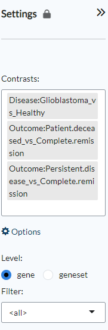

Pairwise scatter
~~~~~~~~~~~~~~~~~~~~~~~~~~~~~~~~~~~~~~~~~~~~~~~~~~~~~~~~~~~~~~~~~~~~~~~~~~~~~~~~
The **Pairwise scatter** panel shows three outputs:

:**Scatterplot pairs**: The Pairs plot provides interactive pairwise scatterplots for the differential expression 
        profiles corresponding to multiple contrasts. The main purpose of this panel is 
        to identify similarity or dissimilarity between selected contrasts. 
        When K>=3 contrasts are selected, the figure shows a KxK scatterplot matrix. 
        Via the *Settings*, users can disable the highlighting of genes on the plot. 

:**Venn diagram**: The Venn diagram visualizes the number of intersecting genes
        between the selected contrast profiles. The diagram can be customised via 
        the settings icon by altering ``logFC`` and ``FDR`` thresholds and by selecting whether to view 
        disregulated genes jointly or separated by up- and down-regulation under ``Counting``.

	.. figure:: figures_v3/SIG_venn_set.png
   		:align: center
   		:width: 20%

:**Leading-edge table**: Venn diagram areas can be selected via the settings icon (``Filter intersection``) and are represented by corresponding letters 
	(e.g. 'ABC' represents the intersection of contrasts A, B and C). Contrast letter identifiers are provided in the Venn Diagram.

	.. figure:: figures_v3/SIG_le_set.png
    		:align: center
    		:width: 25%

The three output panels are highlighted in the figure below.

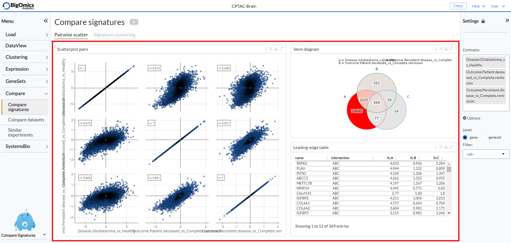
        

Signature clustering
~~~~~~~~~~~~~~~~~~~~~~~~~~~~~~~~~~~~~~~~~~~~~~~~~~~~~~~~~~~~~~~~~~~~~~~~~~~~~~~~
Two plots are showed in this panel:

:**Foldchange heatmap**: The foldchange heatmap shows the similarity of the contrasts visualized as 
        a clustered heatmap. Contrasts that are similar will be clustered close together.
        The plot can be customised via the settings icon. Users can select to show 
        only the selected contrasts (default is to show all), cluster the genes on the heatmap and 
	change the annotation type between logFC (*boxplot*) and cumulative logFC (*barplot*).

	.. figure:: figures_v3/SIG_heat_set.png
    		:align: center
    		:width: 30%

:**Contrast correlation**: Contrasts that are similar will be clustered close together. The numeric value in the cells correspond to the Pearson correlation coefficient between contrast signatures. Red corresponds to positive correlation and blue to negative correlation.
        Under the plot settings, users can use ``show all contrasts`` (default) to show all contrasts or only the selected ones and change the 
	``number of top genes`` to specify the number of top genes for computations (default=1000).

	.. figure:: figures_v3/SIG_cc_set.png
   		:align: center
    		:width: 30%

A typical output can be seen below.

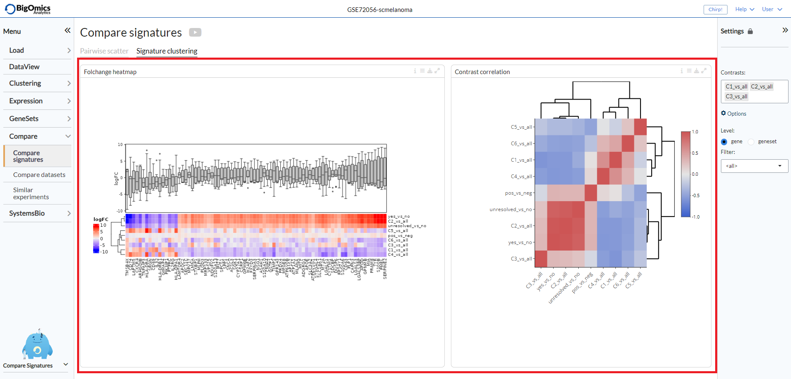

Compare datasets
--------------------------------------------------------------------------------

With this submodule, users can compare pairwise comparisons across datasets that have been uploaded into the platform.
The submodule is split into thee tabs: **Compare expression**, **Foldchange** and **Gene Correlation**.

Settings panel
~~~~~~~~~~~~~~~~~~~~~~~~~~~~~~~~~~~~~~~~~~~~~~~~~~~~~~~~~~~~~~~~~~~~~~~~~~~~~~~~
Users can select the pairwise comparisons to be selcted from ``Dataset1`` and ``Dataset2``, from which they can also select a dataset from the list of uploaded experiments. 
Under *Options*, users can set the ``Plot type`` (default: UMAP1) to be displayed in the **Dataset1** and **Dataset2** panels. ``Highlight genes`` is used to label genes in the **Dataset1** and **Dataset2** plots. The choice is between highlighting top genes/proteins (default) or a custom list that users can type or paste in the corresponding box. With ``ntop`` users can define how many genes or proteins to label.

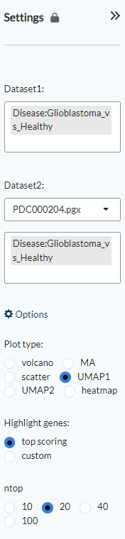

Compare expression
~~~~~~~~~~~~~~~~~~~~~~~~~~~~~~~~~~~~~~~~~~~~~~~~~~~~~~~~~~~~~~~~~~~~~~~~~~~~~~~~
This panel shows plots for selected pairwise comparisons from the current dataset (*Dataset1*) and a second dataset (*Dataset2*) selected from a list of uploaded experiments. The type of plot can be selected via the main submodule **Settings**. Users can select between plotting the genes or proteins as UMAP plots based on either dataset 1 or dataset 2 (UMAP1 and UMAP2), as volcano, MA plots, scatter plots or heatmaps.

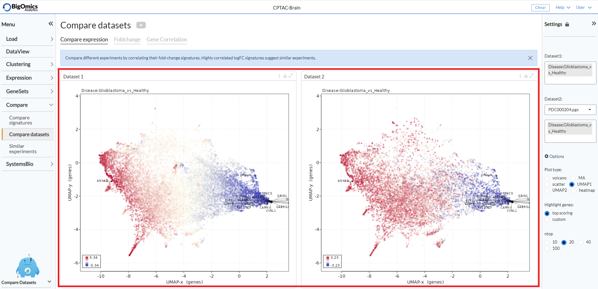

Fold change
~~~~~~~~~~~~~~~~~~~~~~~~~~~~~~~~~~~~~~~~~~~~~~~~~~~~~~~~~~~~~~~~~~~~~~~~~~~~~~~~
This tab contains three panels: **FC correlation**, which contains the plot between the pairwise comparsions selected between two datasets and the **Cumulative foldchange** panels that show barplot highlighting the fold changes in expression for each of the selected pairwise comparisons.

:**FC correlation**: Scatter plot of gene expression scatter values between two contrasts. Scatters that are similar show high correlation, i.e. are close to 		the diagonal.
:**Cumulative foldchange** upper: Barplot showing the cumulative fold changes on dataset 1.
:**Cumulative foldchange** lower: Barplot showing the cumulative fold changes on dataset 2.

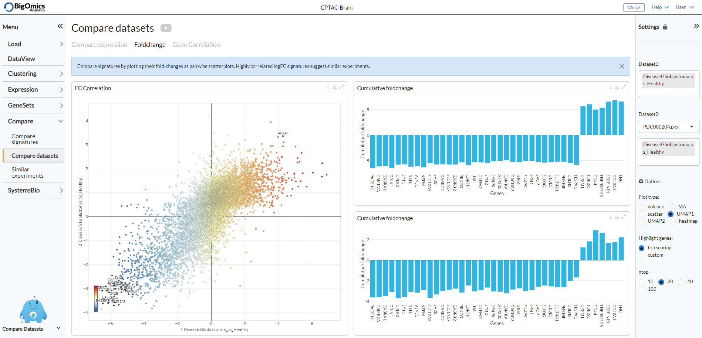

Gene correlation
~~~~~~~~~~~~~~~~~~~~~~~~~~~~~~~~~~~~~~~~~~~~~~~~~~~~~~~~~~~~~~~~~~~~~~~~~~~~~~~~
The **Gene Correlation** tab is used to compare the expression levels of individual genes or proteins between pairwise comparions across datasets. It can also be used for the combined analysis of proteomics and transcriptomics datasets. It contains three panels: **Expression**, **Correlation score** and **Gene correlation**.

:**Expression**: Barplots of expression values for multiple comparisons in the two datasets (blue and green). Bars are labelled by pairwise comparison groups.
:**Correlation score**: In this searchable table, users can check mean expression values and correlation scores of genes/proteins across the selected pairwise comparisons.
:**Gene correlation**: Scatter plots of gene expression scatter values between two contrasts. Scatters that are similar show high correlation, i.e. are close to the diagonal. This plot is only available for studies with matched sample Ids and can be used to compare proteomics and transcriptomics datasets from the 	same samples. Users can select by which pairwise comparison to colour the samples via the settings icon.

	.. figure:: figures_v3/CD_gc_opts.png
    		:align: center
    		:width: 30%

The genes or proteins appearing in the **Expression** barplots and **Gene correlation** scatter plots will be determined in the **Correlation score** table.

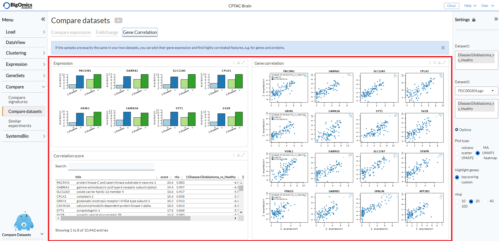

Similar experiments
--------------------------------------------------------------------------------

With the final submodule, users can compare contrasts from different experiments against a selected pairwise comparisons from the current dataset simultenously.  Rather than a pairwise analysis between two datasets, this analysis will take into accounts all uploaded datasets or, alternatively, access two databases of more than 6000 individual experiments collected from the GEO database. The submodule is split into three tabs: **FC correlation**, **FC heatmap** and **Meta-network**.

Settings panel
~~~~~~~~~~~~~~~~~~~~~~~~~~~~~~~~~~~~~~~~~~~~~~~~~~~~~~~~~~~~~~~~~~~~~~~~~~~~~~~~
Through the **Settings** panel, an experimental ``Contrast`` from the selection of available pairwise comparisons in the dataset can be set. Under ``Signature DB``, users can select from three databases: *datasets-sigdb.h5* corresponds to the datasets that have been uploaded by teh user into the platform, *sigdb-archs4.h5* correspond to a collection of more than 6000 datasets from the GEO database, while *sigdb-virome.h5* contains a selection of more than 300 viral infection GEO datasets. Under the *Advanced options*, users can choose whether to ``hide cluster contrasts`` (default) and show the absolute score (``abs.score``), which is the default choice. Under ``Select genes`` it is possible to type or paste a user-generated list of genes/proteins and also select the number of genes to be labelled (default: 50). Clicking ``Recalculate`` will then generate new plots based on the inputed gene list. 

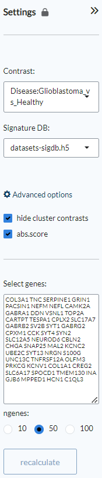

FC correlation
~~~~~~~~~~~~~~~~~~~~~~~~~~~~~~~~~~~~~~~~~~~~~~~~~~~~~~~~~~~~~~~~~~~~~~~~~~~~~~~~
With this tab it is possible to compare different experiments by correlating their fold-change signatures. The tab consists of three panels: **FC scatter plots**, **Similarity scores** and **FC-FC scatterplot**. 

:**FC scatter plots**: Scatter plots of gene expression foldchange values between two contrasts. Foldchanges that are similar show high correlation, i.e. are close to the diagonal. You can switch to gsea or UMAP enrichment plots in the ``plot type`` option in the settings icon.

	.. figure:: figures_v3/SE_fc_set.png
    		:align: center
    		:width: 30%

:**Similarity score**: In this searchable table, Normalized enrichment scores (NES) and Pearson correlation (rho) of reference profiles with respect to the currently selected contrast are displayed. The top 100 up/down genes are considered for the calculation of rho or NES. The score is calculated as rho^2*NES. Highlighting a specific dataset will change the FC-FC scatterplot accordingly.

:**FC-FC scatterplot**: This plot provides a pairwise scatterplot of logFC fold-change profiles for the selected contrasts. The main purpose of this panel is to identify similarity or dissimilarity between selected contrasts. The scatter plot is interactive and shows information of each gene by hovering over it with the mouse. The ``logFC threshold`` can be set via the settings icon.

	.. figure:: figures_v3/SE_fc-fc_set.png
    		:align: center
    		:width: 30%

The three panels are highlighted in the image below. 

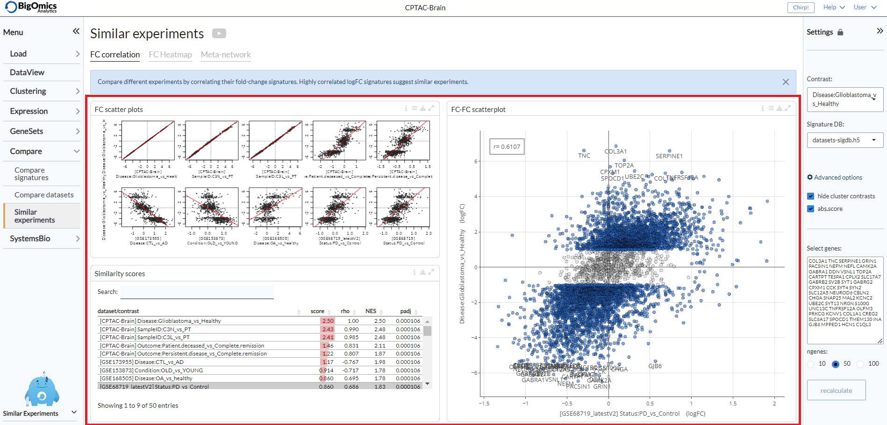

FC heatmap
~~~~~~~~~~~~~~~~~~~~~~~~~~~~~~~~~~~~~~~~~~~~~~~~~~~~~~~~~~~~~~~~~~~~~~~~~~~~~~~~
The **FC heatmap** tab provides three panels for more comparative analysis: **Connectivity map**, **Fold-change table** and **Connectivity heatmap**.

:**Connectvity map**: The connectivity map plot shows the similarity of logFC signatures as a t-SNE plot. Signatures that are similar will be clustered close together, signatures that are different are placed farther away. The plot can be extensively customised via the options in the settings icon. ``Layout`` is usde to alter the layout of the plot, namely pca, tsne (default) and volcano. ``Score threshold`` thresholds the points by minimum score.``Color by`` is used to colour the samples by either score (default) or dataset. ``Color gamma`` is used for colour adjustment. Under ``Other options``, users can add lables to the plot, turn it into a 3D plot, change the background colour to black and increase the size of the dots.

	.. figure:: figures_v3/SE_fc_set.png
    		:align: center
    		:width: 30%

:**Fold-change table**: In this searchable table, gene expression fold-changes (log2FC) of similar signatures across different experiments are indicated.

:**Connectivity heatmap**: The heatmap clusters contrasts that are similar close together to provide an overview of the top most correlated contrasts with th equeried pairwise comparison. Through the settings icon, users can alter the ``Number of signatures`` to be displayed (default=20), they can also ``Cluster genes`` rather than sorting them by expression (default: off), ``Use absolute foldchange`` for calculating the cumulative sum and finally can ``Reverse negative contrasts`` (default: on), so as not to consider the direction of the correlation but only its strength. 

	.. figure:: figures_v3/SE_cm_set.png
    		:align: center
    		:width: 30%

These plots are complementary to the plots provided by the **FC correlation** tab, to explore more in detail the nature of the correlation between contrasts.

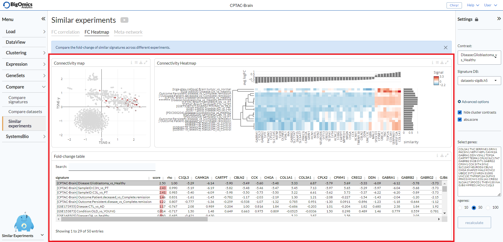

Meta-network
~~~~~~~~~~~~~~~~~~~~~~~~~~~~~~~~~~~~~~~~~~~~~~~~~~~~~~~~~~~~~~~~~~~~~~~~~~~~~~~~
The final tab of the **Similar experiments** submodule provides some comparative gene network analysis as well as geneset level annotation of the most frequently enriched genesets across the correlated pairwise comparisons. It consists of four panels: **Leading-edge graph**, **Cumulative foldchange**, **Enrichment graph** and **Cumulative enrichment**.

:**Leading-edge graph**: This graph displays the connections between genes shared across the correlated signatures. The edge width corresponds to the number of signatures that share that pair of genes in their top differentially expressed genes. Through the settings icon, it is possible to set the ``Edge threshold``, select the number of signatures (``nr of signatures``) to be used (default=10) and select the ``Size`` parameter for the nodes (default: cumFC).

	.. figure:: figures_v3/SE_le_set.png
    		:align: center
    		:width: 30%

:**Cumulative foldchange**: The barplot visualizes the cumulative foldchange between the top-10 most similar profiles. Genes that are frequently shared with high foldchange will show a higher cumulative score. You can choose between signed or ``Absolute foldchange`` in the options and use ``order by`` to order the plot by FC or cumulative FC (cumFC, default).

	.. figure:: figures_v3/SE_ce_set.png
    		:align: center
    		:width: 30%

:**Enrichment graph**: In this graph, the edge width corresponds to the number of signatures that share that pair of genesets in their top enriched genesets. In the plot options you can set the ``Edge threshold``, the number of similar experiments to consider (``N-neighbours``, default=10), whether to add a ``Odd ratio weighting`` (default: off) and the parameter to be used for the node ``Size`` (default: cumFC).

	.. figure:: figures_v3/SE_eg_set.png
    		:align: center
    		:width: 30%

:**Cumulative enrichment**: In this plot, gene sets that are frequently shared with high enrichment will show a higher cumulative scores. You can choose between signed or ``Absolute foldchange`` in the options and use ``order by`` to order the plot by FC or cumulative FC (cumFC, default).

	.. figure:: figures_v3/SE_ce_set.png
    		:align: center
    		:width: 30%

These plots are complementary to the plots provided by the **FC correlation** tab, to explore more in detail the nature of the correlation between contrasts.

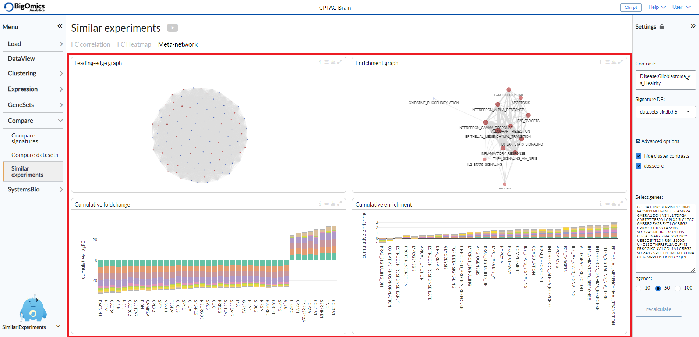
