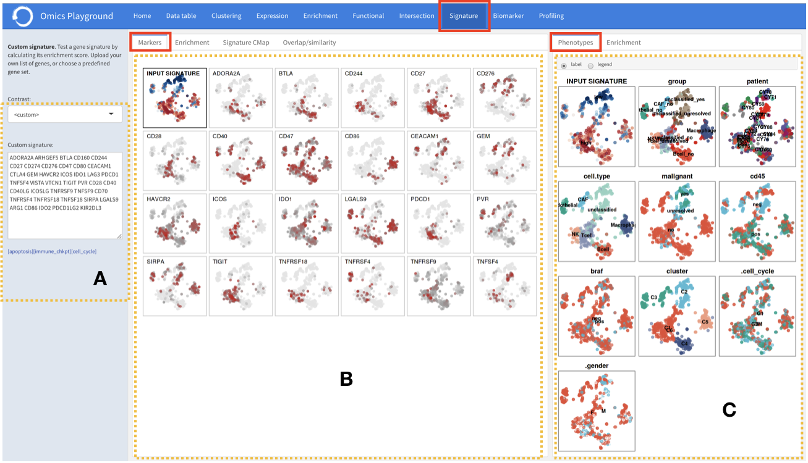
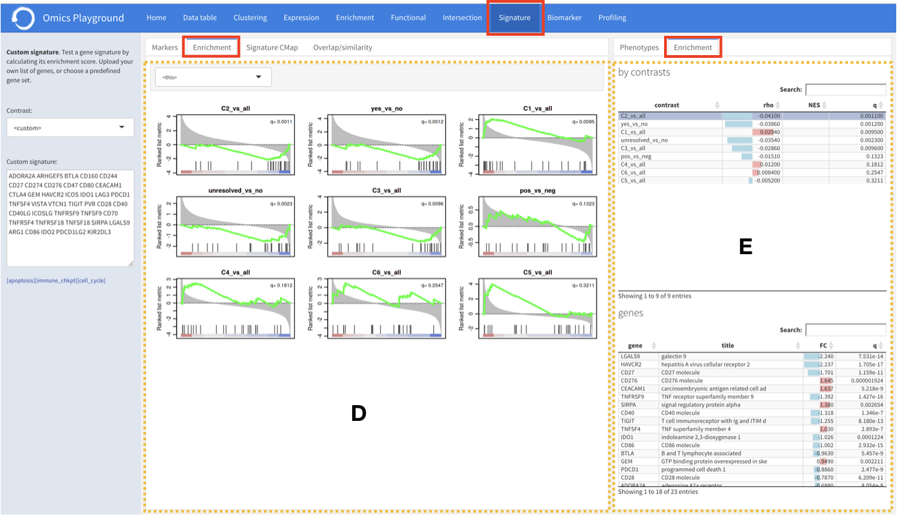
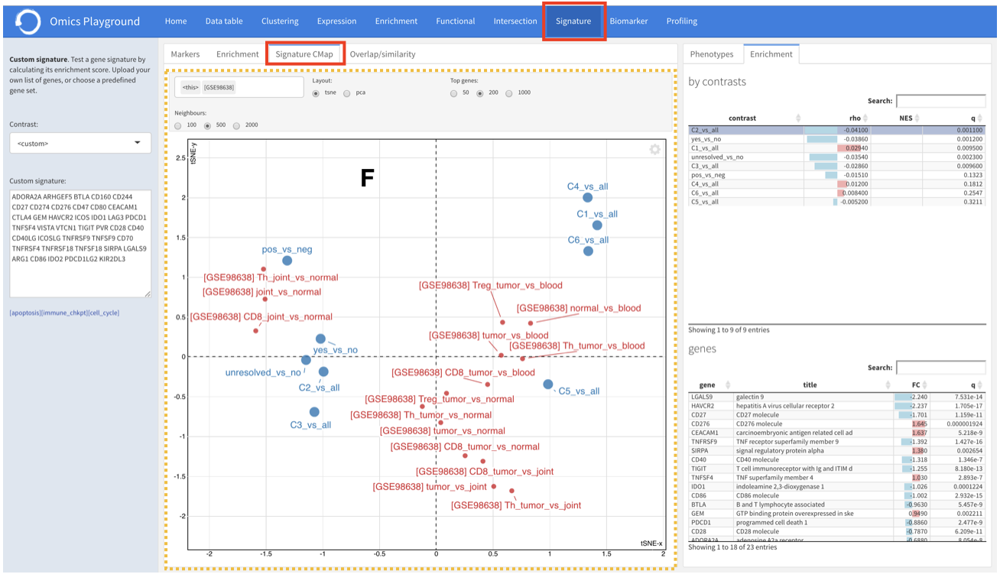
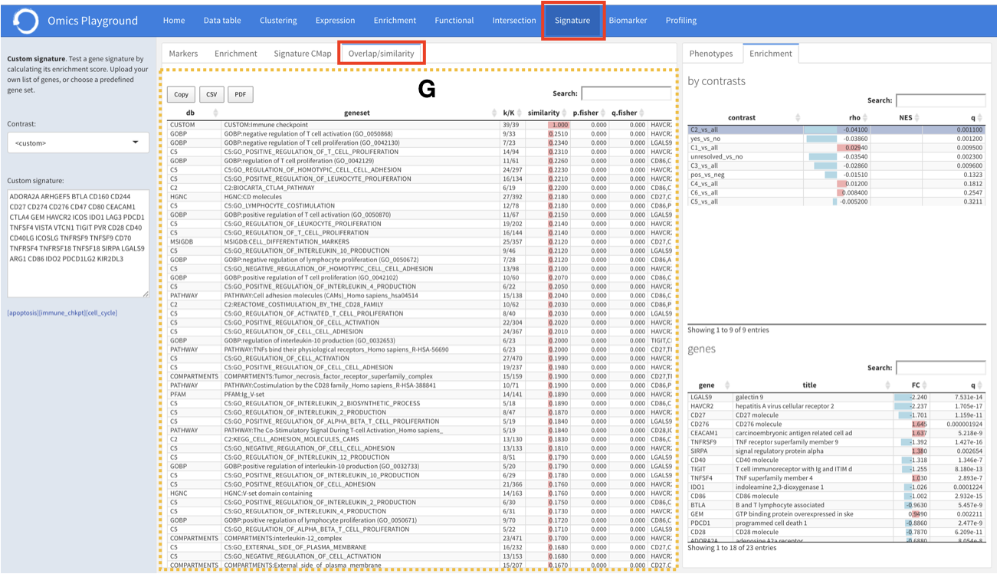

.. _Signature:

Signature analysis
================================================================================

In this module, users can test gene signatures by calculating an enrichment score.

Markers
--------------------------------------------------------------------------------
:**A**: To test the signature enrichment, the user can use a sample list provided
        on the platform or upload own gene list. Instead of a short list, a profile
        can also be selected, which is a complete gene list derived from one of the
        contrasts in the analysis.

:**B**: After uploading a gene list, the markers section produces a t-SNE plot of 
        samples for each gene, coloured by expression levels (upregulation: red; 
        downregulation: blue). 

Phenotypes
--------------------------------------------------------------------------------
??

Enrichment
--------------------------------------------------------------------------------

:**D**: The enrichment tab performs the enrichment analysis of the gene list 
        against all contrasts by running the 
        `GSEA <https://www.biorxiv.org/content/10.1101/060012v1.full>`__ 
        algorithm and plots enrichment outputs.

:**E**: The enrichment statistics can be found in this table.

Signature c-map
--------------------------------------------------------------------------------
The ``signature c-map`` section associates the provided signature list or contrast
profile with similar profiles of other experiments, obtained from ten published 
datasets. 

Overlap/similarity
--------------------------------------------------------------------------------
Under the ``overlap/similarity`` tab, users can compare
their gene list with all the gene sets and pathways in the platform through statistics
such as the total number of genes in the gene set (:option:`K`), the number of
intersecting genes between the list and the gene set (:option:`k`), the overlapping
ratio of :option:`k/K`, as well as the :option:`p`
and :option:`q` values by the Fisher's test for the overlap test.

