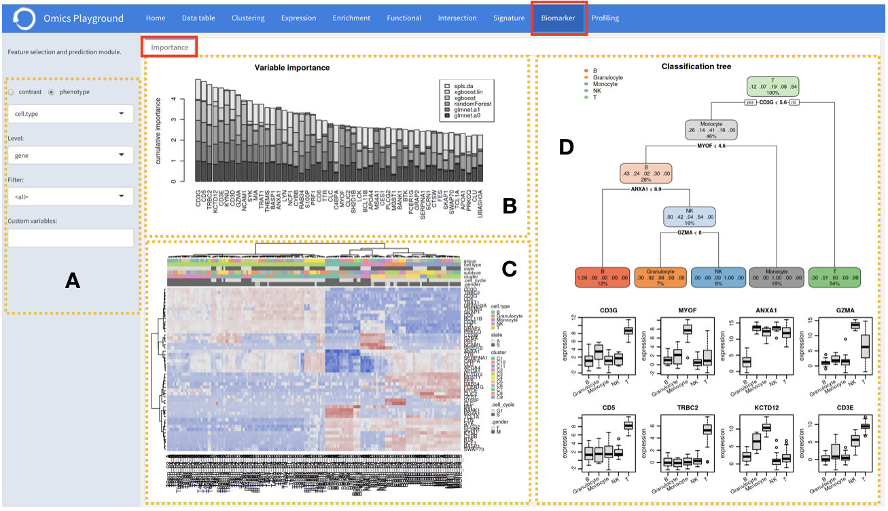

.. _Biomarker:

Biomarker analysis
================================================================================

This module performs the biomarker selection that can be used for classification
or prediction purposes. To better understand which genes, mutations, or gene sets
influence the final phenotype the most, Playground calculates a variable importance
score for each feature using state-of-the-art machine learning algorithms, 
including 
LASSO \cite{Friedman2010Regularization}, 
elastic nets \cite{Candes2007TheDantzig},
random forests \cite{Breiman2007Random}, and 
extreme gradient boosting \cite{Chen2007Xgboost},
and provides the top 50 features according to cumulative ranking by the algorithms.
By combining several methods, the platform aims to select the best possible biomarkers.

:**A**: The phenotype of interest is selected. It can be multiple categories (classes)
        or patient survival data. Instead of choosing a phenotype, users can also 
        specify a particular contrast from the analysis and perform biomarker selection.
        
:**B**: The platform provides top N=25 features based
        on cumulative variable importance scores from multiple methods.
        
        
:**C**: It also provides a heatmap of samples based on identified top features.

:**D**: In addition, this tab generates a classification tree using top features and
        provides expression boxplots by phenotype classes for features present in
        the tree.

If the data set under the study has a survival data, the  **biomarker** tab can also 
provide a survival tree analysis using top features. Furthermore, it provides expression
boxplots by phenotype classes for features present in the tree.

.. figure:: figures/ug.031.png
    :align: center
    :width: 100%

