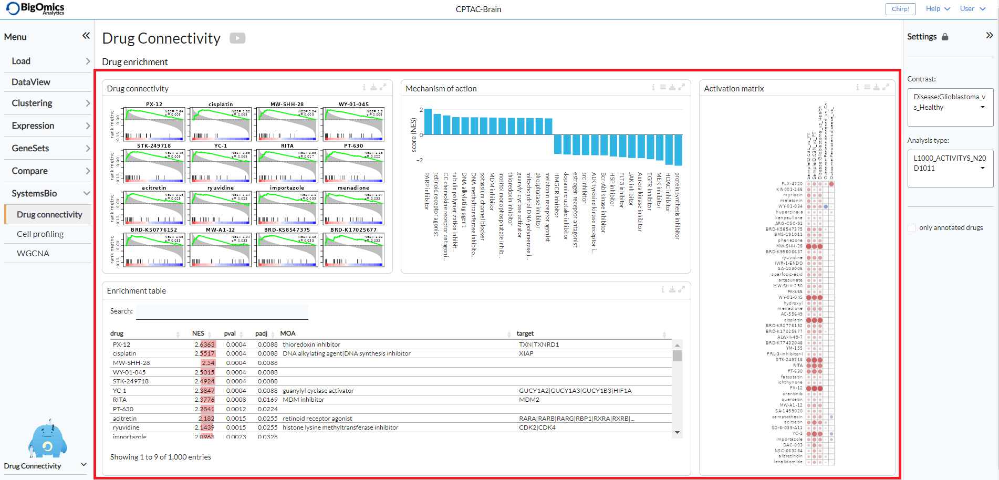
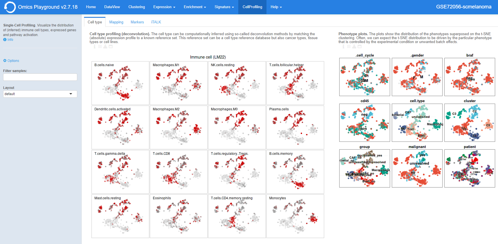
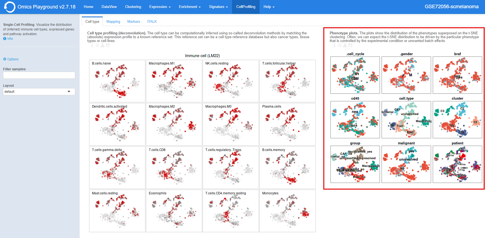
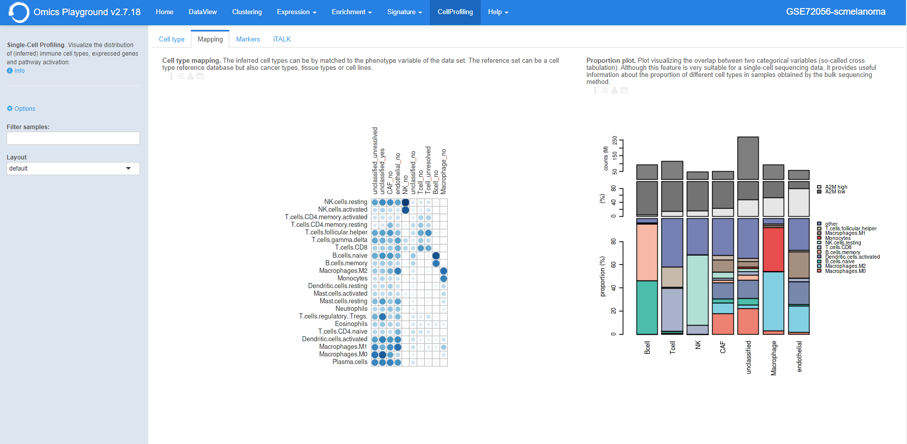
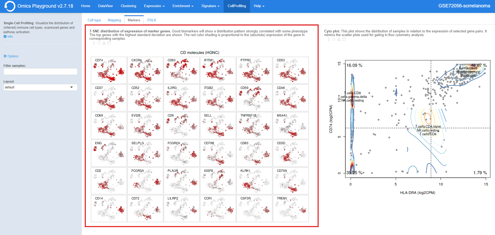
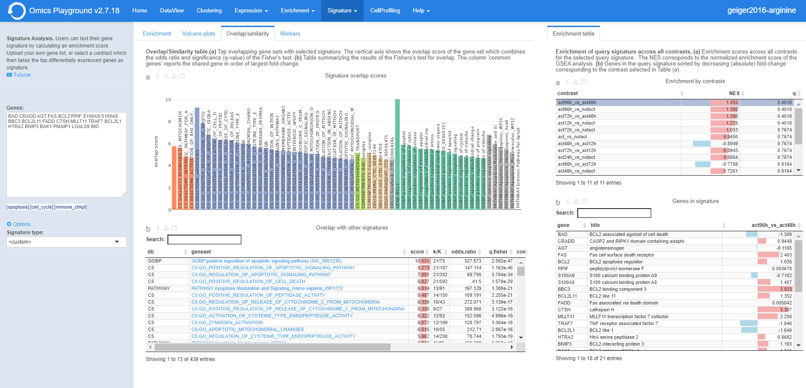
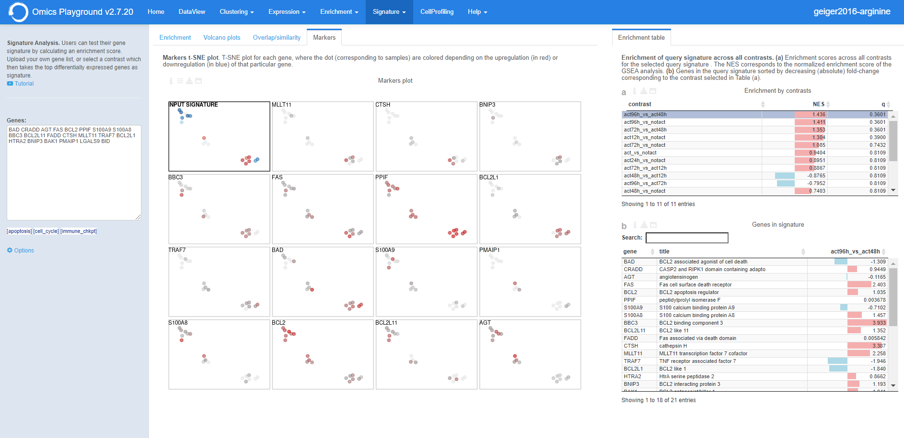
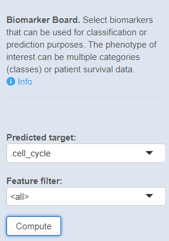
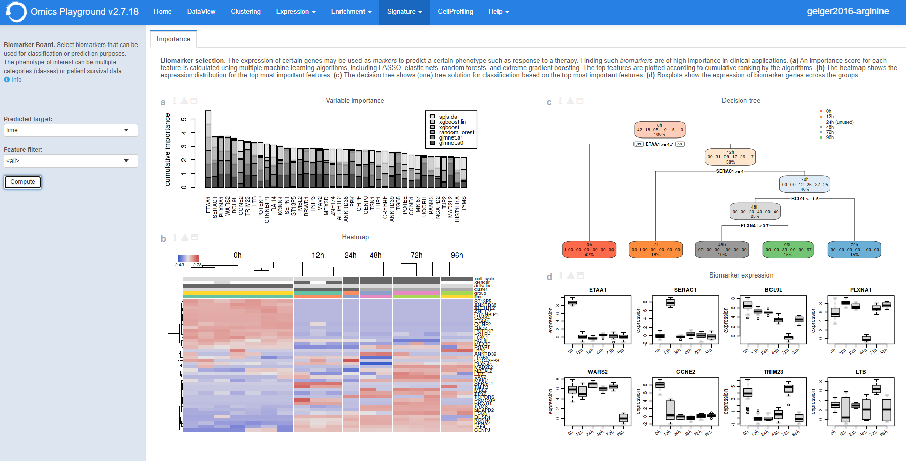

.. _CellProfiling:

SystemsBio
================================================================================
The final module of the platform is divided into three submodules: **Drug connectivity**, **Cell profiling** and **WGCNA**.

Drug connectivity
--------------------------------------------------------------------------------
In the **Drug connectivity** submodule, users can correlate their signature with
more than 5000 known drug profiles from the 
`L1000 <https://www.ncbi.nlm.nih.gov/pubmed/29195078>`__ database, as well as with drug 
sensitivity profiles from the `CTRP v2 <https://portals.broadinstitute.org/ctrp.v2.1/>`__ 
and `GDSC <https://www.cancerrxgene.org/>`__ databases. 
Additionally, a separate list of shRNA- and cDNA-perturebed datasets from the L1000 database 
is also available (gene/L1000).

An activation-heatmap compares drug activation profiles across multiple contrasts. 
This facilitates to quickly see and detect the similarities between contrasts
for certain drugs.

Settings panel
~~~~~~~~~~~~~~~~~~~~~~~~~~~~~~~~~~~~~~~~~~~~~~~~~~~~~~~~~~~~~~~~~~~~~~~~~~~~~~~~
In the **Settings** panel, users can specify the contrast of their interest
with the ``Contrast`` setting. Under ``Analysis type`` users can select from four 
databases, including the L1000 drug connectivity map  (L1000/activity), the L1000 gene perturbation (L1000/gene) database, the CTRP v2 drug sensitivity (CTRP_v2/sensitivity) database and the GDSC drug sensitivity (GDSC/sensitivity) database (default: L1000/activity). The ``only annotated drugs`` option is used to exclude drugs without a known  mechanism of action.

.. figure:: figures_v3/drug_settings.png
    :align: center
    :width: 20%

Drug enrichment
~~~~~~~~~~~~~~~~~~~~~~~~~~~~~~~~~~~~~~~~~~~~~~~~~~~~~~~~~~~~~~~~~~~~~~~~~~~~~~~~
There are four main panels in the **Drug enrichment** tab:    

:**Drug connectivity**: The Drug Connectivity panel correlates your signature with profiles from the L1000 
        (activity/L1000 and gene/L1000), CTRP and GDSC databases. 
        It shows the top N=12 similar and opposite profiles as GSEA plots by running 
        the GSEA algorithm on the contrast-drug profile correlation space. 

:**Enrichment table**: Enrichment is calculated by correlating
        your signature with the profiles from the chosen
        database. Because of multiple perturbation experiments for a
        single small molecule, they are scored by running the GSEA algorithm on the 
        contrast-small molecule profile correlation space. In this way, we obtain a 
        single score for multiple profiles of a single small molecule. The table can be 
        customised via the table *Settings* to only show annotated drugs.

:**Mechanism of action**: This plot visualizes the mechanism of action (MOA) across the enriched
        drug profiles. On the vertical axis, the number of drugs with the same
        MOA are plotted. You can switch to visualize between MOA or target gene.
        Under the plots *Settings*, users can select the plot type of MOA
        analysis: by class description (``drug class``) or by target gene 
        (``target gene``). They can also apply q-value weighting for NES scoe values (``q-weighting``).

        .. figure:: figures_v3/drug_cmap_moa_set.png
            :align: center
            :width: 25%

:**Activation matrix**: The **Activation matrix** visualizes the correlation of small molecule 
        profiles with all available pairwise comparisons. The size of the
        circles correspond to the strength of their correlation, and are
        colored according to their positive (red) or
        negative (blue) correlation to the contrast profile. 
        The matrix can be normalised via the settings icon by ticking the ``normalize activation matrix`` option.

        .. figure:: figures_v3/drug_AM_opts.png
            :align: center
            :width: 25%

This tab can have many applications, which include understanding the MOA of a novel compund, identifying drugs that can be repurposed for treating a disease, identifying suitable partner drugs for the tested compound or target genes for intervention.

Cell Profiling
--------------------------------------------------------------------------------

The **Cell Profiling** tab is specifically developed for the
analysis and visualization of single-cell datasets. The main
applications are identification of immune cell types and
visualisations of markers, phenotypes, and proportions across the cells.

The **Cell type** tab infers the type of cells using computational deconvolution
methods and reference datasets from the literature.

The **Mapping** tab provides a visualization of the inferred cell types 
matched to the phenotype variable of the data set, as well as a proportion plot 
visualizing the interrelationships between two categorical variables 
(so-called cross tabulation). This can be used to study the composition 
of a sample by cell type, for example.  

The **Markers** tab provides potential marker genes, which are the top genes 
with the highest standard deviation within the expression data across the samples. 
It also generates a plot mimicking the scatter plots used for gating in 
flow cytometry analysis.

Settings panel
~~~~~~~~~~~~~~~~~~~~~~~~~~~~~~~~~~~~~~~~~~~~~~~~~~~~~~~~~~~~~~~~~~~~~~~~~~~~~~~~
Users can filter relevant samples in the ``Filter samples`` settings
under the the main ``Options`` in the input panel. They can also
specify the ``layout`` for the figures by chooisng between pca, tsne or umap options (default: tsne).

.. figure:: figures/psc10.0.png
    :align: center
    :width: 20%

Cell type profiling
~~~~~~~~~~~~~~~~~~~~~~~~~~~~~~~~~~~~~~~~~~~~~~~~~~~~~~~~~~~~~~~~~~~~~~~~~~~~~~~~
The **Cell type profiling** tab infers the type of cells using
computational deconvolution methods and reference datasets from the
literature.  In the plot settings menu, users can select the
reference dataset and the method for the cell type prediction in the
``reference`` and ``method`` settings, respectively. Currently, we
have implemented a total of 7 methods (EPIC, DeconRNAseq, DCQ, I-NNLS,
NNLM, correlation-based and a meta-method) and 9 reference datasets to
predict immune cell types (4 datasets: LM22, ImmProt, DICE and
ImmunoStates), tissue types (2 datasets: HPA and GTEx), cell lines (2
datasets: HPA and CCLE) and cancer types (1 dataset: CCLE). Not all
methods or databases may be available for a dataset, the availability
depends on the pre-processing done. From the settings, users can also 
sort plots by either probability or name and change the layout.

.. figure:: figures/psc10.1.0.png
    :align: center
    :width: 30%

The cell type profiling plot is highlighted below.

It also produces phenotypes plots showing the distribution of the 
phenotypes superimposed on the t-SNE clustering. 
Often, we can expect the t-SNE distribution to be driven by the particular 
phenotype that is controlled by the experimental condition or unwanted 
batch effects. Users can select whether they want the group labels to be 
plotted inside the figures or in a seperate legend in the``Legend`` 
under the *Settings*.

Mapping
~~~~~~~~~~~~~~~~~~~~~~~~~~~~~~~~~~~~~~~~~~~~~~~~~~~~~~~~~~~~~~~~~~~~~~~~~~~~~~~~
The **Mapping** panel contains two plots.
To the right there is a plot representing the cell type mapping across all samples.
This plot can be customised via the *Settings* menu. Through it, users can change 
the ``plot type`` between a dotmap and a heatmap, select the ``reference`` dataset, 
select the analysis ``method`` and use ``group by`` to group samples by phenotypes.

.. figure:: figures/psc10.2.a.png
    :align: center
    :width: 30%

The cell type mapping plot is shown below.

To the left, a proportion plot visualizes the overlap between two categorical variables.
This can be useful for bulk RNA datasets, as it provides useful information about 
the proportion of different cell types in the samples. From the *Settings*, users 
can select whwther to display the <cell type> (based on the chosen reference dataset) 
or select one of the available phenotypes on the x- and y-axes of the plot. The number
of counts is also displayed on top. 
By selecting a gene with ``gene`` they can also add an expression barplot for the gene.

.. figure:: figures/psc10.2.b.png
    :align: center
    :width: 30%

The proportion plot (including a gene expression barplot) is shown below.

.. figure:: figures/psc10.2.1.png
    :align: center
    :width: 100% 

Markers
~~~~~~~~~~~~~~~~~~~~~~~~~~~~~~~~~~~~~~~~~~~~~~~~~~~~~~~~~~~~~~~~~~~~~~~~~~~~~~~~
The **Markers** panel produces two outputs. The first output consists of 36 t-SNE 
plots of the genes with the highest standard deviation that could represent 
potential biomarkers. The red color shading is proportional to the (absolute) 
expression of the gene in corresponding samples. 

In the plot *Settings*, users can specify the ``Level`` of the marker analysis: 
gene or gene set level. They can also restrict the analysis by selecting a particular 
functional group in the ``Feature set``, where genes are divided into 89 groups, such as 
chemokines, transcription factors, genes involved in immune checkpoint inhibition, and so on. 
In addition, it is possible to filter markers by a specific keywords in the ``Filter`` setting 
and sort them by name or intensity.

.. figure:: figures/psc10.3.a.png
    :align: center
    :width: 30%

An example of the t-SNE plots are highlighted below.

For each gene pairs combination, the panel also generates a cytometry-like plot (**Cyto plot**) 
of samples. The aim of this feature is to observe the distribution of samples 
in relation to the selected gene pairs. For instance, when applied to single-cell 
sequencing data from immunological cells, it can mimic flow cytometry analysis and distinguish 
T helper cells from other T cells by selecting the CD4 and CD8 gene combination. 
Under the plot *Settings*, user can select their prefered genes on the x- and y-axes 
in the ``x-axis`` and ``y-axis``, respectively.

.. figure:: figures/psc10.3.b.png
    :align: center
    :width: 30%

The Cyto plot is highlighted below.

.. figure:: figures/psc10.3.1.png
    :align: center
    :width: 100%

WGCNA
--------------------------------------------------------------------------------

Settings panel
~~~~~~~~~~~~~~~~~~~~~~~~~~~~~~~~~~~~~~~~~~~~~~~~~~~~~~~~~~~~~~~~~~~~~~~~~~~~~~~~

Leftovers
-------------------------------
Overlap/similarity
~~~~~~~~~~~~~~~~~~~~~~~~~~~~~~~~~~~~~~~~~~~~~~~~~~~~~~~~~~~~~~~~~~~~~~~~~~~~~~~~
Under the **Overlap/similarity** panel, users can compare their gene
list with all the gene sets and pathways in the platform through
overlap analysis, or also known as over-representation analysis. 

The top overlapping gene sets with selected signature are displyed in the plot. 
The vertical axis shows the overlap score of the gene set which is computed 
as the geometric mean of the absolute logarithm of the odds ratio 
and the q-value of the Fisher's test.

Under the plot settings, users can specify the number to top features
to show, or users can select to hide/show the feature names in the plot.
        
.. figure:: figures/psc8.4.a.png
    :align: center
    :width: 30%

The table reports the :option:`score`, total number of genes in the
gene set (:option:`K`), the number of intersecting genes between the
list and the gene set (:option:`k`), the overlapping ratio of
:option:`k/K`, as well as the :option:`odds.ratio` and
:option:`q.fisher` values by the Fisher's test for the overlap test.

	   

Markers
~~~~~~~~~~~~~~~~~~~~~~~~~~~~~~~~~~~~~~~~~~~~~~~~~~~~~~~~~~~~~~~~~~~~~~~~~~~~~~~~
The **Markers** panel produces a t-SNE plot of samples for each gene
in the signature, where the samples are colored with respect to the
upregulation (in red) or downregulation (in blue) of the gene. For
larger signatures, only the top most variable genes in the signature
are given. If you want to check a particular gene not shown, you must
reduce the number of genes in your list.

Find Biomarkers
--------------------------------------------------------------------------------

The **Find Biomarkers** panel selects biomarkers that can be
used for classification or prediction purposes. Biomarker analysis
might also help to better understand which genes, mutations, or gene
sets influence the final phenotype the most.

Omics Playground calculates a variable importance score for each feature using multiple state-of-the-art machine learning algorithms, including `LASSO <https://www.ncbi.nlm.nih.gov/pubmed/20808728>`__, `elastic nets
<https://statweb.stanford.edu/~candes/papers/DantzigSelector.pdf>`__, `random forests <https://www.stat.berkeley.edu/~breiman/randomforest2001.pdf>`__, and
`extreme gradient boosting <https://www.kdd.org/kdd2016/papers/files/rfp0697-chenAemb.pdf>`__. Note that we do not use the machine learning algorithms for prediction but we use them just to compute the variable importances according to the different methods. An aggregated score is then calculated as the cumulative rank of the variable importances of the different algorithms. By combining several methods, the platform aims to select the best possible predictive features. The top features are determined as the features with the highest cumulative ranks. 

The module provides a heatmap of samples based on identified top features. 
In addition, it generates a classification tree using top features and provides
expression boxplots by phenotype classes for features present in the
tree.

Input panel
~~~~~~~~~~~~~~~~~~~~~~~~~~~~~~~~~~~~~~~~~~~~~~~~~~~~~~~~~~~~~~~~~~~~~~~~~~~~~~~~

Users can select the target variable for biomarker selection in the
``Predicted target`` settings from the input panel. Under ``Feature filter``  
users can pre-filter features by selecting specific gene families or sets.
If the user selects :option:`<custom>`, an input area appears and one can paste 
a custom gene list to be used as initial features. Hitting the ``Run``
button will start the biomarker computation. 

Importance
~~~~~~~~~~~~~~~~~~~~~~~~~~~~~~~~~~~~~~~~~~~~~~~~~~~~~~~~~~~~~~~~~~~~~~~~~~~~~~~~
        
This panel provides the output of the biomarker analysis in multiple
figures. Below we provide an short explanation for each figure:

:**a**: **Variable importance plot.** A variable importance score for
        each feature is calculated using multiple machine learning
        algorithms, including `LASSO
        <https://www.ncbi.nlm.nih.gov/pubmed/20808728>`__, `elastic
        nets
        <https://statweb.stanford.edu/~candes/papers/DantzigSelector.pdf>`__,
        `random forests
        <https://www.stat.berkeley.edu/~breiman/randomforest2001.pdf>`__,
        and `extreme gradient boosting
        <https://www.kdd.org/kdd2016/papers/files/rfp0697-chenAemb.pdf>`__.
        By combining several methods, the platform aims to select the
        best possible biomarkers. The top features are plotted
        according to cumulative ranking by the algorithms.
        
:**b**: **Biomarker expression heatmap.** The heatmap shows the expression
        distribution for the top most important features.
                
:**c**: **Decision tree.** The decision tree shows one (out of many
        possible) tree solution for classification based on the top
        most important features.
        
:**d**: **Expression box plots.** These boxplots shows the expression
        of genes/samples of the identified features.

