.. _CellProfiling:

SystemsBio
================================================================================
The final module of the platform is divided into three submodules: **Drug connectivity**, **Cell profiling** and **WGCNA**.

Drug connectivity
--------------------------------------------------------------------------------
In the **Drug connectivity** submodule, users can correlate their signature with
more than 5000 known drug profiles from the 
`L1000 <https://www.ncbi.nlm.nih.gov/pubmed/29195078>`__ database, as well as with drug 
sensitivity profiles from the `CTRP v2 <https://portals.broadinstitute.org/ctrp.v2.1/>`__ 
and `GDSC <https://www.cancerrxgene.org/>`__ databases. 
Additionally, a separate list of shRNA- and cDNA-perturebed datasets from the L1000 database 
is also available (gene/L1000).

An activation-heatmap compares drug activation profiles across multiple contrasts. 
This facilitates to quickly see and detect the similarities between contrasts
for certain drugs.

Settings panel
~~~~~~~~~~~~~~~~~~~~~~~~~~~~~~~~~~~~~~~~~~~~~~~~~~~~~~~~~~~~~~~~~~~~~~~~~~~~~~~~
In the **Settings** panel, users can specify the contrast of their interest
with the ``Contrast`` setting. Under ``Analysis type`` users can select from four 
databases, including the L1000 drug connectivity map  (L1000/activity), the L1000 gene perturbation (L1000/gene) database, the CTRP v2 drug sensitivity (CTRP_v2/sensitivity) database and the GDSC drug sensitivity (GDSC/sensitivity) database (default: L1000/activity). The ``only annotated drugs`` option is used to exclude drugs without a known  mechanism of action.

.. figure:: figures_v3/drug_settings.png
    :align: center
    :width: 20%

Drug enrichment
~~~~~~~~~~~~~~~~~~~~~~~~~~~~~~~~~~~~~~~~~~~~~~~~~~~~~~~~~~~~~~~~~~~~~~~~~~~~~~~~
There are four main panels in the **Drug enrichment** tab:    

:**Drug connectivity**: The Drug Connectivity panel correlates your signature with profiles from the L1000 
        (activity/L1000 and gene/L1000), CTRP and GDSC databases. 
        It shows the top N=12 similar and opposite profiles as GSEA plots by running 
        the GSEA algorithm on the contrast-drug profile correlation space. 

:**Enrichment table**: Enrichment is calculated by correlating
        your signature with the profiles from the chosen
        database. Because of multiple perturbation experiments for a
        single small molecule, they are scored by running the GSEA algorithm on the 
        contrast-small molecule profile correlation space. In this way, we obtain a 
        single score for multiple profiles of a single small molecule. The table can be 
        customised via the table *Settings* to only show annotated drugs.

:**Mechanism of action**: This plot visualizes the mechanism of action (MOA) across the enriched
        drug profiles. On the vertical axis, the number of drugs with the same
        MOA are plotted. You can switch to visualize between MOA or target gene.
        Under the plots *Settings*, users can select the plot type of MOA
        analysis: by class description (``drug class``) or by target gene 
        (``target gene``). They can also apply q-value weighting for NES scoe values (``q-weighting``).

        .. figure:: figures_v3/drug_cmap_moa_set.png
            :align: center
            :width: 25%

:**Activation matrix**: The **Activation matrix** visualizes the correlation of small molecule 
        profiles with all available pairwise comparisons. The size of the
        circles correspond to the strength of their correlation, and are
        colored according to their positive (red) or
        negative (blue) correlation to the contrast profile. 
        The matrix can be normalised via the settings icon by ticking the ``normalize activation matrix`` option.

        .. figure:: figures_v3/drug_AM_opts.png
            :align: center
            :width: 25%

This tab can have many applications, which include understanding the MOA of a novel compund, identifying drugs that can be repurposed for treating a disease, identifying suitable partner drugs for the tested compound or target genes for intervention.

.. figure:: figures_v3/drug_main.png
    :align: center
    :width: 100%

Cell Profiling
--------------------------------------------------------------------------------

The **Cell Profiling** tab is specifically developed for the
analysis and visualization of single-cell datasets. The main
applications are identification of immune cell types and
visualisations of markers, phenotypes, and proportions across the cells.

The **Cell type** tab infers the type of cells using computational deconvolution
methods and reference datasets from the literature.

The **Mapping** tab provides a visualization of the inferred cell types 
matched to the phenotype variable of the data set, as well as a proportion plot 
visualizing the interrelationships between two categorical variables 
(so-called cross tabulation). This can be used to study the composition 
of a sample by cell type, for example.  

The **Markers** tab provides potential marker genes, which are the top genes 
with the highest standard deviation within the expression data across the samples. 
It also generates a plot mimicking the scatter plots used for gating in 
flow cytometry analysis.

Settings panel
~~~~~~~~~~~~~~~~~~~~~~~~~~~~~~~~~~~~~~~~~~~~~~~~~~~~~~~~~~~~~~~~~~~~~~~~~~~~~~~~
Users can filter relevant samples in the ``Filter samples`` settings
under the the main ``Options`` in the input panel. They can also
specify the ``layout`` for the figures by chooisng between pca, tsne or umap options (default: tsne).

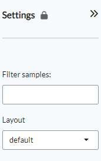

Cell type
~~~~~~~~~~~~~~~~~~~~~~~~~~~~~~~~~~~~~~~~~~~~~~~~~~~~~~~~~~~~~~~~~~~~~~~~~~~~~~~~
The **Cell type** tab contains two panels: **Cell type profiling** and **Phenotypes**.

**Cell type profiling** infers the type of cells using
computational deconvolution methods and reference datasets from the
literature.  In the plot settings menu, users can select the
reference dataset and the method for the cell type prediction in the
``reference`` and ``method`` settings, respectively. Currently, we
have implemented a total of 7 methods (EPIC, DeconRNAseq, DCQ, I-NNLS,
NNLM, correlation-based and a meta-method) and 9 reference datasets to
predict immune cell types (4 datasets: LM22, ImmProt, DICE and
ImmunoStates), tissue types (2 datasets: HPA and GTEx), cell lines (2
datasets: HPA and CCLE) and cancer types (1 dataset: CCLE). Not all
methods or databases may be available for a dataset, the availability
depends on the pre-processing done. From the settings, users can also 
sort plots by either probability or name and change the layout (``sort by``).

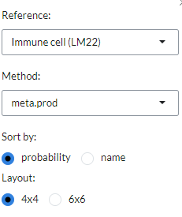

The **Phenotypes** tab displays plots that show the distribution of the phenotypes superposed on the t-SNE clustering. Often, we can expect the t-SNE distribution to be driven by the particular phenotype that is controlled by the experimental condition or unwanted batch effects. Users can customise the plot via the settings icon, where they can ``label`` the plot groups or add a legend instead.

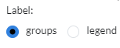

The cell type profiling tab displays the two panels side by side.

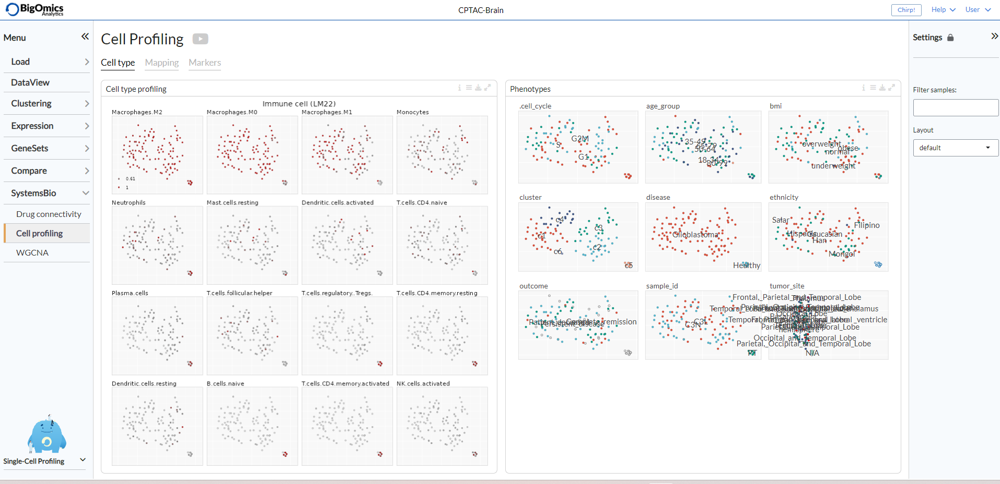

Mapping
~~~~~~~~~~~~~~~~~~~~~~~~~~~~~~~~~~~~~~~~~~~~~~~~~~~~~~~~~~~~~~~~~~~~~~~~~~~~~~~~
The **Mapping** panel contains two panels.
The **Cell type mapping** panel contains a plot representing the cell type mapping across all samples.
This plot can be customised via the *Settings* menu. Through it, users can change 
the ``plot type`` between a dotmap and a heatmap and select the ``reference`` dataset, 
select the analysis ``method``. The reference datasets and the methods available are the same as indicated in the **Cell type profiling** panel under the **Cell type** tab. 
Users can also use ``group by`` to group samples by input phenotypes.

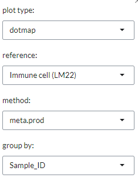

The **Proportions** panel contains a proportion plot visualizes the overlap between two categorical variables.
This may be useful for bulk RNA datasets, as it can provide information about 
the proportion of different cell types in the samples. From the settings icon, users 
can select whwther to display the <cell type> (based on the chosen reference dataset) 
or select one of the available phenotypes on the x- and y-axes of the plot. 
By selecting a gene with ``gene`` they can also add an expression barplot that indicates the expression level (high or low) **(@Mauro, @Ivo: What is high and low based on?)** of the selected gene for each of the sample groups as well as adding the total number of read counts of the selected gene per sample group.

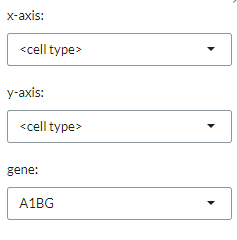

The two panels are displayed side by side in the tab.

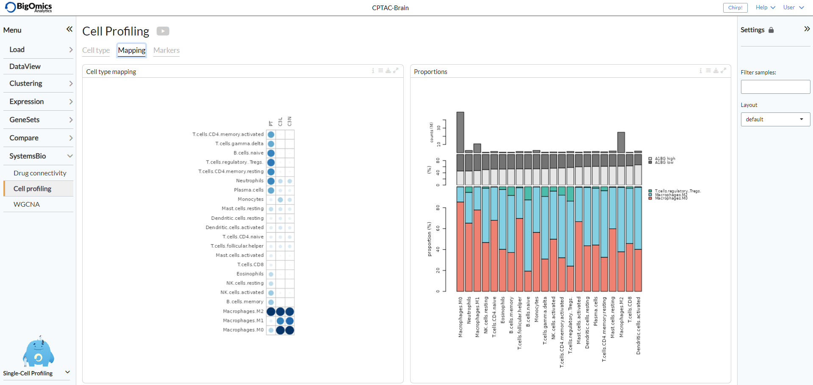

Markers
~~~~~~~~~~~~~~~~~~~~~~~~~~~~~~~~~~~~~~~~~~~~~~~~~~~~~~~~~~~~~~~~~~~~~~~~~~~~~~~~
The **Markers** tab consists of two panels: **Expression of marker genes** and **Cytometry plot**. 

**Expression of marker genes** consists of 25 t-SNE 
plots of the genes with the highest standard deviation that could represent 
potential biomarkers. The red color shading is proportional to the (absolute) 
expression of the gene in corresponding samples. 
In the settings icon, users can specify the ``Level`` of the marker analysis: 
gene or gene set level. They can also restrict the analysis by selecting a particular 
functional group in the ``Feature set``, where genes are divided into 89 groups, such as 
chemokines, transcription factors, genes involved in immune checkpoint inhibition, and so on (default: CD molecules (HGNC)). 
In addition, it is possible to filter markers by a specific keywords in the ``Filter`` setting 
and sort them by intensity (default) or name (``sort by``).

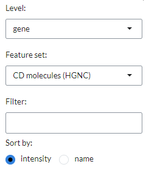

For each gene pairs combination, the panel also generates a cytometry-like plot (**Cyto plot**) 
of samples. The aim of this feature is to observe the distribution of samples 
in relation to the selected gene pairs. For instance, when applied to single-cell 
sequencing data from immunological cells, it can mimic flow cytometry analysis and distinguish 
T helper cells from other T cells by selecting the CD4 and CD8 gene combination. 
Under the plot settings icon, users can select their prefered genes on the x- and y-axes 
in the ``x-axis`` and ``y-axis``, respectively. They can also set the maximum number of bins for histgram distribution (``nbins``) (**@Mauro, @IVO more details needed...what do the histograms refer to?**).

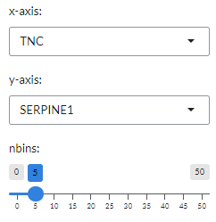

The two panels are displayed side by side in the tab.

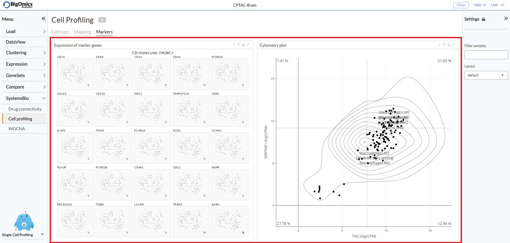

WGCNA (**@IVO, @Mauro: this submodule requires extensive feedback throughout)**
--------------------------------------------------------------------------------
The final submodule under **SystemsBio** is dedicated to weighted correlation network analysis (**WGCNA**), which serves the purpose of identifying clusters (modules) comprising highly correlated genes. These clusters can be summarized using either the module eigengene or an intramodular hub gene. WGCNA also facilitates the association of modules with each other and external sample traits through eigengene network methodology. Furthermore, it allows for the computation of module membership measures.

Settings panel
~~~~~~~~~~~~~~~~~~~~~~~~~~~~~~~~~~~~~~~~~~~~~~~~~~~~~~~~~~~~~~~~~~~~~~~~~~~~~~~~
WGCNA modules are selected from the **Settings** panel (``select module``) and plots can be recalcluated based on the selected module. 
Under *Options*, the number of genes (``Number genes``, default=1000), the miinum module size (``Min. module size``, default=30), the ``Power`` (default=6), the ``deepsplit`` (default=2) and the ``Merge cut height``, default=0.25) can be set.

.. figure:: figures_v3/WGCNA_settings.png
    :align: center
    :width: 20%

WGCNA
~~~~~~~~~~~~~~~~~~~~~~~~~~~~~~~~~~~~~~~~~~~~~~~~~~~~~~~~~~~~~~~~~~~~~~~~~~~~~~~~
The **WGCNA** tab consists of fiive panels (from left to right and top to bottom): **Gene dendrogram and gene modules**, **Scale independence and mean connectivity**, **TOM heatmap**, **Gene clustering** and **Module graph**.

:**Gene dendrogram and gene modules**: In this panel, gene modules are detected as branches of the resulting cluster tree using the dynamic branch cutting approach. Genes inside a given module are summarized with the module eigengene. The module eigengene of a given module is defined as the first principal component of the standardized expression profiles.

:**Scale independence and mean connectivity**:  This panes is used for the the analysis of network topology for various soft-thresholding powers. The left plot shows the scale-free fit index (y-axis) as a function of the soft-thresholding power (x-axis). The right plot displays the mean connectivity (degree, y-axis) as a function of the soft-thresholding power (x-axis).

:**TOM heatmap**: The panel displays the Topological Overlap Matrix (TOM) heatmap, which shows the correlation among gene module memberships  (**@IVO, @Mauro: more information needed. For what practical purpose is it used? How can users act on this information**).

:**Gene clustering**: This panel contains a clustering plot of the genes coloured by module. Via the settings icon, the layout can be changed between tsne (default), pca and umap.
   
    .. figure:: figures_v3/WGCNA_gc_opts.png
        :align: center
        :width: 30%

:**Module graph**: The final panel contains the WGCNA module graph, which represents the relationship betweem of the gene modules. **(@Ivo, @Mauro: we need a better description of what actionable information it provides to users)**

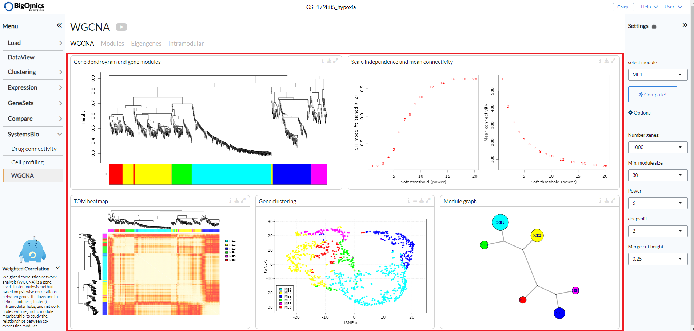

Modules
~~~~~~~~~~~~~~~~~~~~~~~~~~~~~~~~~~~~~~~~~~~~~~~~~~~~~~~~~~~~~~~~~~~~~~~~~~~~~~~~
The **Modules** tab contains fuve panels (left to right, top to bottom): **Module-Trait relationships**, **Correlation network**, **Module Enrichment (plot)**, **Module genes** and **Module enrichment (table)**. **(@Mauro, @Ivo: calling two panels with the same name is very confusing, I suggest adding "plot" to the first and "table" to the second.)**

:**Module-Trait relationships**: In this panel, the relationships between the various WGCNA modules and the phenotypic groups in the dataset are displayed as a heatmap, with shades of red indicating a negative correlation and shades of green indicating a positive correlation. The continuous variables can be binarised **(@Ivo, @Mauro: what does that mean at all?)** via the settings icon (``binarize continuous vars``).
   
    .. figure:: figures_v3/WGCNA_mtr_opts.png
        :align: center
        :width: 30%

:**Correlation network***: A partial correlation graph centered on module eigen-gene with top most correlated features. Green edges correspond to positive (partial) correlation, red edges to negative (partial) correlation. Width of the edges is proportional to the correlation strength of the gene pair. The regularized partial correlation matrix is computed using the 'graphical lasso' (Glasso) with BIC model selection.

:**Module enrichment (plot)**: A plot that displays the functional enrichment **(@Ivo, @Mauro: based on which databases is the functional ernichment analysis performed?)** of the module selected via the **Settings** panel.

:**Module genes**: A table showing the genes in the WGCNA module selected via the **Settings** panel. **(@IVO, @Mauro: what does the me.rho value represent?)**
   
:**Module enrichment (table)**: In this table, users can check mean expression values of features across the conditions for the selected module. **(@Ivo, @Mauro: the legend in the platform says "selected genes' but I believe you meant module)**

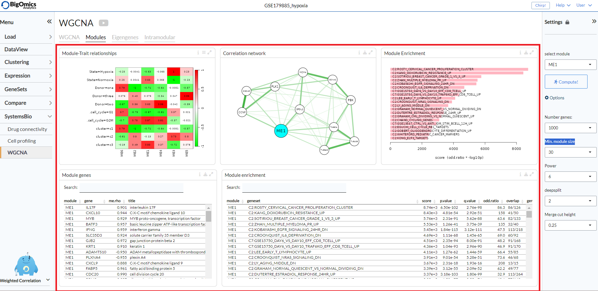

Eigengenes
~~~~~~~~~~~~~~~~~~~~~~~~~~~~~~~~~~~~~~~~~~~~~~~~~~~~~~~~~~~~~~~~~~~~~~~~~~~~~~~~
The **WGCNA** tab

Intramodular
~~~~~~~~~~~~~~~~~~~~~~~~~~~~~~~~~~~~~~~~~~~~~~~~~~~~~~~~~~~~~~~~~~~~~~~~~~~~~~~~
The **WGCNA** tab

