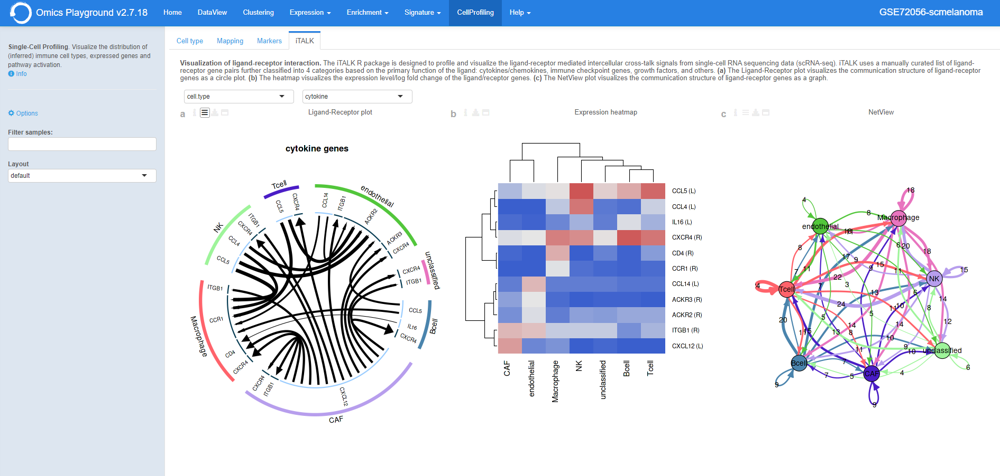

.. _CellProfiling:

Drug connectivity
--------------------------------------------------------------------------------
In the **Drug Connectivity Map** panel, users can correlate their signature with
more than 5000 known drug profiles from the 
`L1000 <https://www.ncbi.nlm.nih.gov/pubmed/29195078>`__ database, as well as with drug 
sensitivity profiles from the `CTRP v2 <https://portals.broadinstitute.org/ctrp.v2.1/>`__ 
and `GDSC <https://www.cancerrxgene.org/>`__ databases. 
Additionally, a separate list of shRNA- and cDNA-perturebed datasets from the L1000 database 
is also available (gene/L1000).

An activation-heatmap compares drug activation profiles across multiple contrasts. 
This facilitates to quickly see and detect the similarities between contrasts
for certain drugs.

Input panel
~~~~~~~~~~~~~~~~~~~~~~~~~~~~~~~~~~~~~~~~~~~~~~~~~~~~~~~~~~~~~~~~~~~~~~~~~~~~~~~~
A tutorial about the module can be found under ``Youtube`` in the input panel.
Users can specify the contrast of their interest
in the ``Contrast`` settings. Under ``Analysis type`` users can select from four 
databases.

.. figure:: figures/psc6.3.0.png
    :align: center
    :width: 30%

Main panel
~~~~~~~~~~~~~~~~~~~~~~~~~~~~~~~~~~~~~~~~~~~~~~~~~~~~~~~~~~~~~~~~~~~~~~~~~~~~~~~~
The main panel consists of four outputs:    

:**a**: The Drug Connectivity Map correlates your signature with profiles from the L1000 
        (activity/L1000 and gene/L1000), CTRP and GDSC databases. 
        It shows the top N=10 similar and opposite profiles by running 
        the GSEA algorithm on the contrast-drug profile correlation space. 

:**b**: Enrichment table. Enrichment is calculated by correlating
        your signature with the profiles from the chosen
        database. Because of multiple perturbation experiments for a
        single small molecule, they are scored by running the GSEA algorithm on the 
        contrast-small molecule profile correlation space. In this way, we obtain a 
        single score for multiple profiles of a single small molecule. The table can be 
        customised via the table *Settings* to only show annotated drugs.

:**c**: This plot visualizes the mechanism of action (MOA) across the enriched
        drug profiles. On the vertical axis, the number of drugs with the same
        MOA are plotted. You can switch to visualize between MOA or target gene.
        Under the plots *Settings*, users can select the plot type of MOA
        analysis: by class description (``drug class``) or by target gene 
        (``target gene``).

        .. figure:: figures/psc6.3.c.png
            :align: center
            :width: 35%

:**d**: The **Activation matrix** visualizes the correlation of small molecule 
        profiles with all available pairwise comparisons. The size of the
        circles correspond to the strength of their correlation, and are
        colored according to their positive (red) or
        negative (blue) correlation to the contrast profile. 
        The matrix can be normalised from the *Settings*.

.. figure:: figures/psc6.3.png
    :align: center
    :width: 100%

Cell Profiling
================================================================================

The **Cell Profiling** module is specifically developed for the
analysis and visualization of single-cell datasets. The main
applications are identification of immune cell types and
visualisations of markers, phenotypes, and proportions across the cells.

The **Cell type** panel infers the type of cells using computational deconvolution
methods and reference datasets from the literature.

The **Mapping** panel provides a visualization of the inferred cell types 
matched to the phenotype variable of the data set, as well as a proportion plot 
visualizing the interrelationships between two categorical variables 
(so-called cross tabulation). This can be used to study the composition 
of a sample by cell type, for example.  

The **Markers** panel provides potential marker genes, which are the top genes 
with the highest standard deviation within the expression data across the samples. 
It also generates a plot mimicking the scatter plots used for gating in 
flow cytometry analysis.

The **iTALK** consists of a computational approach from the literature
to characterize and illustrate intercellular communication signals in the 
multicellular tumor ecosystem.

Input panel
--------------------------------------------------------------------------------
Users can filter relevant samples in the ``Filter samples`` settings
under the the main ``Options`` in the input panel. They can also
specify to use a ``default``  (tSNE) or ``pca`` layout for the figures.

.. figure:: figures/psc10.0.png
    :align: center
    :width: 30%

Cell type
--------------------------------------------------------------------------------
The **Cell type** profiling panel infers the type of cells using
computational deconvolution methods and reference datasets from the
literature.  In the plot settings menu, users can select the
reference dataset and the method for the cell type prediction in the
``reference`` and ``method`` settings, respectively. Currently, we
have implemented a total of 7 methods (EPIC, DeconRNAseq, DCQ, I-NNLS,
NNLM, correlation-based and a meta-method) and 9 reference datasets to
predict immune cell types (4 datasets: LM22, ImmProt, DICE and
ImmunoStates), tissue types (2 datasets: HPA and GTEx), cell lines (2
datasets: HPA and CCLE) and cancer types (1 dataset: CCLE). Not all
methods or databases may be available for a dataset, the availability
depends on the pre-processing done. From the settings, users can also 
sort plots by either probability or name and change the layout.

.. figure:: figures/psc10.1.0.png
    :align: center
    :width: 30%

The cell type profiling plot is highlighted below.

.. figure:: figures/psc10.1.png
    :align: center
    :width: 100%

It also produces phenotypes plots showing the distribution of the 
phenotypes superimposed on the t-SNE clustering. 
Often, we can expect the t-SNE distribution to be driven by the particular 
phenotype that is controlled by the experimental condition or unwanted 
batch effects. Users can select whether they want the group labels to be 
plotted inside the figures or in a seperate legend in the``Legend`` 
under the *Settings*.

.. figure:: figures/psc10.1.1.png
    :align: center
    :width: 100%

Mapping
--------------------------------------------------------------------------------
The **Mapping** panel contains two plots.
To the right there is a plot representing the cell type mapping across all samples.
This plot can be customised via the *Settings* menu. Through it, users can change 
the ``plot type`` between a dotmap and a heatmap, select the ``reference`` dataset, 
select the analysis ``method`` and use ``group by`` to group samples by phenotypes.

.. figure:: figures/psc10.2.a.png
    :align: center
    :width: 30%

The cell type mapping plot is shown below.

.. figure:: figures/psc10.2.png
    :align: center
    :width: 100% 

To the left, a proportion plot visualizes the overlap between two categorical variables.
This can be useful for bulk RNA datasets, as it provides useful information about 
the proportion of different cell types in the samples. From the *Settings*, users 
can select whwther to display the <cell type> (based on the chosen reference dataset) 
or select one of the available phenotypes on the x- and y-axes of the plot. The number
of counts is also displayed on top. 
By selecting a gene with ``gene`` they can also add an expression barplot for the gene.

.. figure:: figures/psc10.2.b.png
    :align: center
    :width: 30%

The proportion plot (including a gene expression barplot) is shown below.

.. figure:: figures/psc10.2.1.png
    :align: center
    :width: 100% 

Markers
--------------------------------------------------------------------------------
The **Markers** panel produces two outputs. The first output consists of 36 t-SNE 
plots of the genes with the highest standard deviation that could represent 
potential biomarkers. The red color shading is proportional to the (absolute) 
expression of the gene in corresponding samples. 

In the plot *Settings*, users can specify the ``Level`` of the marker analysis: 
gene or gene set level. They can also restrict the analysis by selecting a particular 
functional group in the ``Feature set``, where genes are divided into 89 groups, such as 
chemokines, transcription factors, genes involved in immune checkpoint inhibition, and so on. 
In addition, it is possible to filter markers by a specific keywords in the ``Filter`` setting 
and sort them by name or intensity.

.. figure:: figures/psc10.3.a.png
    :align: center
    :width: 30%

An example of the t-SNE plots are highlighted below.

.. figure:: figures/psc10.3.png
    :align: center
    :width: 100%

For each gene pairs combination, the panel also generates a cytometry-like plot (**Cyto plot**) 
of samples. The aim of this feature is to observe the distribution of samples 
in relation to the selected gene pairs. For instance, when applied to single-cell 
sequencing data from immunological cells, it can mimic flow cytometry analysis and distinguish 
T helper cells from other T cells by selecting the CD4 and CD8 gene combination. 
Under the plot *Settings*, user can select their prefered genes on the x- and y-axes 
in the ``x-axis`` and ``y-axis``, respectively.

.. figure:: figures/psc10.3.b.png
    :align: center
    :width: 30%

The Cyto plot is highlighted below.

.. figure:: figures/psc10.3.1.png
    :align: center
    :width: 100%

iTALK
--------------------------------------------------------------------------------
The **iTALK** panel implements the 
`iTALK <https://www.biorxiv.org/content/10.1101/507871v1>`__
package from the literature. It is designed to profile and visualize the 
ligand-receptor mediated intercellular cross-talk signals from single-cell 
RNA sequencing data (scRNA-seq). iTALK uses a manually curated list of 
ligand-receptor gene pairs further classified into 4 categories based on 
the primary function of the ligand: cytokines/chemokines, 
immune checkpoint genes, growth factors, and others.
Phenotype and ligand-receptor gene pairs can be selected from the 
scrolldown menus on top of the Ligand-Receptor plot.

The panel produces three plots:

:**a**: The Ligand-Receptor plot visualizes the communication structure of 
        ligand-receptor genes as a circle plot. The width of the arrow represents
        the expression level/log fold change of the ligand; while the width of
        arrow head represents the expression level/log fold change of the
        receptor. Different color and the type of the arrow stands for whether
        the ligand and/or receptor are upregulated or downregulated. 
        Under the *Settings*, it is possible to select the number of top pairs
        to be displayed in the ``ntop pairs``.

:**b**: The heatmap visualizes the expression level/log fold change of the 
        ligand/receptor genes. For further information, see 
        `iTALK <https://www.biorxiv.org/content/10.1101/507871v1>`__ R package.    

:**c**: The NetView plot visualizes the communication structure of ligand-receptor
        genes as a graph. The colors represent different types of cells as a 
        structure and the width of edges represent the strength of the communication.
        Labels on the edges show exactly how many interactions exist between two 
        types of cells. For further information, see 
        `iTALK <https://www.biorxiv.org/content/10.1101/507871v1>`__ R package.
        Users can set the number of top genes to be plotted in the figure in the
        ``top genes`` under the *Settings*.

