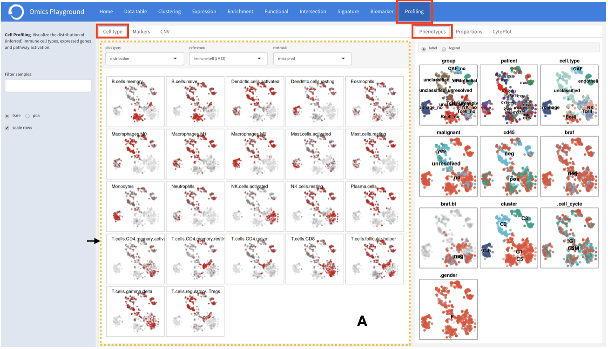
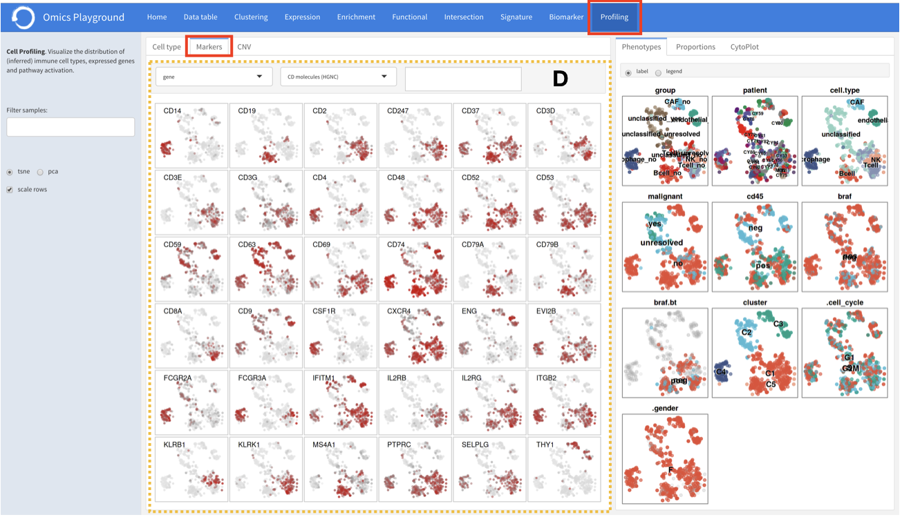
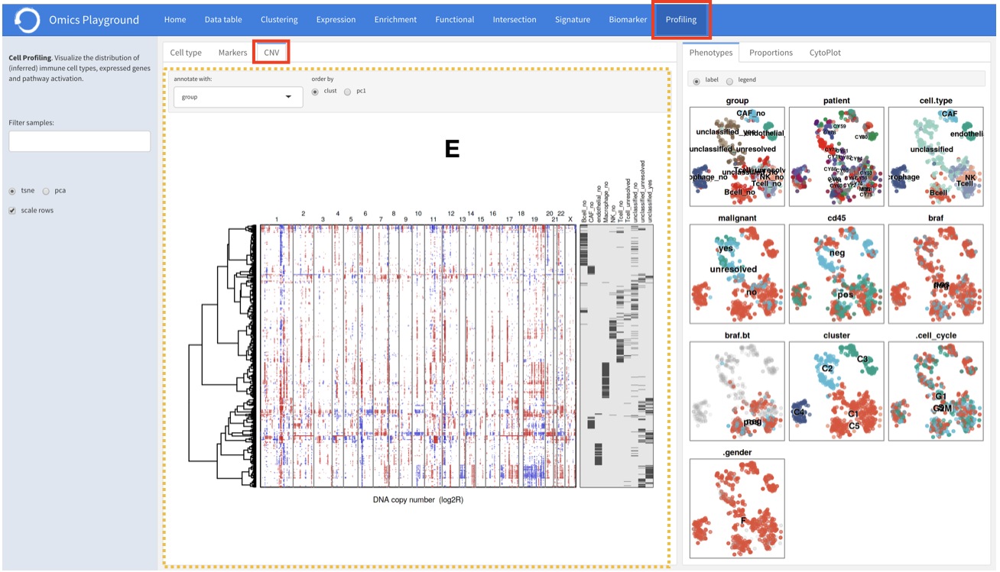
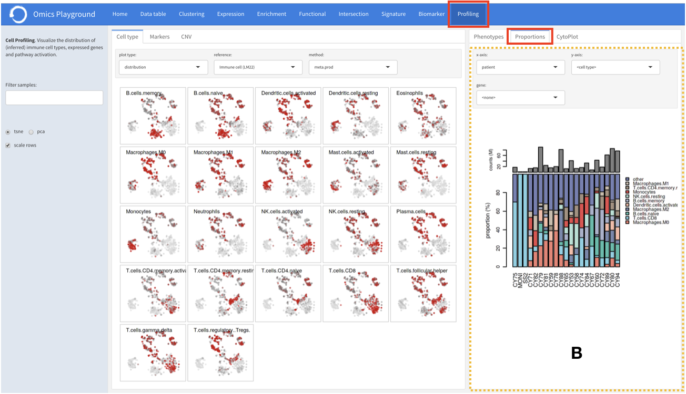
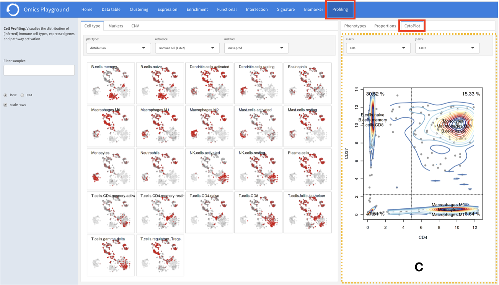

.. _CellProfiling:

Cell profiling
================================================================================

The cell profiling module is specifically developed for the analysis and visualization
of single-cell datasets. The main applications are identification of immuner cell
types and visualisations of markers, copy number variations, phenotypes, and 
proportions across the cells.

Cell type
--------------------------------------------------------------------------------
The ``cell type`` section is used to infer the types of immune cells in a sample
using prediction methods and reference datasets from the literature. 
Currently, we have implemented
a total of eight methods and nine reference datasets to predict immune cell types
(four datasets), tissue types (two datasets), cell lines (two datasets) and cancer
cell types (one dataset).

Markers
--------------------------------------------------------------------------------
The ``markers`` section provides potential marker genes, that is the 36 genes
with the highest standard deviation within the expression data across the samples.
For every gene, it produces a t-SNE plot of samples, with samples colored in red 
when the gene is overexpressed in corresponding samples. Users can also restrict 
the marker analysis by selecting a particular functional group. There are in total
89 such functional groups, including chemokines, transcription factors, genes 
involved in immune checkpoint inhibition, and so on.

CNV
--------------------------------------------------------------------------------
It is also possible to perform a gene copy number variation (CNV) analysis under 
the ``CNV`` tab. The copy number is estimated from gene expression data by 
computing a moving average of the relative gene expression along the chromosomes.
A heatmap of samples versus chromosomes is generated, where samples can be 
annotated further with a phenotype class provided in the data.

Proportions
--------------------------------------------------------------------------------
The ``proportions`` tab visualizes the interrelationships between two categorical
variables (so-called cross tabulation). Although this feature is very suitable
for a single-cell sequencing data, it provides useful information about the
proportion of different cell types in samples obtained by the bulk sequencing method.

Cytoplot
--------------------------------------------------------------------------------
For each gene pairs combination, the platform can generate a cytometry-like plot 
of samples under the ``cytoplot`` tab. The aim of this feature is to observe
the distribution of samples in relation to the selected gene pairs. For instance,
when applied to single-cell sequencing data from immunological cells, it can mimic
flow cytometry analysis and distinguish T helper cells from other T cells by 
selecting the CD4 and CD8 gene combination.

