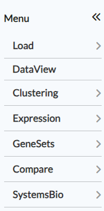
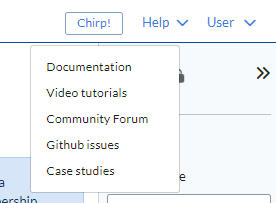
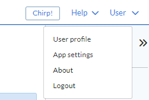
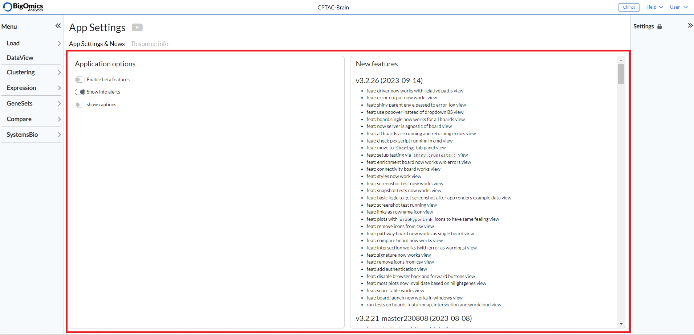
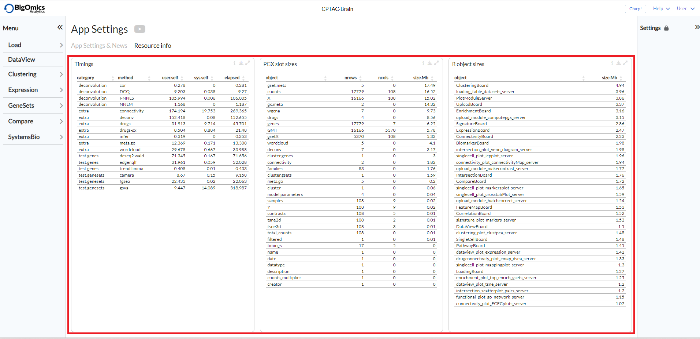

.. _Outline:

Outline
================================================================================

Main menu
--------------------------------------------------------------------------------

Using the main menu on top, you can navigate through the different
analysis modules. Generally you want to start from top to bottom, from specific gene-wise to the more higher-level functional
analysis modules. Some users prefer the other way around.

By default, the following menu items are present, namely :ref:`Load`,
:ref:`DataView`, :ref:`Clustering`, :ref:`Expression`,
:ref:`Genesets`, :ref:`Compare` and :ref:`SystemsBio`.

Help menu
--------------------------------------------------------------------------------
The **Help** menu is located on the top right hand corner. The menu links to the online platform documentation (the page you are currently viewing), a collection of video tutorials on youtube, the community forum of the platform, the Github webpage, where busg can be reported, and a collection of case studies based on Omics Playground.

User menu
--------------------------------------------------------------------------------
The **User** menu is located on the top right hand corner, right next to the **Help** menu. It links to the user profile, where information on the usage of the platform can be found, the app settings, the "About" pop-up that shows information about the version of the platform currently deployed and finally the "Logout" option to disconnect from the platform.

Clicking "App settings" will take the user to a new page with two tabs: **App settings & News** and ** Resource info**.

There are two panels under the **App settings & News** tab: **Application options** and **new features**.

:**Application options**: Through this panel, users can enable beta features, disable alerts and enable captions for the plots.

:**New features**: This panel provides a list of new features implemented with each new update of the platform.

Three panels are found under **Resource info**: **Timings**, **PGX slot sizes** and **R object sizes**.

:**Timings**: The timings table reports more detailed information about the object dimensions, object sizes and execution times of the methods.

:**PGX slot sizes**: This table provides details about the pgx object.

:**R object sizes**: This table provides size details about R objects.

Figure & table tags
--------------------------------------------------------------------------------

Each figure or table on the platform is assigned the following interactive buttons, where:

* Info: provides detailed information about the figure or table.
* Settings: users can specify additional settings if applicable.
* Download: downloads a figure as a PNG or PDF file or a table in CSV format.
* Maximize: shows a larger version of a figure in a separate window.

.. figure:: figures/isd2.png
    :align: center
    :width: 60%

Glossary
--------------------------------------------------------------------------------
* Signature: a list of selected genes (e.g. by significance or fold
  change),
* Condition: a specific phenotype group (e.g. tumor or control),
* Contrast: a comparison between two conditions (e.g. tumor vs control),
* Profile: a vector of fold changes corresponding to a certain comparison,
* Hierarchical clustering: a method that groups similar samples into groups,
* Q value: an FDR-adjusted p value,
* Biomarker: a biological feature (gene, mutation or gene set) that
  characterises a specific physiological or pathological process.
