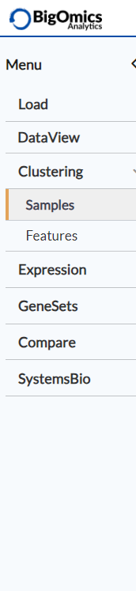
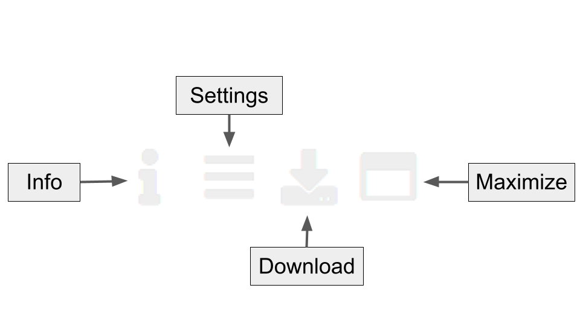

.. _Outline:

Outline
================================================================================

Main menu
--------------------------------------------------------------------------------

Using the main menu on top, you can navigate through the different
analysis modules. Generally you want to start from top to bottom, from specific gene-wise to the more higher-level functional
analysis modules. Some users prefer the other way around.

By default, the following menu items are present, namely :ref:`Home`,
:ref:`DataView`, :ref:`Clustering`, :ref:`Expression`,
:ref:`Enrichment` and :ref:`Signature`, while :ref:`CellProfiling` is
an optional choice. The last menu item :ref:`User` (with user icon)
contains user settings, a help submenu and logout buttons.

Figure & table tags
--------------------------------------------------------------------------------

Each figure or table on the platform is assigned the following interactive buttons, where:

* Info: provides detailed information about the figure or table.
* Settings: users can specify additional settings if applicable.
* Download: downloads a figure as a PNG or PDF file or a table in CSV format.
* Maximize: shows a larger version of a figure in a separate window.

Glossary
--------------------------------------------------------------------------------
* Signature: a list of selected genes (e.g. by significance or fold
  change),
* Condition: a specific phenotype group (e.g. tumor or control),
* Contrast: a comparison between two conditions (e.g. tumor vs control),
* Profile: a vector of fold changes corresponding to a certain comparison,
* Hierarchical clustering: a method that groups similar samples into groups,
* Q value: an FDR-adjusted p value,
* Biomarker: a biological feature (gene, mutation or gene set) that
  characterises a specific physiological or pathological process.
