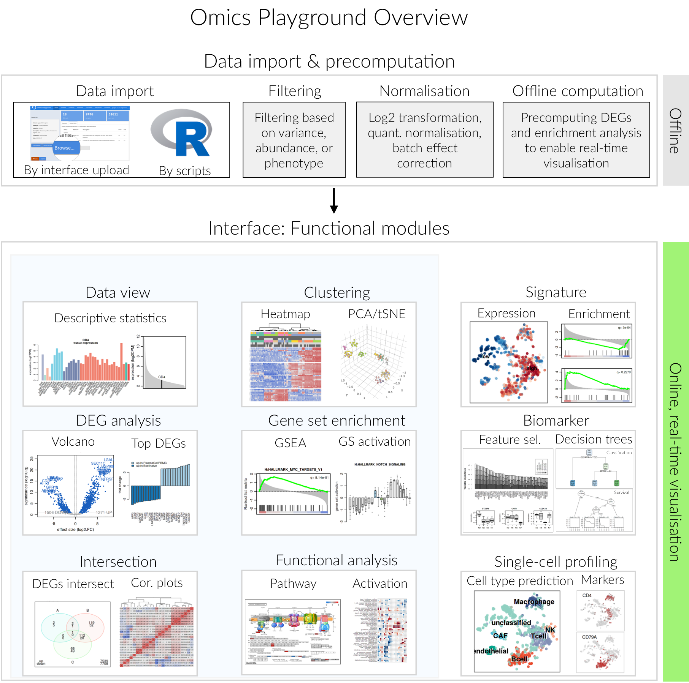

Overview
================================================================================

Increasingly powerful `omics approaches enable the interrogation of cellular phenotypes in great detail by generating vast amount of transcriptomics data. The advent of single-cell RNA-sequencing (scRNA-seq) has particularly contributed to the data growth and is providing previously unavailable insights into cellular mechanisms. Yet, the challenge is to efficiently analyze accumulated highthroughput data to obtain a comprehensive understanding of the molecular underpinnings of a cellular phenotype.

Here we present Omics Playground, a user-friendly and interactive web-based platform for the analysis and visualization of transcriptomics and proteomics data. Omics Playground allows users to apply a multitude of state-of-the-art analysis tools to their own data to explore and discover interesting biology in a short time.

The current version of our platform (0.99) is implemented in R using the Shiny web application framework. The overview of the platform is shown in the figure below and consists of two main components. The first component address the data cleaning and preprocessing, which includes preparing the input data, filtering, normalising and precomputing of statistics for some analyses. The second part is composed of the online interface, which supports the real-time visualisation and interaction with users.

